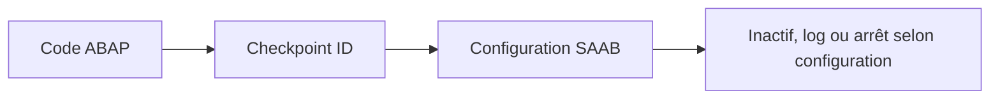

# 🌸 ASSERTIONS ET POINTS DE CONTRÔLE

## 🌺 OBJECTIFS

- Utiliser `ASSERT` pour vérifier un invariant
- Distinguer assertion et validation métier
- Comprendre les groupes de points de contrôle
- Utiliser la transaction `SAAB`
- Éviter les assertions sur des erreurs utilisateur prévisibles

## 🌺 PRINCIPE

Une assertion vérifie qu’une expression logique représente un état qui doit toujours être vrai à cet endroit du programme.

```abap
ASSERT lv_total >= 0.
```

Si l’expression est fausse, le comportement dépend de la forme de l’assertion et de l’activation du point de contrôle.

## 🌺 INVARIANT TECHNIQUE

Exemple adapté :

```abap
ASSERT lines( lt_items ) = lv_expected_count.
```

Le programme considère que son propre traitement garantit cette égalité. Une violation indique potentiellement un défaut de programmation.

## 🌺 VALIDATION MÉTIER

Mauvais :

```abap
ASSERT p_quantity > 0.
```

Une quantité saisie à zéro est une situation prévisible. L’utilisateur doit recevoir un message contrôlé ou une exception métier.

Correct :

```abap
IF p_quantity <= 0.
  MESSAGE e008(zdev_msg).
ENDIF.
```

## 🌺 GROUPES DE POINTS DE CONTRÔLE

```abap
ASSERT ID zdev_check
  SUBKEY sy-uname
  FIELDS lv_total lv_expected_count
  CONDITION lv_total = lv_expected_count.
```

L’ajout `ID` associe l’assertion à un groupe de points de contrôle. La transaction `SAAB` permet de configurer son activation et son comportement selon le système.

Les ajouts disponibles dépendent de la syntaxe supportée par la version ABAP.

## 🌺 POINTS DE CONTRÔLE ACTIVABLES

Les groupes peuvent aussi être utilisés avec des instructions comme :

- `BREAK-POINT ID` ;
- `LOG-POINT ID` ;
- `ASSERT ID`.

Ils permettent d’activer un diagnostic sans modifier le code à chaque analyse.



## 🌺 DONNÉES SENSIBLES

Ne pas journaliser avec `FIELDS` des données sensibles sans nécessité. Un point de contrôle peut enregistrer des valeurs consultables par des administrateurs ou développeurs autorisés.

## 🌺 ASSERTION ET ABAP UNIT

`ASSERT` dans le code productif ne remplace pas les méthodes d’assertion d’ABAP Unit. Les tests automatisés disposent de classes dédiées comme `CL_ABAP_UNIT_ASSERT`.

Les tests seront traités dans le dossier qualité et tests.

## 🌺 CAS D’USAGE

Dans un contexte où un import doit signaler clairement les erreurs, permettre leur traitement et éviter les arrêts non maîtrisés, le besoin consiste à **gérer une situation d’erreur avec assertions et points de contrôle et produire une information exploitable par l’appelant ou l’utilisateur**. Cette notion est pertinente lorsque le lecteur doit pouvoir relier la syntaxe ou l’outil à une situation professionnelle concrète.

## 🌺 PROCÉDURE PAS À PAS

1. Saisir `/nSE38` dans le champ de commande.
2. Entrer le nom d’un programme Z de test, par exemple `ZREF_DEMO`, puis choisir **Créer** ou **Modifier** selon le cas.
3. Pour un exercice local uniquement, affecter `$TMP` ; pour un développement livrable, utiliser le package et l’ordre fournis par le projet.
4. Coller ou adapter le snippet du chapitre.
5. Exécuter le contrôle syntaxique avec `Ctrl+F2`.
6. Activer avec `Ctrl+F3`.
7. Exécuter avec `F8` et comparer le résultat avec la section **Vérification**.

## 🌺 VÉRIFICATION

- Le contrôle syntaxique réussit.
- La version active correspond au code sauvegardé.
- L’exécution produit le résultat décrit dans le chapitre.
- Les cas vide, limite et erreur sont testés séparément lorsque la syntaxe le permet.

## 🌺 ERREURS FRÉQUENTES

- Copier un exemple sans adapter les types, noms d’objets et données disponibles dans le système.
- Tester uniquement le cas nominal et ignorer les valeurs initiales, absentes ou invalides.
- Afficher un message technique incompréhensible à l’utilisateur.
- Attraper une exception sans action ni propagation.

## 🌺 SNIPPET À RÉUTILISER

> [!NOTE]
> Adapter les noms `Z*`, les types DDIC, les données et les autorisations au système cible. Effectuer un contrôle syntaxique avant activation.

```abap
ASSERT ID zdev_check
  SUBKEY sy-uname
  FIELDS lv_total lv_expected_count
  CONDITION lv_total = lv_expected_count.
```

## 🌺 TERMES DU LEXIQUE

- [Exception](<../└─ 🧩 00 - LEXIQUE SAP ET ABAP/04 - 🍧 LANGAGE ET DEVELOPPEMENT ABAP.md#exception>)
- [Dump ABAP](<../└─ 🧩 00 - LEXIQUE SAP ET ABAP/08 - 🍧 EXECUTION EXPLOITATION ET ADMINISTRATION.md#dump-abap>)

## 🌺 À RETENIR

- À l’issue du chapitre, le lecteur sait **gérer une situation d’erreur avec assertions et points de contrôle et produire une information exploitable par l’appelant ou l’utilisateur**.
- Toujours tester sur un objet Z ou un jeu de données sans impact avant d’intervenir sur un traitement réel.
- La documentation `F1` du système reste la référence pour la syntaxe disponible dans sa release.

## 🌺 RÉFÉRENCES OFFICIELLES SAP

- [ASSERT — ABAP Keyword Documentation](https://help.sap.com/doc/abapdocu_latest_index_htm/latest/en-US/ABAPASSERT_SHORTREF.html)
- [Activatable Checkpoints — SAP Help Portal](https://help.sap.com/docs/SAP_NETWEAVER_750/ba879a6e2ea04d9bb94c7ccd7cdac446/491c002326bc14cde10000000a42189b.html)
- [ABAP Test Support — SAP Help Portal](https://help.sap.com/docs/ABAP_PLATFORM_NEW/7bfe8cdcfbb040dcb6702dada8c3e2f0/f7eaddabcb9e4c84b83b5b1da863c28e.html)


---

➡️ [Chapitre suivant — STRATÉGIE ET BONNES PRATIQUES](<./16 - 🍧 STRATEGIE ET BONNES PRATIQUES.md>)
