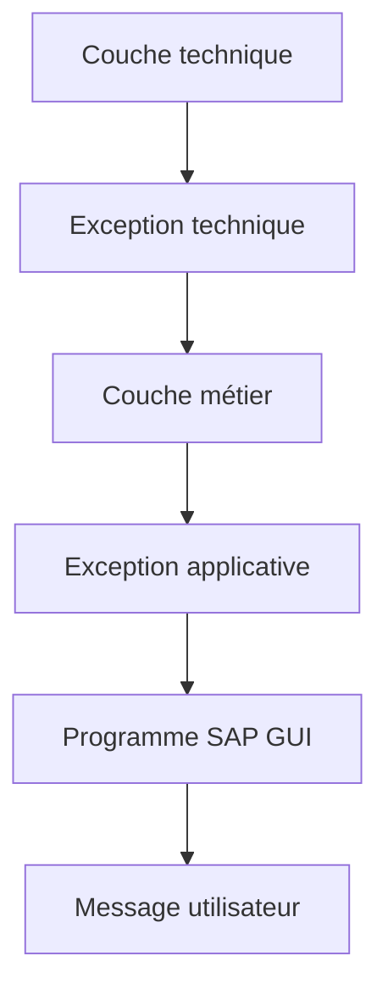

# 🌸 STRATÉGIE ET BONNES PRATIQUES

## 🌺 OBJECTIFS

- Construire une stratégie homogène de gestion des erreurs
- Choisir le mécanisme selon la couche
- Préserver les causes techniques
- Produire des messages exploitables
- Vérifier le traitement avant livraison

## 🌺 STRATÉGIE PAR COUCHE

| Couche                     | Mécanisme principal                           |
| -------------------------- | --------------------------------------------- |
| Écran ou report SAP GUI    | `MESSAGE`, conversion finale d’exceptions     |
| Logique métier             | Exceptions de classes applicatives            |
| Accès technique            | Exceptions techniques converties ou propagées |
| Instruction classique      | Contrôle immédiat de `sy-subrc`               |
| Invariant de programmation | `ASSERT` ou exception technique               |
| Traitement de masse        | Collecte structurée et journalisation         |

## 🌺 RÈGLES DE CONCEPTION

- détecter l’erreur au plus près de sa cause ;
- ne traiter localement que ce qui peut réellement être corrigé ;
- propager une exception structurée lorsqu’une décision appartient à l’appelant ;
- conserver la cause précédente ;
- ne jamais analyser un texte traduit pour décider du traitement ;
- tester `sy-subrc` immédiatement ;
- éviter les blocs `CATCH` vides ;
- éviter `CATCH cx_root` sans stratégie de traçabilité ;
- ne pas utiliser `MESSAGE X` pour une erreur fonctionnelle ;
- ne pas utiliser `ASSERT` pour une saisie utilisateur invalide.

## 🌺 MESSAGE UTILISATEUR

Un bon message indique :

- ce qui a échoué ;
- l’objet concerné ;
- la donnée à corriger ;
- l’action possible.

Éviter d’exposer :

- noms de tables internes sans nécessité ;
- classes techniques incompréhensibles ;
- dumps complets ;
- données sensibles ;
- textes génériques sans cause.

## 🌺 TRAITEMENT PARTIEL

Un traitement de masse ne doit pas nécessairement s’arrêter au premier rejet. Définir explicitement si l’unité de traitement est :

- tout le lot ;
- un document ;
- une ligne ;
- un objet métier.

Collecter les erreurs avec leur contexte, puis produire un résultat global clair.

La journalisation applicative détaillée sera traitée dans son dossier dédié.

## 🌺 FRONTIÈRE TRANSACTIONNELLE

Une exception n’effectue pas automatiquement un `ROLLBACK WORK`. Un message n’effectue pas automatiquement un `COMMIT WORK`.

La stratégie d’erreur doit être cohérente avec la SAP LUW :

- qui valide ;
- qui annule ;
- quelles opérations sont déjà persistées ;
- quelles mises à jour sont encore en attente.

## 🌺 CHECKLIST

- [ ] Chaque code retour est-il contrôlé immédiatement ?
- [ ] Les valeurs de `sy-subrc` sont-elles interprétées selon la documentation de l’instruction ?
- [ ] Les messages utilisateur proviennent-ils d’une classe traduisible ?
- [ ] Le type de message correspond-il au comportement souhaité ?
- [ ] Les méthodes métier évitent-elles une dépendance directe à SAP GUI ?
- [ ] Les exceptions importantes possèdent-elles une classe précise ?
- [ ] Les exceptions propagées sont-elles déclarées lorsque leur catégorie l’exige ?
- [ ] Les causes techniques sont-elles conservées avec `PREVIOUS` ?
- [ ] Les blocs `TRY` sont-ils limités au code réellement protégé ?
- [ ] Aucun `CATCH` ne masque-t-il silencieusement une erreur ?
- [ ] Les assertions vérifient-elles uniquement des invariants ?
- [ ] Le comportement en arrière-plan a-t-il été vérifié ?
- [ ] Les erreurs d’un traitement partiel sont-elles restituées avec leur contexte ?
- [ ] Les contrôles syntaxiques et étendus ont-ils été exécutés ?

## 🌺 CONTRÔLES AVANT LIVRAISON

Exécuter au minimum :

- vérification syntaxique ;
- contrôle étendu du programme ;
- tests des chemins d’erreur ;
- tests sans autorisation ou donnée attendue ;
- tests de volume ;
- tests en arrière-plan si le programme est concerné ;
- analyse d’un éventuel dump dans `ST22`.

## 🌺 CAS D’USAGE

Dans un contexte où un import doit signaler clairement les erreurs, permettre leur traitement et éviter les arrêts non maîtrisés, le besoin consiste à **gérer une situation d’erreur avec stratégie et bonnes pratiques et produire une information exploitable par l’appelant ou l’utilisateur**. Cette notion est pertinente lorsque plusieurs solutions sont possibles et il faut retenir celle qui limite les risques de maintenance.

## 🌺 PROCÉDURE PAS À PAS

1. Lire la définition et identifier les prérequis du chapitre.
2. Choisir un objet Z ou un scénario de démonstration sans impact métier.
3. Reproduire l’exemple dans un système de développement et relever les données d’entrée.
4. Contrôler la syntaxe ou la configuration avant activation/exécution.
5. Comparer le résultat observé avec la section **Vérification**.
6. Documenter toute différence liée à la release, aux autorisations ou au paramétrage du système.

## 🌺 VÉRIFICATION

- Le lecteur peut expliquer la différence entre cette notion et les concepts proches.
- Le choix technique est justifié par un besoin concret, pas uniquement par habitude.
- Les limites liées à la release, aux autorisations et au contexte d’exécution sont identifiées.

## 🌺 ERREURS FRÉQUENTES

- Afficher un message technique incompréhensible à l’utilisateur.
- Attraper une exception sans action ni propagation.

## 🌺 TERMES DU LEXIQUE

- [Exception](<../└─ 🧩 00 - LEXIQUE SAP ET ABAP/04 - 🍧 LANGAGE ET DEVELOPPEMENT ABAP.md#exception>)
- [Dump ABAP](<../└─ 🧩 00 - LEXIQUE SAP ET ABAP/08 - 🍧 EXECUTION EXPLOITATION ET ADMINISTRATION.md#dump-abap>)

## 🌺 À RETENIR

- À l’issue du chapitre, le lecteur sait **gérer une situation d’erreur avec stratégie et bonnes pratiques et produire une information exploitable par l’appelant ou l’utilisateur**.
- Toujours tester sur un objet Z ou un jeu de données sans impact avant d’intervenir sur un traitement réel.
- La documentation `F1` du système reste la référence pour la syntaxe disponible dans sa release.

## 🌺 RÉFÉRENCES OFFICIELLES SAP

- [Handling and Propagating Exceptions — ABAP Programming Guideline](https://help.sap.com/doc/abapdocu_latest_index_htm/latest/en-US/ABENHANDL_PROP_EXCEPT_GUIDL.html)
- [Return Code — ABAP Programming Guideline](https://help.sap.com/doc/abapdocu_latest_index_htm/latest/en-US/ABENRETURN_CODE_GUIDL.html)
- [Extended Program Check — ABAP Programming Guideline](https://help.sap.com/doc/abapdocu_latest_index_htm/latest/en-US/ABENEXTENDED_PROGRAM_CHECK_GUIDL.html)
- [MESSAGE — ABAP Keyword Documentation](https://help.sap.com/doc/abapdocu_latest_index_htm/latest/en-US/ABAPMESSAGE_SHORTREF.html)
