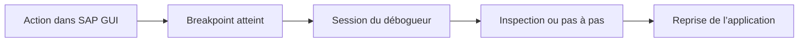

# 🌸 DÉMARRER LE DÉBOGUEUR DANS SAP GUI

## 🌺 OBJECTIFS

- Démarrer le débogueur depuis un programme ou une transaction
- Utiliser un breakpoint ou la commande de débogage SAP GUI
- Comprendre la création d’une session de débogage
- Identifier les limites d’un contexte non dialogué

## 🌺 DEPUIS LE CODE SOURCE

Dans l’éditeur ABAP, placer un breakpoint sur une instruction exécutable, activer le programme, puis lancer le scénario.

```abap
REPORT zdev_debug_demo.

DATA(lv_total) = 10 + 5. " Point d’arrêt sur cette ligne
WRITE lv_total.
```

Le débogueur s’ouvre lorsque le processeur ABAP atteint un breakpoint actif pour l’utilisateur et le contexte concernés.

## 🌺 DEPUIS UNE TRANSACTION SAP GUI

Pour un traitement dialogué classique, saisir `/h` dans le champ de commande SAP GUI, valider, puis déclencher l’action à analyser. Le débogueur démarre au prochain point approprié du traitement ABAP.

Cette méthode est utile lorsque :

- le programme exact n’est pas encore connu ;
- le traitement est déclenché par un bouton ;
- plusieurs programmes ou écrans s’enchaînent ;
- le code standard appelle une extension client.

Ne pas confondre `/h` avec une analyse complète. La commande permet d’entrer dans le débogueur ; il faut ensuite localiser le traitement pertinent.

## 🌺 DEPUIS SE38 OU SE80

Selon l’outil et la version du système, un programme exécutable peut être lancé directement en mode débogage depuis les fonctions de test ou d’exécution.

Le point d’entrée initial peut se trouver avant l’événement recherché. Utiliser alors :

- un breakpoint sur une ligne précise ;
- un breakpoint sur une instruction ;
- la fonction **Continuer** jusqu’au prochain arrêt.

## 🌺 DEPUIS UNE TRANSACTION SE93

La maintenance des transactions permet de tester une transaction en mode débogage. Cette approche est utile pour vérifier le programme de démarrage et le type de transaction configuré.

## 🌺 CONTEXTE DE SESSION

Le débogueur standard s’exécute dans une session distincte de la session applicative. Le programme analysé reste suspendu tant que l’exécution n’est pas poursuivie ou terminée.



## 🌺 CAS OÙ LE DÉBOGUEUR NE S OUVRE PAS

Vérifier :

- que le breakpoint est actif ;
- que le code exécuté correspond à la bonne version active ;
- que l’utilisateur du traitement est bien celui du breakpoint ;
- que le traitement ne s’exécute pas en tâche de fond, en mise à jour ou via un appel externe ;
- que le système et le mandant sont corrects ;
- que les autorisations de débogage sont présentes.

## 🌺 ARRÊTER PROPREMENT

Éviter de fermer brutalement la fenêtre. Utiliser les fonctions du débogueur pour :

- poursuivre l’exécution ;
- revenir au programme appelant ;
- terminer le traitement lorsque cela est nécessaire.

Une transaction interrompue peut conserver des verrous ou laisser une opération métier inachevée jusqu’à la fin de la session.

## 🌺 CAS D’USAGE

Dans un contexte où un incident ne se produit que pour certaines données et doit être reproduit puis localisé sans modifier le comportement métier, le besoin consiste à **utiliser démarrer le débogueur dans sap gui pour collecter une preuve technique et localiser la cause d’un incident reproductible**. Cette notion est pertinente lorsque le lecteur doit pouvoir relier la syntaxe ou l’outil à une situation professionnelle concrète.

## 🌺 PROCÉDURE PAS À PAS

1. Saisir `/nSE38` dans le champ de commande.
2. Entrer le nom d’un programme Z de test, par exemple `ZREF_DEMO`, puis choisir **Créer** ou **Modifier** selon le cas.
3. Pour un exercice local uniquement, affecter `$TMP` ; pour un développement livrable, utiliser le package et l’ordre fournis par le projet.
4. Coller ou adapter le snippet du chapitre.
5. Exécuter le contrôle syntaxique avec `Ctrl+F2`.
6. Activer avec `Ctrl+F3`.
7. Exécuter avec `F8` et comparer le résultat avec la section **Vérification**.

## 🌺 VÉRIFICATION

- Le scénario reproduit correspond au même utilisateur, mandant, transaction et jeu de données.
- L’horodatage et l’identifiant de l’analyse sont conservés.
- La cause retenue est soutenue par une ligne source, une trace ou une valeur observée.
- Après correction, le même scénario ne reproduit plus le défaut et le résultat métier reste identique.

## 🌺 ERREURS FRÉQUENTES

- Copier un exemple sans adapter les types, noms d’objets et données disponibles dans le système.
- Tester uniquement le cas nominal et ignorer les valeurs initiales, absentes ou invalides.
- Modifier les données dans le débogueur puis considérer le résultat comme reproductible.
- Laisser une trace active trop longtemps.

## 🌺 SNIPPET À RÉUTILISER

> [!NOTE]
> Adapter les noms `Z*`, les types DDIC, les données et les autorisations au système cible. Effectuer un contrôle syntaxique avant activation.

```abap
REPORT zdev_debug_demo.

DATA(lv_total) = 10 + 5. " Point d’arrêt sur cette ligne
WRITE lv_total.
```

## 🌺 TERMES DU LEXIQUE

- [SAP GUI](<../└─ 🧩 00 - LEXIQUE SAP ET ABAP/02 - 🍧 SAP GUI NAVIGATION ET TRANSACTIONS.md#sap-gui>)
- [Breakpoint](<../└─ 🧩 00 - LEXIQUE SAP ET ABAP/08 - 🍧 EXECUTION EXPLOITATION ET ADMINISTRATION.md#breakpoint>)
- [Watchpoint](<../└─ 🧩 00 - LEXIQUE SAP ET ABAP/08 - 🍧 EXECUTION EXPLOITATION ET ADMINISTRATION.md#watchpoint>)
- [Dump ABAP](<../└─ 🧩 00 - LEXIQUE SAP ET ABAP/08 - 🍧 EXECUTION EXPLOITATION ET ADMINISTRATION.md#dump-abap>)
- [Trace](<../└─ 🧩 00 - LEXIQUE SAP ET ABAP/08 - 🍧 EXECUTION EXPLOITATION ET ADMINISTRATION.md#trace>)

## 🌺 À RETENIR

- À l’issue du chapitre, le lecteur sait **utiliser démarrer le débogueur dans sap gui pour collecter une preuve technique et localiser la cause d’un incident reproductible**.
- Toujours tester sur un objet Z ou un jeu de données sans impact avant d’intervenir sur un traitement réel.
- La documentation `F1` du système reste la référence pour la syntaxe disponible dans sa release.

## 🌺 RÉFÉRENCES OFFICIELLES SAP

- [Starting and Directly Debugging ABAP Programs — SAP Help Portal](https://help.sap.com/docs/ABAP_PLATFORM_NEW/ba879a6e2ea04d9bb94c7ccd7cdac446/a95208086a6e448aa35f08357d958af5.html)
- [Switching Directly to the ABAP Debugger — SAP Help Portal](https://help.sap.com/docs/ABAP_PLATFORM_NEW/ba879a6e2ea04d9bb94c7ccd7cdac446/e4fc840c8c09403c87501c68f80fa716.html)
- [Standard ABAP Debugger — SAP Help Portal](https://help.sap.com/docs/SAP_NETWEAVER_AS_ABAP_751_IP/ba879a6e2ea04d9bb94c7ccd7cdac446/49250c884d7216b5e10000000a42189d.html)


---

➡️ [Chapitre suivant — BREAKPOINTS DE SESSION, EXTERNES ET DU DÉBOGUEUR](<./03 - 🍧 BREAKPOINTS DE SESSION EXTERNES ET DU DEBUGGER.md>)
