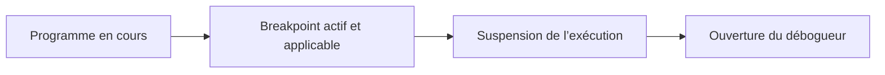

# 🌸 BREAKPOINTS DE SESSION, EXTERNES ET DU DÉBOGUEUR

## 🌺 OBJECTIFS

- Choisir le bon type de breakpoint
- Comprendre sa portée et sa durée de validité
- Arrêter un traitement dialogué ou externe
- Éviter les breakpoints placés sur le mauvais utilisateur

## 🌺 PRINCIPE

Un breakpoint demande au processeur ABAP de suspendre l’exécution à un emplacement déterminé.



## 🌺 BREAKPOINT DE SESSION

Le breakpoint de session concerne normalement les traitements exécutés par le même utilisateur dans la session SAP GUI correspondante.

Utilisation typique :

- rapport lancé depuis `SE38` ;
- transaction dialoguée ;
- programme appelé dans le même contexte utilisateur.

Il convient aux tests manuels réalisés directement dans SAP GUI.

## 🌺 BREAKPOINT EXTERNE

Le breakpoint externe est destiné aux traitements dont l’appel arrive depuis un autre canal ou une autre session, par exemple :

- requête HTTP ;
- service ICF ;
- appel RFC ;
- application web utilisant le système ABAP ;
- scénario où la session SAP GUI qui pose le breakpoint n’exécute pas directement le traitement.

Le traitement doit généralement s’exécuter avec l’utilisateur pour lequel le breakpoint externe est défini. Certains contextes techniques utilisent un autre utilisateur que celui attendu.

## 🌺 BREAKPOINT DU DÉBOGUEUR

Un breakpoint créé pendant une session de débogage est géré dans cette session. Il permet de préparer plusieurs arrêts après avoir déjà interrompu le programme.

Le Breakpoints Tool permet de lister et gérer :

- breakpoints ;
- watchpoints ;
- checkpoints.

## 🌺 BREAKPOINT DANS LE CODE

L’instruction suivante inscrit un breakpoint dans le source :

```abap
BREAK-POINT.
```

Un breakpoint codé ne doit pas être livré sans justification. Il peut interrompre les utilisateurs autorisés au débogage et polluer le code applicatif.

Pour un besoin temporaire, préférer un breakpoint défini dans l’éditeur ou le débogueur.

## 🌺 CHOIX RAPIDE

| Contexte                                  | Breakpoint conseillé               |
| ----------------------------------------- | ---------------------------------- |
| Rapport exécuté dans SAP GUI              | Session                            |
| Transaction dialoguée du même utilisateur | Session                            |
| Appel HTTP ou OData                       | Externe                            |
| Appel RFC entrant                         | Externe                            |
| Analyse après entrée dans le débogueur    | Débogueur                          |
| Point permanent contrôlé par le code      | Instruction seulement si justifiée |

## 🌺 DIAGNOSTIC D UN BREAKPOINT IGNORÉ

Contrôler :

1. utilisateur réel du traitement ;
2. ligne réellement exécutée ;
3. version active de l’objet ;
4. type de breakpoint ;
5. date d’expiration éventuelle ;
6. contexte système ou mise à jour ;
7. autorisations.

## 🌺 CAS D’USAGE

Dans un contexte où un incident ne se produit que pour certaines données et doit être reproduit puis localisé sans modifier le comportement métier, le besoin consiste à **utiliser breakpoints de session, externes et du débogueur pour collecter une preuve technique et localiser la cause d’un incident reproductible**. Cette notion est pertinente lorsque le lecteur doit pouvoir relier la syntaxe ou l’outil à une situation professionnelle concrète.

## 🌺 PROCÉDURE PAS À PAS

1. Saisir `/nSE38` dans le champ de commande.
2. Entrer le nom d’un programme Z de test, par exemple `ZREF_DEMO`, puis choisir **Créer** ou **Modifier** selon le cas.
3. Pour un exercice local uniquement, affecter `$TMP` ; pour un développement livrable, utiliser le package et l’ordre fournis par le projet.
4. Coller ou adapter le snippet du chapitre.
5. Exécuter le contrôle syntaxique avec `Ctrl+F2`.
6. Activer avec `Ctrl+F3`.
7. Exécuter avec `F8` et comparer le résultat avec la section **Vérification**.

## 🌺 VÉRIFICATION

- Le scénario reproduit correspond au même utilisateur, mandant, transaction et jeu de données.
- L’horodatage et l’identifiant de l’analyse sont conservés.
- La cause retenue est soutenue par une ligne source, une trace ou une valeur observée.
- Après correction, le même scénario ne reproduit plus le défaut et le résultat métier reste identique.

## 🌺 ERREURS FRÉQUENTES

- Copier un exemple sans adapter les types, noms d’objets et données disponibles dans le système.
- Tester uniquement le cas nominal et ignorer les valeurs initiales, absentes ou invalides.
- Modifier les données dans le débogueur puis considérer le résultat comme reproductible.
- Laisser une trace active trop longtemps.

## 🌺 SNIPPET À RÉUTILISER

> [!NOTE]
> Adapter les noms `Z*`, les types DDIC, les données et les autorisations au système cible. Effectuer un contrôle syntaxique avant activation.

```abap
BREAK-POINT.
```

## 🌺 TERMES DU LEXIQUE

- [Breakpoint](<../└─ 🧩 00 - LEXIQUE SAP ET ABAP/08 - 🍧 EXECUTION EXPLOITATION ET ADMINISTRATION.md#breakpoint>)
- [Watchpoint](<../└─ 🧩 00 - LEXIQUE SAP ET ABAP/08 - 🍧 EXECUTION EXPLOITATION ET ADMINISTRATION.md#watchpoint>)
- [Dump ABAP](<../└─ 🧩 00 - LEXIQUE SAP ET ABAP/08 - 🍧 EXECUTION EXPLOITATION ET ADMINISTRATION.md#dump-abap>)
- [Trace](<../└─ 🧩 00 - LEXIQUE SAP ET ABAP/08 - 🍧 EXECUTION EXPLOITATION ET ADMINISTRATION.md#trace>)

## 🌺 À RETENIR

- À l’issue du chapitre, le lecteur sait **utiliser breakpoints de session, externes et du débogueur pour collecter une preuve technique et localiser la cause d’un incident reproductible**.
- Toujours tester sur un objet Z ou un jeu de données sans impact avant d’intervenir sur un traitement réel.
- La documentation `F1` du système reste la référence pour la syntaxe disponible dans sa release.

## 🌺 RÉFÉRENCES OFFICIELLES SAP

- [Breakpoints — SAP Help Portal](https://help.sap.com/docs/ABAP_PLATFORM_NEW/ba879a6e2ea04d9bb94c7ccd7cdac446/491e9433f3ee6492e10000000a42189b.html)
- [Breakpoints Tool — SAP Help Portal](https://help.sap.com/docs/ABAP_PLATFORM_NEW/ba879a6e2ea04d9bb94c7ccd7cdac446/492535784d7216b5e10000000a42189d.html)
- [Managing Breakpoints in the ABAP Editor — SAP Help Portal](https://help.sap.com/docs/ABAP_PLATFORM_NEW/ba879a6e2ea04d9bb94c7ccd7cdac446/0d1f9c93dc474415810224f98551577b.html)
- [Managing Breakpoints in the ABAP Debugger — SAP Help Portal](https://help.sap.com/docs/ABAP_PLATFORM_NEW/ba879a6e2ea04d9bb94c7ccd7cdac446/e6c585648f054f33ac6384ba6a2e3bf2.html)


---

➡️ [Chapitre suivant — BREAKPOINTS CONDITIONNELS ET DYNAMIQUES](<./04 - 🍧 BREAKPOINTS CONDITIONNELS ET DYNAMIQUES.md>)
