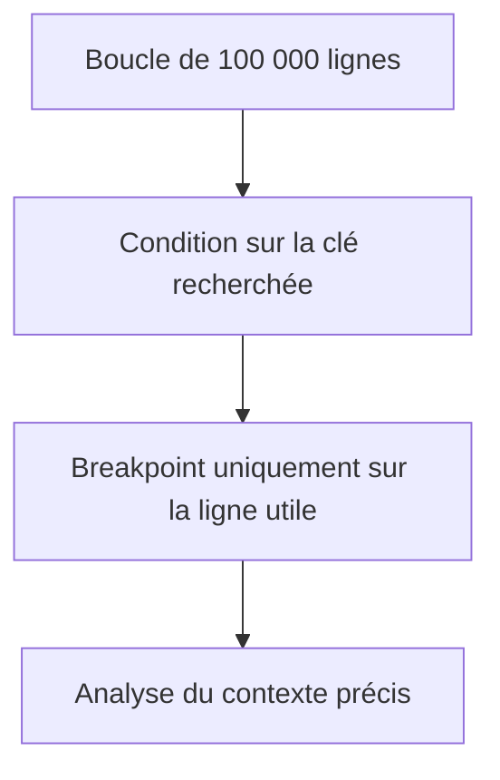

# 🌸 BREAKPOINTS CONDITIONNELS ET DYNAMIQUES

## 🌺 OBJECTIFS

- Arrêter l’exécution uniquement dans le cas utile
- Utiliser une condition pour éviter des milliers d’arrêts
- Poser un breakpoint sur une instruction ou un événement
- Réduire le coût d’analyse d’un traitement volumineux

## 🌺 BREAKPOINT CONDITIONNEL

Un breakpoint conditionnel n’interrompt l’exécution que lorsque son expression est vraie.

Exemples de conditions :

```abap
lv_matnr = '000000000000006200'
sy-subrc <> 0
lines( lt_items ) > 1000
```

La condition doit être :

- simple ;
- sans effet de bord ;
- basée sur des données disponibles à cet emplacement ;
- assez sélective pour éviter des arrêts inutiles.

## 🌺 CAS D USAGE



Un breakpoint non conditionnel placé dans une boucle massive rend l’analyse lente et peut immobiliser inutilement le traitement.

## 🌺 BREAKPOINT SUR UNE INSTRUCTION ABAP

Le débogueur permet de demander un arrêt lorsqu’une instruction particulière est rencontrée, par exemple :

- `MESSAGE` ;
- `AUTHORITY-CHECK` ;
- `CALL FUNCTION` ;
- `COMMIT WORK` ;
- `SELECT` selon les possibilités de la version.

Cette technique est utile lorsque le programme source exact n’est pas connu.

## 🌺 BREAKPOINT SUR UN MESSAGE

Lorsque l’application émet un message précis, un breakpoint sur l’instruction ou les attributs du message permet de remonter vers l’endroit qui le déclenche.

Données utiles :

- classe de messages ;
- numéro ;
- type ;
- variables `sy-msgv1` à `sy-msgv4`.

## 🌺 BREAKPOINT SUR UNE MÉTHODE OU UN MODULE FONCTION

Selon les outils disponibles, un breakpoint dynamique peut cibler :

- une méthode ;
- un module fonction ;
- un sous-programme ;
- une instruction ABAP ;
- un écran ou un événement Dynpro.

Il évite de rechercher manuellement chaque appel dans un environnement complexe.

## 🌺 PRÉCAUTIONS

- ne pas définir une condition coûteuse ;
- éviter les appels de méthode susceptibles de modifier l’état ;
- vérifier les conversions implicites ;
- supprimer les breakpoints devenus inutiles ;
- ne pas utiliser une condition dépendant d’une variable hors portée.

## 🌺 RÉFÉRENCES OFFICIELLES SAP

- [Managing Dynamic Breakpoints — SAP Help Portal](https://help.sap.com/docs/ABAP_PLATFORM_NEW/ba879a6e2ea04d9bb94c7ccd7cdac446/49256af629ac16b7e10000000a42189d.html)
- [Breakpoints Tool — SAP Help Portal](https://help.sap.com/docs/ABAP_PLATFORM_NEW/ba879a6e2ea04d9bb94c7ccd7cdac446/492535784d7216b5e10000000a42189d.html)
- [Breakpoints — SAP Help Portal](https://help.sap.com/docs/ABAP_PLATFORM_NEW/ba879a6e2ea04d9bb94c7ccd7cdac446/491e9433f3ee6492e10000000a42189b.html)

---

➡️ [Chapitre suivant — WATCHPOINTS](<./05 - 🍧 WATCHPOINTS.md>)
