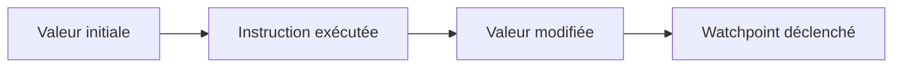

# 🌸 WATCHPOINTS

## 🌺 OBJECTIFS

- Arrêter l’exécution lors de la modification d’une donnée
- Distinguer watchpoint et breakpoint
- Ajouter une condition de déclenchement
- Retrouver l’instruction qui altère une valeur

## 🌺 PRINCIPE

Un watchpoint surveille un objet de données pendant la session de débogage. Le débogueur s’arrête lorsque la valeur surveillée change ou lorsque la condition associée devient vraie.



## 🌺 DIFFÉRENCE AVEC UN BREAKPOINT

| Breakpoint                                 | Watchpoint                                            |
| ------------------------------------------ | ----------------------------------------------------- |
| Associé à un emplacement ou événement      | Associé à une donnée                                  |
| Arrête avant ou sur une instruction ciblée | Arrête après la modification détectée                 |
| Requiert de connaître le point probable    | Utile lorsque l’auteur de la modification est inconnu |

## 🌺 EXEMPLE

Une quantité devient négative, mais plusieurs procédures peuvent la modifier.

1. démarrer le débogueur avant la divergence ;
2. afficher `lv_quantity` ;
3. créer un watchpoint sur cette variable ;
4. poursuivre avec **Continuer** ;
5. analyser l’instruction ayant produit la nouvelle valeur.

Condition possible :

```abap
lv_quantity < 0
```

## 🌺 VALEUR AVANT ET APRÈS

L’outil de watchpoints peut afficher :

- la valeur actuelle ;
- la valeur avant la dernière modification ;
- la condition ;
- l’état actif du watchpoint.

Comparer les deux valeurs permet de vérifier que l’arrêt correspond bien à la divergence recherchée.

## 🌺 LIMITES

Un watchpoint peut perdre sa validité lorsque :

- la variable locale sort de sa portée ;
- une référence ne pointe plus sur le même objet ;
- la session interne change ;
- l’objet surveillé est recréé ;
- le traitement passe dans un autre contexte technique.

Les détails varient selon la version du débogueur et le type de donnée.

## 🌺 BONNES PRATIQUES

- surveiller une donnée précise plutôt qu’une structure complète ;
- ajouter une condition restrictive ;
- supprimer les watchpoints inutiles ;
- documenter la valeur attendue ;
- vérifier la pile d’appels au déclenchement.

## 🌺 PROCÉDURE PAS À PAS

1. Saisir `/nATC` ou utiliser l’entrée ATC disponible dans le système.
2. Choisir une variante de contrôle autorisée.
3. Lancer le contrôle sur l’objet, le package ou l’ordre de transport.
4. Classer les findings par priorité et corriger d’abord les erreurs bloquantes.
5. Demander une exemption uniquement avec justification, propriétaire et échéance.
6. Relancer le contrôle avant libération.

## 🌺 VÉRIFICATION

- Le scénario reproduit correspond au même utilisateur, mandant, transaction et jeu de données.
- L’horodatage et l’identifiant de l’analyse sont conservés.
- La cause retenue est soutenue par une ligne source, une trace ou une valeur observée.
- Après correction, le même scénario ne reproduit plus le défaut et le résultat métier reste identique.

## 🌺 ERREURS FRÉQUENTES

- Copier un exemple sans adapter les types, noms d’objets et données disponibles dans le système.
- Tester uniquement le cas nominal et ignorer les valeurs initiales, absentes ou invalides.
- Modifier les données dans le débogueur puis considérer le résultat comme reproductible.
- Laisser une trace active trop longtemps.

## 🌺 SNIPPET À RÉUTILISER

> [!NOTE]
> Adapter les noms `Z*`, les types DDIC, les données et les autorisations au système cible. Effectuer un contrôle syntaxique avant activation.

```abap
lv_quantity < 0
```

## 🌺 TERMES DU LEXIQUE

- [Watchpoint](<../└─ 🧩 00 - LEXIQUE SAP ET ABAP/08 - 🍧 EXECUTION EXPLOITATION ET ADMINISTRATION.md#watchpoint>)
- [Breakpoint](<../└─ 🧩 00 - LEXIQUE SAP ET ABAP/08 - 🍧 EXECUTION EXPLOITATION ET ADMINISTRATION.md#breakpoint>)
- [Dump ABAP](<../└─ 🧩 00 - LEXIQUE SAP ET ABAP/08 - 🍧 EXECUTION EXPLOITATION ET ADMINISTRATION.md#dump-abap>)
- [Trace](<../└─ 🧩 00 - LEXIQUE SAP ET ABAP/08 - 🍧 EXECUTION EXPLOITATION ET ADMINISTRATION.md#trace>)

## 🌺 RÉFÉRENCES OFFICIELLES SAP

- [Watchpoints — SAP Help Portal](https://help.sap.com/docs/ABAP_PLATFORM_NEW/ba879a6e2ea04d9bb94c7ccd7cdac446/4926d933c93016b8e10000000a42189d.html)
- [Breakpoints Tool — SAP Help Portal](https://help.sap.com/docs/ABAP_PLATFORM_NEW/ba879a6e2ea04d9bb94c7ccd7cdac446/492535784d7216b5e10000000a42189d.html)


---

➡️ [Chapitre suivant — PILOTER L’EXÉCUTION DU PROGRAMME](<./06 - 🍧 PILOTER L EXECUTION DU PROGRAMME.md>)
