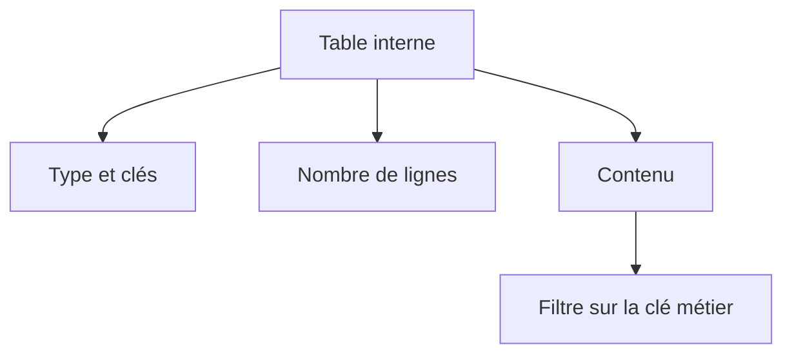

# 🌸 ANALYSER LES TABLES INTERNES

## 🌺 OBJECTIFS

- Afficher le contenu d’une table interne
- Identifier son type, sa clé et son volume
- Filtrer, trier et organiser les colonnes
- Contrôler les références ou structures imbriquées
- Modifier temporairement une ligne à des fins de diagnostic

## 🌺 TABLE TOOL

Le débogueur ABAP fournit un outil spécialisé pour les tables internes. Il permet notamment de :

- afficher les lignes ;
- configurer les colonnes ;
- afficher des composants imbriqués ;
- visualiser les attributs d’objets référencés ;
- filtrer et trier l’affichage ;
- modifier, ajouter ou supprimer temporairement des lignes selon le contexte.

## 🌺 PREMIERS CONTRÔLES

Avant d’examiner les lignes, vérifier :

- type `STANDARD`, `SORTED` ou `HASHED` ;
- nombre de lignes ;
- clé primaire ;
- clés secondaires ;
- présence d’une ligne d’en-tête dans un code ancien ;
- type de ligne.



## 🌺 FILTRER LE CONTENU

Pour une table volumineuse, filtrer sur une clé pertinente :

- numéro de document ;
- article ;
- division ;
- statut ;
- identifiant technique.

Ne pas parcourir manuellement des milliers de lignes si le critère de divergence est connu.

## 🌺 STRUCTURES IMBRIQUÉES ET RÉFÉRENCES

Le configurateur de colonnes peut permettre d’ajouter :

- un composant d’une structure imbriquée ;
- un attribut d’un objet référencé ;
- un champ de clé masqué dans l’affichage initial.

Cette vue facilite l’analyse sans modifier le type ou le code source.

## 🌺 MODIFICATION TEMPORAIRE

Modifier une table dans le débogueur permet de tester une hypothèse, par exemple :

- ajouter la ligne manquante ;
- corriger un statut ;
- supprimer un doublon ;
- remplacer une quantité.

Cette manipulation ne constitue pas une correction. Elle peut changer le résultat du scénario et doit être documentée.

## 🌺 ERREURS FRÉQUENTES

- table initiale car le `SELECT` n’a rien retourné ;
- filtre trop restrictif ;
- doublons créés avant un `DELETE ADJACENT DUPLICATES` ;
- clé incomplète lors d’un `READ TABLE` ;
- ligne modifiée sur une copie `INTO` mais jamais réécrite ;
- field-symbol encore lié à la ligne actuelle ;
- tri incompatible avec le traitement suivant.

## 🌺 PROCÉDURE PAS À PAS

1. Lire la définition et identifier les prérequis du chapitre.
2. Choisir un objet Z ou un scénario de démonstration sans impact métier.
3. Reproduire l’exemple dans un système de développement et relever les données d’entrée.
4. Contrôler la syntaxe ou la configuration avant activation/exécution.
5. Comparer le résultat observé avec la section **Vérification**.
6. Documenter toute différence liée à la release, aux autorisations ou au paramétrage du système.

## 🌺 VÉRIFICATION

- Le scénario reproduit correspond au même utilisateur, mandant, transaction et jeu de données.
- L’horodatage et l’identifiant de l’analyse sont conservés.
- La cause retenue est soutenue par une ligne source, une trace ou une valeur observée.
- Après correction, le même scénario ne reproduit plus le défaut et le résultat métier reste identique.

## 🌺 FICHE DE CONTRÔLE À COPIER

```text
Système / SID       :
Mandant             :
Utilisateur         :
Transaction / outil :
Objet technique     :
Jeu de données      :
Résultat attendu    :
Résultat observé    :
Horodatage          :
Ordre de transport  :
```

## 🌺 TERMES DU LEXIQUE

- [Breakpoint](<../└─ 🧩 00 - LEXIQUE SAP ET ABAP/08 - 🍧 EXECUTION EXPLOITATION ET ADMINISTRATION.md#breakpoint>)
- [Watchpoint](<../└─ 🧩 00 - LEXIQUE SAP ET ABAP/08 - 🍧 EXECUTION EXPLOITATION ET ADMINISTRATION.md#watchpoint>)
- [Dump ABAP](<../└─ 🧩 00 - LEXIQUE SAP ET ABAP/08 - 🍧 EXECUTION EXPLOITATION ET ADMINISTRATION.md#dump-abap>)
- [Trace](<../└─ 🧩 00 - LEXIQUE SAP ET ABAP/08 - 🍧 EXECUTION EXPLOITATION ET ADMINISTRATION.md#trace>)

## 🌺 RÉFÉRENCES OFFICIELLES SAP

- [The Table Tool: Work With Internal Tables in the ABAP Debugger — SAP Help Portal](https://help.sap.com/docs/ABAP_PLATFORM_NEW/ba879a6e2ea04d9bb94c7ccd7cdac446/492db60934e414d0e10000000a42189b.html)
- [Standard ABAP Debugger — SAP Help Portal](https://help.sap.com/docs/SAP_NETWEAVER_AS_ABAP_751_IP/ba879a6e2ea04d9bb94c7ccd7cdac446/49250c884d7216b5e10000000a42189d.html)


---

➡️ [Chapitre suivant — PILE D’APPELS ET CONTEXTE D’EXÉCUTION](<./09 - 🍧 PILE D APPELS ET CONTEXTE D EXECUTION.md>)
