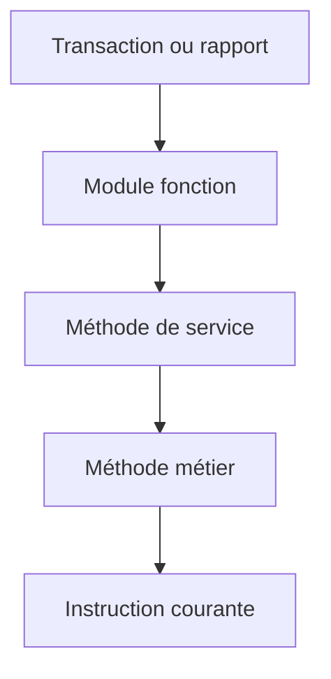

# 🌸 PILE D’APPELS ET CONTEXTE D’EXÉCUTION

## 🌺 OBJECTIFS

- Comprendre comment le traitement a atteint la ligne courante
- Naviguer entre appelants et appelés
- Retrouver les paramètres et variables locales d’un niveau
- Distinguer pile ABAP et pile Dynpro
- Identifier le premier appel métier pertinent

## 🌺 PRINCIPE

La pile d’appels représente les blocs actifs qui ont conduit à l’instruction courante.

## 🌺 INFORMATIONS DISPONIBLES

Selon la version, une entrée de pile peut indiquer :

- profondeur ;
- type ABAP ou Dynpro ;
- type d’événement ;
- nom de méthode, module ou routine ;
- programme ;
- include ;
- numéro de ligne.

## 🌺 NAVIGUER DANS LA PILE

En sélectionnant un niveau, le débogueur repositionne le contexte visible :

- variables locales de la procédure ;
- paramètres d’entrée et de sortie ;
- variables globales du programme ;
- source correspondant à l’appel.

La navigation dans la pile n’exécute pas le programme. Elle change uniquement le contexte d’analyse.

## 🌺 TROUVER LA CAUSE

Lorsqu’une erreur apparaît dans une routine générique standard, remonter la pile jusqu’au premier niveau qui :

- appartient au développement client ;
- construit les données incorrectes ;
- choisit un paramètre erroné ;
- appelle l’API standard avec un contrat non respecté.

La ligne qui déclenche l’erreur n’est pas toujours la ligne qui crée sa cause.

## 🌺 PILE DYNPRO

Dans une application classique, la pile peut inclure :

- PBO ;
- PAI ;
- modules d’écran ;
- programmes ABAP associés.

Un contexte Dynpro expose principalement les données globales du programme d’écran. Les variables locales appartiennent aux procédures ABAP actives.

## 🌺 PROGRAMMES SYSTÈME

Les programmes système peuvent être masqués ou affichés différemment. Leur analyse nécessite l’activation du débogage système et les autorisations appropriées.

Activer ce mode uniquement lorsque le problème se situe réellement dans une couche système ou standard.

## 🌺 RÉFÉRENCES OFFICIELLES SAP

- [Call Stack — SAP Help Portal](https://help.sap.com/docs/ABAP_PLATFORM_NEW/ba879a6e2ea04d9bb94c7ccd7cdac446/88feb68f058446539bb51e8d95caac00.html)
- [System Debugging — SAP Help Portal](https://help.sap.com/docs/ABAP_PLATFORM_NEW/ba879a6e2ea04d9bb94c7ccd7cdac446/4925636629ac16b7e10000000a42189d.html)

---

➡️ [Chapitre suivant — MODIFIER LES DONNEES ET LE FLUX D EXECUTION](<./10 - 🍧 MODIFIER LES DONNEES ET LE FLUX D EXECUTION.md>)
