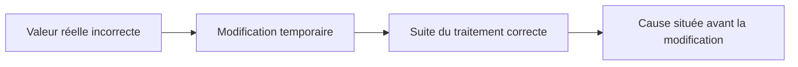

# 🌸 MODIFIER LES DONNÉES ET LE FLUX D’EXÉCUTION

## 🌺 OBJECTIFS

- Modifier temporairement une variable dans le débogueur
- Tester une branche alternative
- Comprendre les risques d’un saut d’instruction
- Distinguer diagnostic et correction
- Préserver la cohérence transactionnelle

## 🌺 MODIFIER UNE VALEUR

Le débogueur peut autoriser la modification de certaines variables :

- variables élémentaires ;
- composants de structures ;
- lignes de tables internes ;
- attributs accessibles ;
- paramètres selon leur mode de passage.

Exemple de diagnostic : remplacer temporairement un statut pour vérifier si la suite du traitement fonctionne.

## 🌺 TESTER UNE HYPOTHÈSE



Cette conclusion reste une hypothèse à confirmer dans le code qui produit la valeur réelle.

## 🌺 SAUTER VERS UNE INSTRUCTION

Le débogueur peut proposer une fonction de déplacement de l’instruction courante. Elle peut :

- sauter un bloc ;
- rejouer une instruction ;
- forcer une branche ;
- contourner temporairement un arrêt.

Cette fonction modifie le flux réel. Elle peut rendre incohérents :

- variables ;
- verrous ;
- ressources ;
- mises à jour ;
- état d’un objet ;
- pile d’appels.

## 🌺 INTERDICTIONS PRATIQUES

Ne pas utiliser un saut pour :

- contourner un contrôle d’autorisation ;
- valider une transaction productive ;
- ignorer une étape de mise à jour ;
- simuler une correction définitive ;
- modifier une donnée métier réelle sans procédure autorisée.

## 🌺 EFFETS TRANSACTIONNELS

Le débogueur ne neutralise pas les opérations de base de données. Une exécution poursuivie peut atteindre :

- `COMMIT WORK` ;
- appel de mise à jour ;
- création de verrou ;
- envoi de message ou document ;
- interface externe.

Réaliser les manipulations sur un système et des données de test appropriés.

## 🌺 PREUVE À CONSERVER

Pour toute modification temporaire, noter :

- variable ;
- ancienne valeur ;
- nouvelle valeur ;
- ligne ;
- résultat observé ;
- hypothèse validée ou rejetée.

## 🌺 CAS D’USAGE

Dans un contexte où un incident ne se produit que pour certaines données et doit être reproduit puis localisé sans modifier le comportement métier, le besoin consiste à **répéter un traitement un nombre connu ou borné de fois**. Cette notion est pertinente lorsque une modification trop large peut altérer des données ou des usages non prévus.

## 🌺 PROCÉDURE PAS À PAS

1. Lire la définition et identifier les prérequis du chapitre.
2. Choisir un objet Z ou un scénario de démonstration sans impact métier.
3. Reproduire l’exemple dans un système de développement et relever les données d’entrée.
4. Contrôler la syntaxe ou la configuration avant activation/exécution.
5. Comparer le résultat observé avec la section **Vérification**.
6. Documenter toute différence liée à la release, aux autorisations ou au paramétrage du système.

## 🌺 VÉRIFICATION

- Le scénario reproduit correspond au même utilisateur, mandant, transaction et jeu de données.
- L’horodatage et l’identifiant de l’analyse sont conservés.
- La cause retenue est soutenue par une ligne source, une trace ou une valeur observée.
- Après correction, le même scénario ne reproduit plus le défaut et le résultat métier reste identique.

## 🌺 ERREURS FRÉQUENTES

- Modifier les données dans le débogueur puis considérer le résultat comme reproductible.
- Laisser une trace active trop longtemps.

## 🌺 FICHE DE CONTRÔLE À COPIER

```text
Système / SID       :
Mandant             :
Utilisateur         :
Transaction / outil :
Objet technique     :
Jeu de données      :
Résultat attendu    :
Résultat observé    :
Horodatage          :
Ordre de transport  :
```

## 🌺 TERMES DU LEXIQUE

- [Breakpoint](<../└─ 🧩 00 - LEXIQUE SAP ET ABAP/08 - 🍧 EXECUTION EXPLOITATION ET ADMINISTRATION.md#breakpoint>)
- [Watchpoint](<../└─ 🧩 00 - LEXIQUE SAP ET ABAP/08 - 🍧 EXECUTION EXPLOITATION ET ADMINISTRATION.md#watchpoint>)
- [Dump ABAP](<../└─ 🧩 00 - LEXIQUE SAP ET ABAP/08 - 🍧 EXECUTION EXPLOITATION ET ADMINISTRATION.md#dump-abap>)
- [Trace](<../└─ 🧩 00 - LEXIQUE SAP ET ABAP/08 - 🍧 EXECUTION EXPLOITATION ET ADMINISTRATION.md#trace>)

## 🌺 À RETENIR

- À l’issue du chapitre, le lecteur sait **répéter un traitement un nombre connu ou borné de fois**.
- Toujours tester sur un objet Z ou un jeu de données sans impact avant d’intervenir sur un traitement réel.
- La documentation `F1` du système reste la référence pour la syntaxe disponible dans sa release.

## 🌺 RÉFÉRENCES OFFICIELLES SAP

- [Source Code Execution and Navigation — SAP Help Portal](https://help.sap.com/docs/ABAP_PLATFORM_NEW/ba879a6e2ea04d9bb94c7ccd7cdac446/679664bc4ac74d2d82a05f458396797c.html)
- [The Table Tool — SAP Help Portal](https://help.sap.com/docs/ABAP_PLATFORM_NEW/ba879a6e2ea04d9bb94c7ccd7cdac446/492db60934e414d0e10000000a42189b.html)
- [Standard ABAP Debugger — SAP Help Portal](https://help.sap.com/docs/SAP_NETWEAVER_AS_ABAP_751_IP/ba879a6e2ea04d9bb94c7ccd7cdac446/49250c884d7216b5e10000000a42189d.html)


---

➡️ [Chapitre suivant — DEBUG SYSTÈME ET TRAITEMENTS SPÉCIAUX](<./11 - 🍧 DEBUG SYSTEME ET TRAITEMENTS SPECIAUX.md>)
