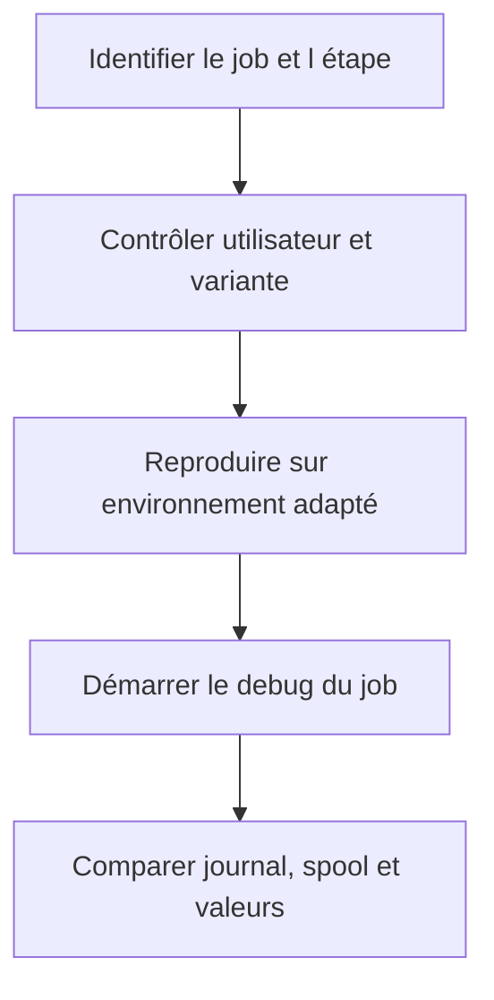

# 🌸 DEBUG DES JOBS ET TRAITEMENTS EN ARRIÈRE-PLAN

## 🌺 OBJECTIFS

- Comprendre les différences entre dialogue et arrière-plan
- Déboguer un job sélectionné dans `SM37`
- Contrôler variante, utilisateur et étape du job
- Identifier les limites de la simulation dialoguée
- Éviter de perturber un job productif

## 🌺 CONTEXTE D UN JOB

Un job de fond possède notamment :

- un utilisateur d’exécution ;
- une ou plusieurs étapes ;
- un programme ou une commande ;
- une variante ;
- une condition de démarrage ;
- un journal et éventuellement un spool.

Avant de déboguer, vérifier que le problème ne provient pas simplement de la variante ou de l’utilisateur du job.

## 🌺 DÉBOGAGE AVEC SM37

SAP documente une procédure de débogage d’un job sélectionné dans `SM37` à l’aide de la commande `JDBG`. Le job et ses étapes sont alors exécutés dans un processus dialogué afin de permettre l’utilisation des outils habituels du débogueur.

Cette opération doit être réalisée sur un job approprié et avec les autorisations nécessaires.

## 🌺 LIMITES DE LA SIMULATION

La simulation conserve certaines caractéristiques d’un traitement de fond, notamment `sy-batch = 'X'`, mais elle ne reproduit pas parfaitement tous les comportements d’un véritable processus de fond.

Différences possibles :

- zones mémoire ;
- absence d’accès réel à SAP GUI ;
- environnement de spool ;
- temporisation ;
- parallélisme ;
- appels externes ;
- ressources disponibles.

## 🌺 MÉTHODE

## 🌺 POINTS À CONTRÔLER

- `sy-batch` ;
- `sy-uname` ;
- `sy-repid` ;
- variante réellement chargée ;
- paramètres de sélection ;
- droits de l’utilisateur du job ;
- fichiers et chemins serveur ;
- dépendances à une interface graphique ;
- `COMMIT WORK` et mises à jour ;
- temporisation ou volume de données.

## 🌺 ALTERNATIVE AU DEBUG

Pour un job long ou difficile à reproduire, préférer parfois :

- journal applicatif ;
- spool ;
- dump `ST22` ;
- analyse `SAT` ou `ST12` ;
- traces d’interface ;
- instrumentation temporaire contrôlée.

## 🌺 RÉFÉRENCES OFFICIELLES SAP

- [Starting and Directly Debugging ABAP Programs — SAP Help Portal](https://help.sap.com/docs/ABAP_PLATFORM_NEW/ba879a6e2ea04d9bb94c7ccd7cdac446/a95208086a6e448aa35f08357d958af5.html)
- [Batch Debugging — SAP Help Portal](https://help.sap.com/docs/ABAP_PLATFORM_NEW/ba879a6e2ea04d9bb94c7ccd7cdac446/bf1a5464da734b559d94199e80926005.html)

---

➡️ [Chapitre suivant — ANALYSER LES DUMPS AVEC ST22](<./13 - 🍧 ANALYSER LES DUMPS AVEC ST22.md>)
