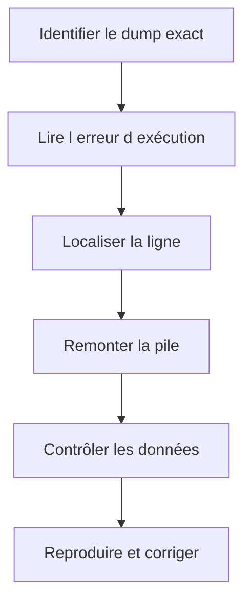

# 🌸 ANALYSER LES DUMPS AVEC ST22

## 🌺 OBJECTIFS

- Comprendre ce qu’est un dump ABAP
- Retrouver un dump avec `ST22`
- Lire les sections les plus utiles
- Relier l’erreur d’exécution au code et aux données
- Distinguer cause immédiate et cause initiale

## 🌺 PRINCIPE

Lorsqu’une erreur d’exécution non gérée interrompt un programme ABAP, le système produit un **short dump** contenant le contexte technique disponible.

`ST22` permet de lister et analyser les erreurs d’exécution enregistrées pour le système et le mandant accessibles à l’utilisateur autorisé.

## 🌺 SÉLECTION

Rechercher avec :

- date et heure ;
- utilisateur ;
- programme ;
- erreur d’exécution ;
- mandant ;
- serveur lorsque disponible.

L’heure exacte fournie par l’utilisateur réduit fortement le périmètre.

## 🌺 SECTIONS PRIORITAIRES

| Section              | Utilité                                  |
| -------------------- | ---------------------------------------- |
| Erreur d’exécution   | Catégorie technique                      |
| Exception            | Classe d’exception non gérée éventuelle  |
| Programme            | Objet interrompu                         |
| Analyse de l’erreur  | Explication du mécanisme                 |
| Comment corriger     | Orientations générales                   |
| Point d’arrêt        | Ligne et include concernés               |
| Source code extract  | Instructions autour de l’arrêt           |
| Pile d’appels        | Chemin ayant conduit au dump             |
| Variables            | Valeurs disponibles au moment de l’arrêt |
| Informations système | Contexte d’exécution                     |

## 🌺 MÉTHODE DE LECTURE

## 🌺 EXCEPTION NON GÉRÉE

Si le dump contient une classe `CX_*`, déterminer :

- quelle instruction l’a levée ;
- pourquoi aucun `CATCH` applicable ne l’a interceptée ;
- si l’exception devait être gérée localement ou propagée ;
- si les données d’entrée rendaient l’erreur prévisible.

Ne pas ajouter systématiquement `CATCH cx_root`. Le traitement doit préserver le sens de l’erreur.

## 🌺 ERREURS DE MÉMOIRE OU DE TEMPS

Un dump de mémoire, de temps maximal ou de ressources requiert souvent des outils complémentaires :

- `SAT` ;
- `ST05` ;
- Memory Inspector ;
- analyse du volume ;
- contrôle des boucles et lectures SQL.

## 🌺 AUTORISATION

L’accès aux dumps est protégé. SAP documente notamment l’objet d’autorisation `S_ABAPDUMP` pour l’analyse des dumps.

## 🌺 RÉFÉRENCES OFFICIELLES SAP

- [ABAP Dump Analysis ST22 — SAP Help Portal](https://help.sap.com/docs/ABAP_PLATFORM_NEW/ba879a6e2ea04d9bb94c7ccd7cdac446/b134ab1cd8e44562b0fee9524c638cca.html)
- [ABAP Test and Analysis Tools — SAP Help Portal](https://help.sap.com/docs/ABAP_PLATFORM_NEW/ba879a6e2ea04d9bb94c7ccd7cdac446/491aa66f87041903e10000000a42189c.html)

---

➡️ [Chapitre suivant — ANALYSER LE TEMPS D EXECUTION AVEC SAT](<./14 - 🍧 ANALYSER LE TEMPS D EXECUTION AVEC SAT.md>)
