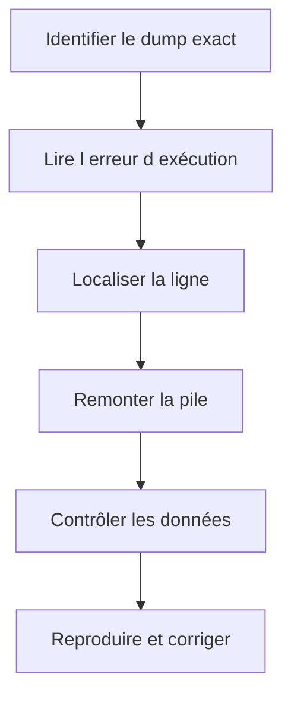

# 🌸 ANALYSER LES DUMPS AVEC ST22

## 🌺 OBJECTIFS

- Comprendre ce qu’est un dump ABAP
- Retrouver un dump avec `ST22`
- Lire les sections les plus utiles
- Relier l’erreur d’exécution au code et aux données
- Distinguer cause immédiate et cause initiale

## 🌺 PRINCIPE

Lorsqu’une erreur d’exécution non gérée interrompt un programme ABAP, le système produit un **short dump** contenant le contexte technique disponible.

`ST22` permet de lister et analyser les erreurs d’exécution enregistrées pour le système et le mandant accessibles à l’utilisateur autorisé.

## 🌺 SÉLECTION

Rechercher avec :

- date et heure ;
- utilisateur ;
- programme ;
- erreur d’exécution ;
- mandant ;
- serveur lorsque disponible.

L’heure exacte fournie par l’utilisateur réduit fortement le périmètre.

## 🌺 SECTIONS PRIORITAIRES

| Section              | Utilité                                  |
| -------------------- | ---------------------------------------- |
| Erreur d’exécution   | Catégorie technique                      |
| Exception            | Classe d’exception non gérée éventuelle  |
| Programme            | Objet interrompu                         |
| Analyse de l’erreur  | Explication du mécanisme                 |
| Comment corriger     | Orientations générales                   |
| Point d’arrêt        | Ligne et include concernés               |
| Source code extract  | Instructions autour de l’arrêt           |
| Pile d’appels        | Chemin ayant conduit au dump             |
| Variables            | Valeurs disponibles au moment de l’arrêt |
| Informations système | Contexte d’exécution                     |

## 🌺 MÉTHODE DE LECTURE



## 🌺 EXCEPTION NON GÉRÉE

Si le dump contient une classe `CX_*`, déterminer :

- quelle instruction l’a levée ;
- pourquoi aucun `CATCH` applicable ne l’a interceptée ;
- si l’exception devait être gérée localement ou propagée ;
- si les données d’entrée rendaient l’erreur prévisible.

Ne pas ajouter systématiquement `CATCH cx_root`. Le traitement doit préserver le sens de l’erreur.

## 🌺 ERREURS DE MÉMOIRE OU DE TEMPS

Un dump de mémoire, de temps maximal ou de ressources requiert souvent des outils complémentaires :

- `SAT` ;
- `ST05` ;
- Memory Inspector ;
- analyse du volume ;
- contrôle des boucles et lectures SQL.

## 🌺 AUTORISATION

L’accès aux dumps est protégé. SAP documente notamment l’objet d’autorisation `S_ABAPDUMP` pour l’analyse des dumps.

## 🌺 CAS D’USAGE

Dans un contexte où un incident ne se produit que pour certaines données et doit être reproduit puis localisé sans modifier le comportement métier, le besoin consiste à **retrouver le dump correspondant au scénario et identifier la cause technique**. Cette notion est pertinente lorsque la modification ne doit intervenir qu’après identification du bon objet et de son impact.

## 🌺 PROCÉDURE PAS À PAS

1. Saisir `/nST22`.
2. Choisir la période correspondant à la reproduction.
3. Filtrer par utilisateur, transaction ou runtime error lorsque nécessaire.
4. Ouvrir le dump et relever le nom de l’erreur, l’exception, le programme et la ligne source.
5. Lire les sections **Error analysis**, **How to correct the error** et **Source Code Extract**.
6. Corréler le dump avec les données d’entrée et la version active du code.

## 🌺 VÉRIFICATION

- Le scénario reproduit correspond au même utilisateur, mandant, transaction et jeu de données.
- L’horodatage et l’identifiant de l’analyse sont conservés.
- La cause retenue est soutenue par une ligne source, une trace ou une valeur observée.
- Après correction, le même scénario ne reproduit plus le défaut et le résultat métier reste identique.

## 🌺 ERREURS FRÉQUENTES

- Modifier les données dans le débogueur puis considérer le résultat comme reproductible.
- Laisser une trace active trop longtemps.

## 🌺 FICHE DE CONTRÔLE À COPIER

```text
Système / SID       :
Mandant             :
Utilisateur         :
Transaction / outil :
Objet technique     :
Jeu de données      :
Résultat attendu    :
Résultat observé    :
Horodatage          :
Ordre de transport  :
```

## 🌺 TERMES DU LEXIQUE

- [Breakpoint](<../└─ 🧩 00 - LEXIQUE SAP ET ABAP/08 - 🍧 EXECUTION EXPLOITATION ET ADMINISTRATION.md#breakpoint>)
- [Watchpoint](<../└─ 🧩 00 - LEXIQUE SAP ET ABAP/08 - 🍧 EXECUTION EXPLOITATION ET ADMINISTRATION.md#watchpoint>)
- [Dump ABAP](<../└─ 🧩 00 - LEXIQUE SAP ET ABAP/08 - 🍧 EXECUTION EXPLOITATION ET ADMINISTRATION.md#dump-abap>)
- [Trace](<../└─ 🧩 00 - LEXIQUE SAP ET ABAP/08 - 🍧 EXECUTION EXPLOITATION ET ADMINISTRATION.md#trace>)

## 🌺 À RETENIR

- À l’issue du chapitre, le lecteur sait **retrouver le dump correspondant au scénario et identifier la cause technique**.
- Toujours tester sur un objet Z ou un jeu de données sans impact avant d’intervenir sur un traitement réel.
- La documentation `F1` du système reste la référence pour la syntaxe disponible dans sa release.

## 🌺 RÉFÉRENCES OFFICIELLES SAP

- [ABAP Dump Analysis ST22 — SAP Help Portal](https://help.sap.com/docs/ABAP_PLATFORM_NEW/ba879a6e2ea04d9bb94c7ccd7cdac446/b134ab1cd8e44562b0fee9524c638cca.html)
- [ABAP Test and Analysis Tools — SAP Help Portal](https://help.sap.com/docs/ABAP_PLATFORM_NEW/ba879a6e2ea04d9bb94c7ccd7cdac446/491aa66f87041903e10000000a42189c.html)


---

➡️ [Chapitre suivant — ANALYSER LE TEMPS D’EXÉCUTION AVEC SAT](<./14 - 🍧 ANALYSER LE TEMPS D EXECUTION AVEC SAT.md>)
