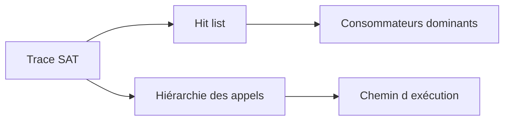

# 🌸 ANALYSER LE TEMPS D’EXÉCUTION AVEC SAT

## 🌺 OBJECTIFS

- Mesurer l’exécution d’un programme ABAP
- Distinguer temps ABAP, base de données et système
- Identifier les appels dominants
- Limiter la trace au scénario utile
- Utiliser le résultat pour formuler une hypothèse

## 🌺 RÔLE DE SAT

La transaction `SAT` réalise une analyse d’exécution ABAP. Elle mesure les appels et temps consommés pendant un scénario enregistré.

Elle convient pour analyser :

- rapport ;
- transaction ;
- module fonction ;
- méthode ;
- unité de traitement reproductible.

## 🌺 PRÉPARATION

Définir avant l’enregistrement :

- utilisateur ;
- programme ou transaction ;
- scénario exact ;
- variante ou données ;
- durée attendue ;
- filtre ou agrégation souhaitée.

Une trace trop large produit un résultat difficile à exploiter.

## 🌺 LECTURE DU RÉSULTAT

Analyser notamment :

- temps total ;
- temps propre ;
- temps cumulé ;
- nombre d’appels ;
- hiérarchie des appels ;
- appels SQL ;
- instructions ou procédures dominantes.

## 🌺 TEMPS PROPRE ET CUMULÉ

- **Temps propre** : temps consommé directement dans l’unité mesurée.
- **Temps cumulé** : temps de l’unité et des traitements qu’elle appelle.

Une méthode peut avoir un temps propre faible mais un temps cumulé élevé parce qu’elle appelle une lecture SQL coûteuse.

## 🌺 INTERPRÉTATION

Ne pas corriger uniquement la ligne la plus lente sans contexte. Vérifier :

- fréquence d’appel ;
- volume traité ;
- nécessité fonctionnelle ;
- répétition d’un accès ;
- algorithme ;
- possibilité de regrouper le traitement.

## 🌺 LIMITES

`SAT` mesure une exécution donnée. Un résultat peut varier selon :

- caches ;
- buffer ;
- charge système ;
- données ;
- utilisateur ;
- parallélisme ;
- première exécution ou exécutions suivantes.

Comparer des scénarios similaires et répéter si nécessaire.

## 🌺 RÉFÉRENCES OFFICIELLES SAP

- [Analyzing Performance with the ABAP Runtime Analysis — SAP Help Portal](https://help.sap.com/docs/ABAP_PLATFORM_NEW/ba879a6e2ea04d9bb94c7ccd7cdac446/3c74c6163ce4459888bc06dedda37685.html)
- [Runtime Analysis — SAP Help Portal](https://help.sap.com/docs/SAP_NETWEAVER_750/ba879a6e2ea04d9bb94c7ccd7cdac446/4a2f5264cfc4044fe10000000a421937.html)

---

➡️ [Chapitre suivant — ANALYSER LES ACCES AVEC ST05](<./15 - 🍧 ANALYSER LES ACCES AVEC ST05.md>)
