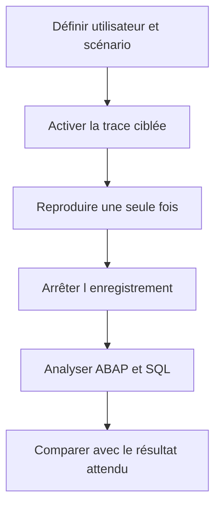

# 🌸 ANALYSE CIBLÉE AVEC ST12

## 🌺 OBJECTIFS

- Comprendre le rôle d’une analyse de transaction unique
- Corréler trace ABAP et trace SQL
- Enregistrer un scénario court et reproductible
- Identifier le chemin d’appel responsable d’un coût
- Savoir quand préférer `SAT` ou `ST05`

## 🌺 RÔLE

`ST12` est couramment utilisé pour une analyse ciblée d’une transaction ou d’un traitement en combinant des informations d’exécution ABAP et SQL dans un même scénario.

L’outil peut varier selon la version et les composants installés. Les fonctions disponibles et les autorisations doivent être vérifiées sur le système concerné.

## 🌺 QUAND L UTILISER

Utiliser une analyse ciblée lorsque :

- une transaction précise est lente ;
- le problème peut venir du code ABAP ou de la base ;
- il faut relier un accès SQL au chemin d’appel ;
- le scénario est suffisamment court pour être enregistré.

## 🌺 DÉMARCHE



## 🌺 CHOIX ENTRE OUTILS

| Besoin                         | Outil privilégié |
| ------------------------------ | ---------------- |
| Pas-à-pas et valeurs           | Débogueur        |
| Dump déjà produit              | `ST22`           |
| Temps des procédures ABAP      | `SAT`            |
| Détail des accès SQL           | `ST05`           |
| Corrélation ciblée ABAP et SQL | `ST12`           |

## 🌺 ANALYSE

Chercher :

- unités ABAP dominantes ;
- accès SQL coûteux ;
- nombre d’appels ;
- répétitions ;
- temps propre et cumulé ;
- lien entre appel métier et accès technique.

Une trace ne remplace pas la compréhension fonctionnelle. Une requête coûteuse peut être nécessaire, tandis qu’une requête rapide répétée un million de fois constitue le vrai problème.

## 🌺 PRÉCAUTIONS

- limiter la durée ;
- cibler l’utilisateur ;
- ne pas enregistrer plusieurs scénarios différents ;
- désactiver la trace ;
- conserver l’identifiant du résultat ;
- protéger les données techniques exportées.

## 🌺 CAS D’USAGE

Dans un contexte où un incident ne se produit que pour certaines données et doit être reproduit puis localisé sans modifier le comportement métier, le besoin consiste à **corréler une trace ABAP et SQL sur un scénario ciblé**. Cette notion est pertinente lorsque le lecteur doit pouvoir relier la syntaxe ou l’outil à une situation professionnelle concrète.

## 🌺 PROCÉDURE PAS À PAS

1. Saisir `/nST12`.
2. Choisir le type de trace et le contexte utilisateur/transaction.
3. Démarrer la trace, reproduire le scénario puis l’arrêter.
4. Analyser séparément la trace ABAP et la trace SQL.
5. Conserver l’identifiant de la trace pour comparer avant et après correction.

## 🌺 VÉRIFICATION

- Le scénario reproduit correspond au même utilisateur, mandant, transaction et jeu de données.
- L’horodatage et l’identifiant de l’analyse sont conservés.
- La cause retenue est soutenue par une ligne source, une trace ou une valeur observée.
- Après correction, le même scénario ne reproduit plus le défaut et le résultat métier reste identique.

## 🌺 ERREURS FRÉQUENTES

- Modifier les données dans le débogueur puis considérer le résultat comme reproductible.
- Laisser une trace active trop longtemps.

## 🌺 FICHE DE CONTRÔLE À COPIER

```text
Système / SID       :
Mandant             :
Utilisateur         :
Transaction / outil :
Objet technique     :
Jeu de données      :
Résultat attendu    :
Résultat observé    :
Horodatage          :
Ordre de transport  :
```

## 🌺 TERMES DU LEXIQUE

- [Breakpoint](<../└─ 🧩 00 - LEXIQUE SAP ET ABAP/08 - 🍧 EXECUTION EXPLOITATION ET ADMINISTRATION.md#breakpoint>)
- [Watchpoint](<../└─ 🧩 00 - LEXIQUE SAP ET ABAP/08 - 🍧 EXECUTION EXPLOITATION ET ADMINISTRATION.md#watchpoint>)
- [Dump ABAP](<../└─ 🧩 00 - LEXIQUE SAP ET ABAP/08 - 🍧 EXECUTION EXPLOITATION ET ADMINISTRATION.md#dump-abap>)
- [Trace](<../└─ 🧩 00 - LEXIQUE SAP ET ABAP/08 - 🍧 EXECUTION EXPLOITATION ET ADMINISTRATION.md#trace>)

## 🌺 À RETENIR

- À l’issue du chapitre, le lecteur sait **corréler une trace ABAP et SQL sur un scénario ciblé**.
- Toujours tester sur un objet Z ou un jeu de données sans impact avant d’intervenir sur un traitement réel.
- La documentation `F1` du système reste la référence pour la syntaxe disponible dans sa release.

## 🌺 RÉFÉRENCES OFFICIELLES SAP

- [ST12 Single Transaction Analysis — SAP Help Portal](https://help.sap.com/docs/SAP_TRADE_MANAGEMENT/d0043d28a55b45a1814735ecb296be7d/b6432c3277ba4f3187625524f58f338d.html)
- [How to Create an ST12 Performance Trace — SAP Help Portal](https://help.sap.com/docs/SUPPORT_CONTENT/abap/3353523507.html)
- [Analyzing Performance with ABAP Runtime Analysis — SAP Help Portal](https://help.sap.com/docs/ABAP_PLATFORM_NEW/ba879a6e2ea04d9bb94c7ccd7cdac446/3c74c6163ce4459888bc06dedda37685.html)
- [SQL Performance Monitoring — SAP Help Portal](https://help.sap.com/docs/ABAP_PLATFORM_NEW/a24970c68fcf4770a64bf9a78e3719e2/355d59ff44ce4f789d6b29cda7ec45fa.html)


---

➡️ [Chapitre suivant — ANALYSE MÉMOIRE AVEC MEMORY INSPECTOR](<./17 - 🍧 ANALYSE MEMOIRE AVEC MEMORY INSPECTOR.md>)
