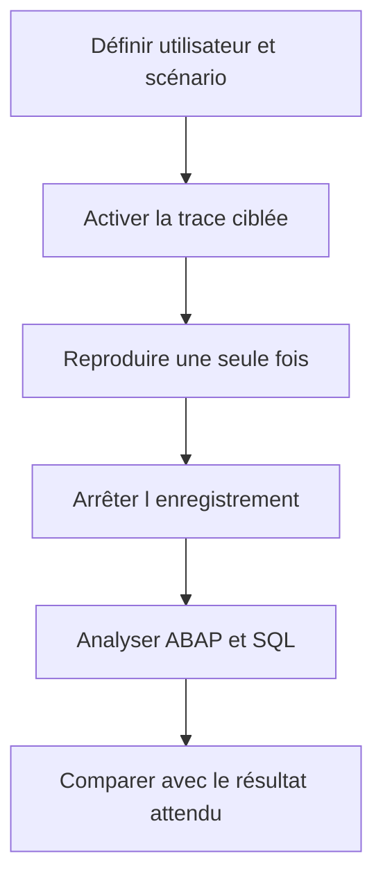

# 🌸 ANALYSE CIBLÉE AVEC ST12

## 🌺 OBJECTIFS

- Comprendre le rôle d’une analyse de transaction unique
- Corréler trace ABAP et trace SQL
- Enregistrer un scénario court et reproductible
- Identifier le chemin d’appel responsable d’un coût
- Savoir quand préférer `SAT` ou `ST05`

## 🌺 RÔLE

`ST12` est couramment utilisé pour une analyse ciblée d’une transaction ou d’un traitement en combinant des informations d’exécution ABAP et SQL dans un même scénario.

L’outil peut varier selon la version et les composants installés. Les fonctions disponibles et les autorisations doivent être vérifiées sur le système concerné.

## 🌺 QUAND L UTILISER

Utiliser une analyse ciblée lorsque :

- une transaction précise est lente ;
- le problème peut venir du code ABAP ou de la base ;
- il faut relier un accès SQL au chemin d’appel ;
- le scénario est suffisamment court pour être enregistré.

## 🌺 DÉMARCHE

## 🌺 CHOIX ENTRE OUTILS

| Besoin                         | Outil privilégié |
| ------------------------------ | ---------------- |
| Pas-à-pas et valeurs           | Débogueur        |
| Dump déjà produit              | `ST22`           |
| Temps des procédures ABAP      | `SAT`            |
| Détail des accès SQL           | `ST05`           |
| Corrélation ciblée ABAP et SQL | `ST12`           |

## 🌺 ANALYSE

Chercher :

- unités ABAP dominantes ;
- accès SQL coûteux ;
- nombre d’appels ;
- répétitions ;
- temps propre et cumulé ;
- lien entre appel métier et accès technique.

Une trace ne remplace pas la compréhension fonctionnelle. Une requête coûteuse peut être nécessaire, tandis qu’une requête rapide répétée un million de fois constitue le vrai problème.

## 🌺 PRÉCAUTIONS

- limiter la durée ;
- cibler l’utilisateur ;
- ne pas enregistrer plusieurs scénarios différents ;
- désactiver la trace ;
- conserver l’identifiant du résultat ;
- protéger les données techniques exportées.

## 🌺 RÉFÉRENCES OFFICIELLES SAP

- [ST12 Single Transaction Analysis — SAP Help Portal](https://help.sap.com/docs/SAP_TRADE_MANAGEMENT/d0043d28a55b45a1814735ecb296be7d/b6432c3277ba4f3187625524f58f338d.html)
- [How to Create an ST12 Performance Trace — SAP Help Portal](https://help.sap.com/docs/SUPPORT_CONTENT/abap/3353523507.html)
- [Analyzing Performance with ABAP Runtime Analysis — SAP Help Portal](https://help.sap.com/docs/ABAP_PLATFORM_NEW/ba879a6e2ea04d9bb94c7ccd7cdac446/3c74c6163ce4459888bc06dedda37685.html)
- [SQL Performance Monitoring — SAP Help Portal](https://help.sap.com/docs/ABAP_PLATFORM_NEW/a24970c68fcf4770a64bf9a78e3719e2/355d59ff44ce4f789d6b29cda7ec45fa.html)

---

➡️ [Chapitre suivant — ANALYSE MEMOIRE AVEC MEMORY INSPECTOR](<./17 - 🍧 ANALYSE MEMOIRE AVEC MEMORY INSPECTOR.md>)
