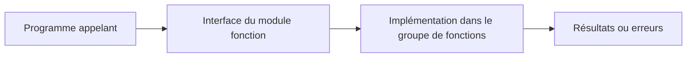

# 🌸 PRINCIPES DES MODULES FONCTION

## 🌺 OBJECTIFS

- Situer le module fonction parmi les unités de modularisation ABAP
- Comprendre son rôle d’interface globale réutilisable
- Distinguer module fonction local, RFC et BAPI
- Identifier les cas où une classe constitue un meilleur choix

## 🌺 DÉFINITION

Un **module fonction** est une procédure globale gérée dans le Function Builder. Il appartient obligatoirement à un **groupe de fonctions** et peut être appelé depuis tout programme ABAP autorisé.

Contrairement à un sous-programme `FORM`, son interface est enregistrée dans le Repository ABAP et peut être analysée indépendamment du programme appelant.

## 🌺 CARACTÉRISTIQUES

Un module fonction possède :

- un nom global dans le système ABAP ;
- une interface typée ;
- une documentation ;
- une implémentation ABAP ;
- un groupe de fonctions propriétaire ;
- éventuellement des exceptions ;
- un type de traitement : normal, distant ou mise à jour.

## 🌺 FAMILLES DE MODULES

| Famille                        | Utilisation                                                         |
| ------------------------------ | ------------------------------------------------------------------- |
| Module fonction normal         | Réutilisation interne au système ABAP                               |
| Module fonction distant        | Appel par RFC depuis un autre système ou processus                  |
| Module fonction de mise à jour | Exécution différée dans la tâche de mise à jour                     |
| BAPI                           | Interface métier stable, généralement implémentée par un module RFC |

## 🌺 CHOIX D ARCHITECTURE

Créer un module fonction lorsque :

- une API existante impose cette technologie ;
- le traitement doit être appelé par RFC ;
- un framework SAP attend un module fonction ;
- une BAPI ou une interface classique doit être consommée ;
- un traitement doit être enregistré en tâche de mise à jour.

Pour une nouvelle logique purement interne et orientée objet, préférer généralement une classe et des méthodes. Ne pas créer un module fonction uniquement pour éviter de structurer correctement le code.

## 🌺 RÈGLE ESSENTIELLE

Un module fonction constitue une **frontière d’interface**. Le contrat d’entrée, de sortie et d’erreur doit être plus stable que son implémentation.

## 🌺 RÉFÉRENCES OFFICIELLES SAP

- [Modularization with Function Modules — SAP Help Portal](https://help.sap.com/docs/SAP_NETWEAVER_AS_ABAP_752/c238d694b825421f940829321ffa326a/4ec1cbf46e391014adc9fffe4e204223.html)
- [Working with ABAP Function Groups and Modules — SAP Help Portal](https://help.sap.com/docs/ABAP_PLATFORM_NEW/c238d694b825421f940829321ffa326a/5b3370ee088a4e2b9579da3f6e994456.html)
- [Describing Remote Function Calls and BAPIs — SAP Learning](https://learning.sap.com/courses/technical-implementation-and-operation-i-of-sap-s-4hana-and-sap-business-suite/describing-remote-function-calls-and-bapis)

---

➡️ [Chapitre suivant — GROUPES DE FONCTIONS ET PROGRAMMES GÉNÉRÉS](<./02 - 🍧 GROUPES DE FONCTIONS ET PROGRAMMES GENERES.md>)
