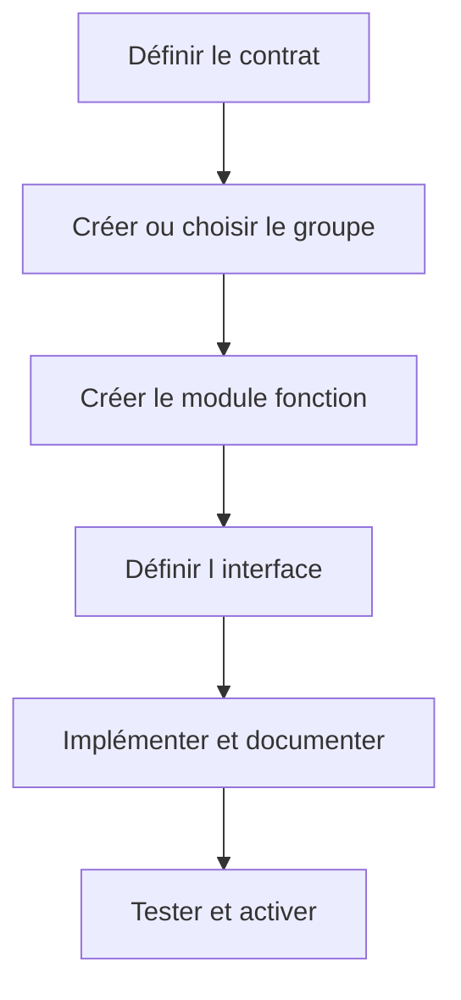

# 🌸 CRÉER UN GROUPE ET UN MODULE FONCTION

## 🌺 OBJECTIFS

- Créer un groupe de fonctions dans le namespace client
- Créer un module fonction dans `SE37`
- Affecter les objets au package et à l’ordre de transport
- Respecter les étapes d’activation

## 🌺 PRÉREQUIS

Définir avant la création :

- responsabilité du module ;
- nom dans le namespace client ;
- package ;
- groupe de fonctions ;
- interface prévue ;
- stratégie d’erreur ;
- type de traitement.

## 🌺 CRÉATION DU GROUPE

Le groupe peut être créé depuis `SE80` ou lors de la création du module selon le système.

Exemple :

```text
Groupe de fonctions : ZFG_DEV_PRODUCT
Description          : Services classiques sur les produits
Package              : ZDEV_ABAP
```

## 🌺 CRÉATION DU MODULE

Dans `SE37` :

1. saisir `Z_DEV_PRODUCT_GET` ;
2. choisir **Créer** ;
3. renseigner le groupe `ZFG_DEV_PRODUCT` ;
4. saisir une description précise ;
5. définir l’interface ;
6. implémenter le traitement ;
7. documenter ;
8. vérifier la syntaxe ;
9. activer le module et le groupe.



## 🌺 NOMMAGE

Le nom doit exprimer une action et un périmètre. Exemples :

- `Z_DEV_PRODUCT_GET`
- `Z_DEV_PRODUCT_VALIDATE`
- `Z_DEV_ORDER_CREATE`

Éviter :

- `Z_TEST1` ;
- `Z_FUNCTION` ;
- noms dépendant d’un écran ou d’un utilisateur ;
- abréviations incompréhensibles.

## 🌺 TRANSPORT

Le groupe de fonctions et les modules sont des objets Repository. Vérifier que :

- le package n’est pas `$TMP` pour un développement transportable ;
- tous les sous-objets sont enregistrés dans l’ordre correct ;
- les types DDIC requis sont transportés avant ou avec le module ;
- l’activation est complète dans le système source.

## 🌺 RÉFÉRENCES OFFICIELLES SAP

- [Creating New Function Modules — SAP Help Portal](https://help.sap.com/docs/ABAP_PLATFORM_NEW/bd833c8355f34e96a6e83096b38bf192/d1801ee8454211d189710000e8322d00.html)
- [Working with ABAP Function Groups and Modules — SAP Help Portal](https://help.sap.com/docs/ABAP_PLATFORM_NEW/c238d694b825421f940829321ffa326a/5b3370ee088a4e2b9579da3f6e994456.html)

---

➡️ [Chapitre suivant — DÉFINIR L INTERFACE DU MODULE FONCTION](<./05 - 🍧 DEFINIR L INTERFACE DU MODULE FONCTION.md>)
