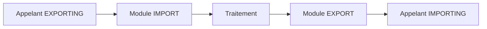

# 🌸 DÉFINIR L INTERFACE DU MODULE FONCTION

## 🌺 OBJECTIFS

- Comprendre le sens des paramètres de l’interface
- Choisir entre import, export, modification et tables
- Définir les paramètres facultatifs et valeurs par défaut
- Construire un contrat minimal et explicite

## 🌺 PERSPECTIVE DU MODULE

Les directions sont définies du point de vue du module fonction.

| Section `SE37` | Sens dans le module              | Section lors de l’appel |
| -------------- | -------------------------------- | ----------------------- |
| Import         | Le module reçoit                 | `EXPORTING`             |
| Export         | Le module retourne               | `IMPORTING`             |
| Modification   | Le module reçoit et retourne     | `CHANGING`              |
| Tables         | Table bidirectionnelle classique | `TABLES`                |



## 🌺 EXEMPLE D INTERFACE

Module fictif `Z_DEV_PRODUCT_GET` :

```text
IMPORT
  IV_MATNR TYPE MATNR

EXPORT
  ES_MARA  TYPE MARA

EXCEPTIONS
  NOT_FOUND
  INVALID_INPUT
```

L’appelant fournit le numéro article et reçoit la structure uniquement lorsque la lecture réussit.

## 🌺 PARAMÈTRES CHANGING

Utiliser `CHANGING` seulement lorsqu’une donnée représente réellement un état d’entrée-sortie. Ne pas l’utiliser pour réduire artificiellement le nombre de paramètres.

## 🌺 PARAMÈTRES TABLES

`TABLES` est une forme classique encore présente dans de nombreuses API. Pour un nouveau module non contraint par un framework, préférer généralement un paramètre tabulaire correctement typé dans `IMPORT`, `EXPORT` ou `CHANGING` lorsque la version le permet.

## 🌺 FACULTATIF ET VALEUR PAR DÉFAUT

Un paramètre facultatif doit avoir un comportement documenté lorsque l’appelant ne le fournit pas.

Exemple :

```text
IV_LANGUAGE TYPE SYLANGU OPTIONAL
```

Le code peut ensuite utiliser `sy-langu` si le paramètre est initial. Éviter les paramètres facultatifs dont l’absence produit un comportement ambigu.

## 🌺 CONTRAT MINIMAL

Une bonne interface :

- expose uniquement les données nécessaires ;
- utilise des types stables ;
- évite les structures excessivement larges ;
- ne dépend pas de données globales cachées ;
- documente les unités, formats et règles ;
- sépare résultat métier et diagnostic.

## 🌺 PROCÉDURE PAS À PAS

1. Saisir `/nSE37`.
2. Entrer le nom du module fonction puis choisir **Afficher**, **Modifier** ou **Créer** selon l’autorisation.
3. Analyser les onglets Import, Export, Changing, Tables et Exceptions.
4. Lire la documentation et le code source avant tout appel.
5. Utiliser **Test/Exécuter** avec des données non destructives.
6. Pour un module Z, contrôler, activer puis tester les cas nominal et d’erreur.

## 🌺 VÉRIFICATION

- Le lecteur peut expliquer la différence entre cette notion et les concepts proches.
- Le choix technique est justifié par un besoin concret, pas uniquement par habitude.
- Les limites liées à la release, aux autorisations et au contexte d’exécution sont identifiées.

## 🌺 ERREURS FRÉQUENTES

- Appeler un module fonction sans lire sa documentation et ses exceptions.
- Supposer qu’une BAPI effectue automatiquement le commit.

## 🌺 FICHE DE CONTRÔLE À COPIER

```text
Système / SID       :
Mandant             :
Utilisateur         :
Transaction / outil :
Objet technique     :
Jeu de données      :
Résultat attendu    :
Résultat observé    :
Horodatage          :
Ordre de transport  :
```

## 🌺 TERMES DU LEXIQUE

- [Module fonction](<../└─ 🧩 00 - LEXIQUE SAP ET ABAP/06 - 🍧 PROGRAMMES CLASSES ET OBJETS TECHNIQUES.md#module-fonction>)
- [Interface](<../└─ 🧩 00 - LEXIQUE SAP ET ABAP/07 - 🍧 INTERFACES ET INTEGRATION.md#interface-integration>)
- [Function group](<../└─ 🧩 00 - LEXIQUE SAP ET ABAP/06 - 🍧 PROGRAMMES CLASSES ET OBJETS TECHNIQUES.md#function-group>)
- [RFC](<../└─ 🧩 00 - LEXIQUE SAP ET ABAP/10 - 🍧 ACRONYMES SAP.md#acro-rfc>)
- [BAPI](<../└─ 🧩 00 - LEXIQUE SAP ET ABAP/10 - 🍧 ACRONYMES SAP.md#acro-bapi>)
- [Destination RFC](<../└─ 🧩 00 - LEXIQUE SAP ET ABAP/07 - 🍧 INTERFACES ET INTEGRATION.md#destination-rfc>)

## 🌺 RÉFÉRENCES OFFICIELLES SAP

- [Specifying Parameters and Exceptions — SAP Help Portal](https://help.sap.com/docs/ABAP_PLATFORM_2021/bd833c8355f34e96a6e83096b38bf192/d1801f0f454211d189710000e8322d00.html)
- [Interface Parameters of a Function Module — SAP Help Portal](https://help.sap.com/docs/SAP_NETWEAVER_702/ff59ad5d6c55101492f7f1c64dee0529/d1801ece454211d189710000e8322d00.html)


---

➡️ [Chapitre suivant — TYPAGE, PASSAGE DE PARAMÈTRES ET COMPATIBILITÉ](<./06 - 🍧 TYPAGE PASSAGE DE PARAMETRES ET COMPATIBILITE.md>)
