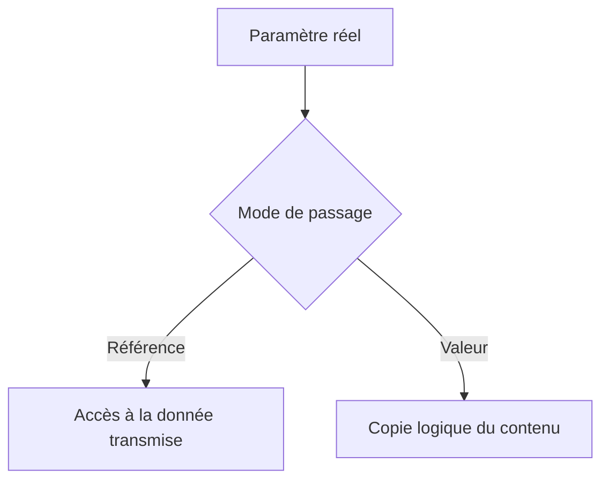

# 🌸 TYPAGE, PASSAGE DE PARAMÈTRES ET COMPATIBILITÉ

## 🌺 OBJECTIFS

- Typage correctement les paramètres
- Comprendre passage par référence et passage par valeur
- Identifier les contraintes supplémentaires du RFC
- Éviter les incompatibilités silencieuses

## 🌺 TYPAGE

Associer chaque paramètre à un type ABAP ou DDIC cohérent avec sa sémantique.

Préférer :

- un élément de données métier pour une valeur métier ;
- une structure DDIC stable pour une interface partagée ;
- un type de table nommé pour une collection ;
- une longueur et des décimales adaptées.

Éviter les champs génériques `CHAR255` utilisés comme conteneur universel.

## 🌺 PASSAGE PAR RÉFÉRENCE

Par défaut, certains paramètres d’un module normal peuvent être transmis par référence. Le module travaille alors sur la même zone mémoire logique que le paramètre réel, sous réserve des conversions techniques réalisées par l’environnement ABAP.

## 🌺 PASSAGE PAR VALEUR

Avec l’option **Passage par valeur**, le module reçoit ou retourne une copie logique de la valeur.

## 🌺 RÈGLES PRATIQUES

- Utiliser le passage par valeur lorsqu’une copie est requise par le contrat.
- Ne pas modifier un paramètre d’import dans le seul but de produire une sortie.
- Évaluer le volume des structures et tables avant d’imposer des copies inutiles.
- Ne pas baser le comportement sur un effet de bord du passage par référence.

## 🌺 CONTRAINTES RFC

Pour un module distant, les paramètres traversent une frontière de communication. La documentation ABAP impose notamment le passage par valeur pour les paramètres `IMPORTING`, `EXPORTING` et `CHANGING` d’un module RFC.

Les types doivent également être sérialisables et compatibles avec l’interface RFC. Vérifier les restrictions de la version cible avant d’exposer des références, objets ou types techniques complexes.

## 🌺 COMPATIBILITÉ

Une modification de type peut casser les appelants même si le nom du paramètre ne change pas. Avant de modifier une interface utilisée :

1. lancer la liste d’utilisation ;
2. identifier les consommateurs externes ;
3. vérifier les conversions ;
4. préserver les paramètres obligatoires existants ;
5. versionner l’API lorsque la compatibilité ne peut pas être conservée.

## 🌺 CAS D’USAGE

Dans un contexte où une logique doit être réutilisée localement ou appelée à distance tout en respectant son interface et sa transaction, le besoin consiste à **analyser ou appeler typage, passage de paramètres et compatibilité en respectant l’interface, les exceptions, les autorisations et la transaction**. Cette notion est pertinente lorsque le lecteur doit pouvoir relier la syntaxe ou l’outil à une situation professionnelle concrète.

## 🌺 PROCÉDURE PAS À PAS

1. Saisir `/nSE37`.
2. Entrer le nom du module fonction puis choisir **Afficher**, **Modifier** ou **Créer** selon l’autorisation.
3. Analyser les onglets Import, Export, Changing, Tables et Exceptions.
4. Lire la documentation et le code source avant tout appel.
5. Utiliser **Test/Exécuter** avec des données non destructives.
6. Pour un module Z, contrôler, activer puis tester les cas nominal et d’erreur.

## 🌺 VÉRIFICATION

- Le lecteur peut expliquer la différence entre cette notion et les concepts proches.
- Le choix technique est justifié par un besoin concret, pas uniquement par habitude.
- Les limites liées à la release, aux autorisations et au contexte d’exécution sont identifiées.

## 🌺 ERREURS FRÉQUENTES

- Appeler un module fonction sans lire sa documentation et ses exceptions.
- Supposer qu’une BAPI effectue automatiquement le commit.

## 🌺 TERMES DU LEXIQUE

- [Module fonction](<../└─ 🧩 00 - LEXIQUE SAP ET ABAP/06 - 🍧 PROGRAMMES CLASSES ET OBJETS TECHNIQUES.md#module-fonction>)
- [Function group](<../└─ 🧩 00 - LEXIQUE SAP ET ABAP/06 - 🍧 PROGRAMMES CLASSES ET OBJETS TECHNIQUES.md#function-group>)
- [RFC](<../└─ 🧩 00 - LEXIQUE SAP ET ABAP/10 - 🍧 ACRONYMES SAP.md#acro-rfc>)
- [BAPI](<../└─ 🧩 00 - LEXIQUE SAP ET ABAP/10 - 🍧 ACRONYMES SAP.md#acro-bapi>)
- [Destination RFC](<../└─ 🧩 00 - LEXIQUE SAP ET ABAP/07 - 🍧 INTERFACES ET INTEGRATION.md#destination-rfc>)

## 🌺 À RETENIR

- À l’issue du chapitre, le lecteur sait **analyser ou appeler typage, passage de paramètres et compatibilité en respectant l’interface, les exceptions, les autorisations et la transaction**.
- Toujours tester sur un objet Z ou un jeu de données sans impact avant d’intervenir sur un traitement réel.
- La documentation `F1` du système reste la référence pour la syntaxe disponible dans sa release.

## 🌺 RÉFÉRENCES OFFICIELLES SAP

- [CALL FUNCTION — ABAP Keyword Documentation](https://help.sap.com/doc/abapdocu_latest_index_htm/latest/en-US/abapcall_function.htm)
- [RFC Restrictions — ABAP Keyword Documentation](https://help.sap.com/doc/abapdocu_816_index_htm/8.16/en-US/ABENRFC_LIMITATIONS.html)
- [Specifying Parameters and Exceptions — SAP Help Portal](https://help.sap.com/docs/ABAP_PLATFORM_2021/bd833c8355f34e96a6e83096b38bf192/d1801f0f454211d189710000e8322d00.html)

---

➡️ [Chapitre suivant — IMPLÉMENTATION, DONNÉES GLOBALES ET INCLUDES](<./07 - 🍧 IMPLEMENTATION DONNEES GLOBALES ET INCLUDES.md>)
