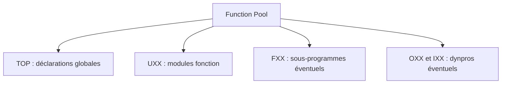

# 🌸 IMPLÉMENTATION, DONNÉES GLOBALES ET INCLUDES

## 🌺 OBJECTIFS

- Situer le code du module dans le Function Pool
- Utiliser correctement variables locales et données globales
- Structurer les includes du groupe
- Limiter les effets de bord

## 🌺 CODE GÉNÉRÉ

Le Function Builder génère le bloc :

```abap
FUNCTION z_dev_calculate_total.
*"----------------------------------------------------------------------
*" Interface locale
*"----------------------------------------------------------------------

  " Implémentation

ENDFUNCTION.
```

Écrire le traitement entre `FUNCTION` et `ENDFUNCTION`. Ne pas modifier manuellement les éléments générés de l’interface dans le commentaire technique.

## 🌺 DONNÉES LOCALES

Déclarer localement les données nécessaires au traitement :

```abap
DATA lv_total TYPE decfloat34.

lv_total = iv_quantity * iv_unit_price.
ev_total = lv_total.
```

Une donnée locale :

- réduit le couplage ;
- facilite le debug ;
- évite les états persistants ;
- clarifie la responsabilité du module.

## 🌺 INCLUDE TOP

L’include `...TOP` contient les déclarations globales du groupe. Il peut héberger :

- types communs ;
- constantes réellement partagées ;
- références nécessaires à plusieurs modules ;
- contrôles déclaratifs du Function Pool.

Éviter d’y placer toutes les variables par habitude.

## 🌺 INCLUDES COMPLÉMENTAIRES

Selon les conventions du projet, des includes peuvent séparer :

- sous-programmes internes ;
- implémentations PBO/PAI d’écrans du groupe ;
- types et constantes ;
- traitements techniques communs.



## 🌺 DÉPENDANCES

Un module fonction doit pouvoir être compris à partir de :

- son interface ;
- son code ;
- les appels explicites qu’il effectue ;
- une quantité minimale de contexte global.

Une variable globale modifiée par un autre module du groupe constitue une dépendance cachée. La supprimer ou la documenter précisément.

## 🌺 RÉFÉRENCES OFFICIELLES SAP

- [Understanding Function Module Code — SAP Help Portal](https://help.sap.com/docs/ABAP_PLATFORM_NEW/bd833c8355f34e96a6e83096b38bf192/d1801f1c454211d189710000e8322d00.html)
- [Creating New Function Modules — SAP Help Portal](https://help.sap.com/docs/ABAP_PLATFORM_NEW/bd833c8355f34e96a6e83096b38bf192/d1801ee8454211d189710000e8322d00.html)

---

➡️ [Chapitre suivant — APPELER UN MODULE FONCTION AVEC CALL FUNCTION](<./08 - 🍧 APPELER UN MODULE FONCTION AVEC CALL FUNCTION.md>)
