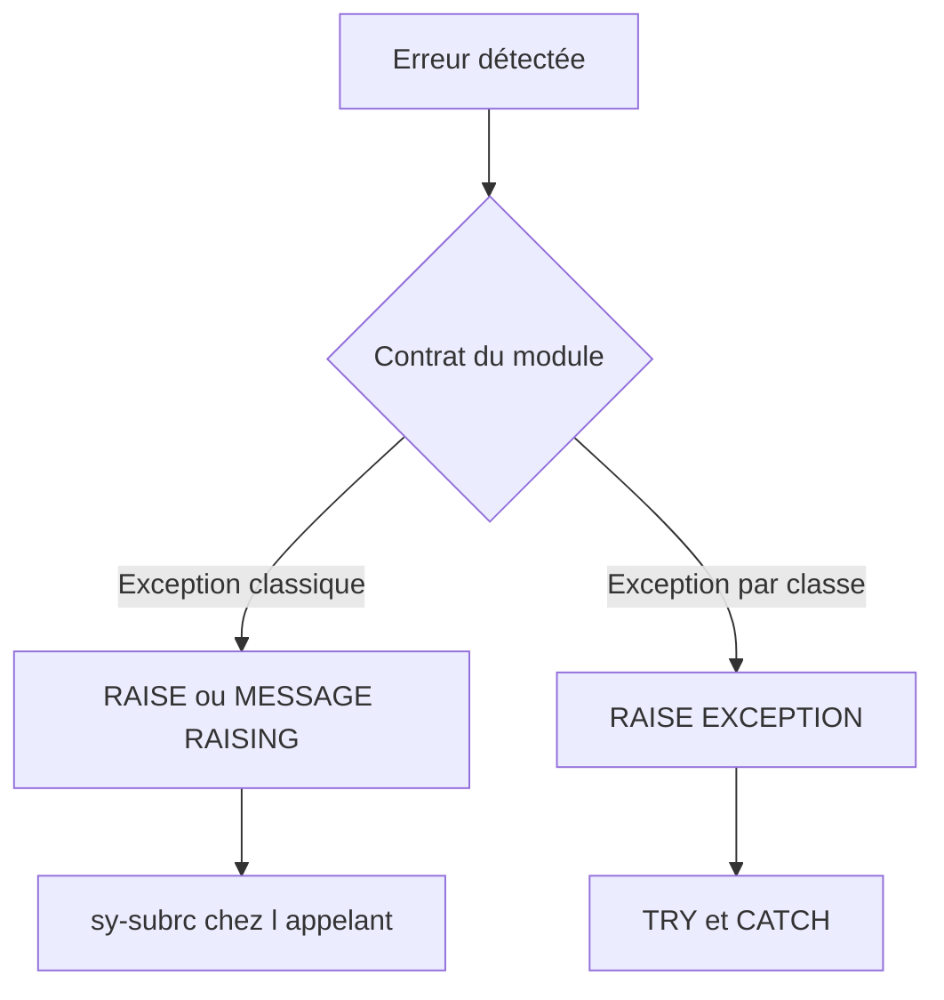

# 🌸 EXCEPTIONS CLASSIQUES ET MESSAGES

## 🌺 OBJECTIFS

- Déclarer et lever une exception classique
- Associer les exceptions à `sy-subrc`
- Gérer les messages émis par un module
- Distinguer exceptions classiques et exceptions par classes

## 🌺 EXCEPTION CLASSIQUE

Une exception classique est déclarée dans l’onglet **Exceptions** du Function Builder.

Exemple :

```text
INVALID_INPUT
NOT_FOUND
```

Dans le module :

```abap
IF iv_matnr IS INITIAL.
  RAISE invalid_input.
ENDIF.
```

Dans l’appel :

```abap
CALL FUNCTION 'Z_DEV_PRODUCT_GET'
  EXPORTING
    iv_matnr      = lv_matnr
  IMPORTING
    es_mara       = ls_mara
  EXCEPTIONS
    invalid_input = 1
    not_found     = 2
    OTHERS        = 3.
```

## 🌺 MESSAGE RAISING

Un message peut déclencher une exception déclarée :

```abap
MESSAGE e001(zdev_msg) RAISING invalid_input.
```

Le comportement dépend de la gestion mise en place par l’appelant.

## 🌺 ERROR MESSAGE

L’exception prédéfinie `ERROR_MESSAGE` dans l’appel permet d’intercepter certains messages d’erreur ou d’abandon émis par le module.

```abap
CALL FUNCTION 'Z_DEV_VALIDATE'
  EXCEPTIONS
    invalid_input = 1
    error_message = 2
    OTHERS        = 3.
```

## 🌺 EXCEPTIONS PAR CLASSES

Le Function Builder peut également déclarer des classes d’exception selon la version et le type d’interface. Elles offrent une information structurée et une propagation plus riche.

Ne pas mélanger sans conception claire :

- interface classique avec `EXCEPTIONS` et `sy-subrc` ;
- interface par classes avec `RAISING`, `TRY` et `CATCH`.

Les deux approches ont des règles différentes. Pour un module RFC, vérifier spécifiquement les contraintes de transport des erreurs entre systèmes.



## 🌺 BONNES PRATIQUES

- Définir une exception par situation utile à l’appelant.
- Éviter `OTHERS` comme seul traitement métier.
- Ne pas convertir toutes les erreurs en message générique.
- Documenter les conditions exactes de chaque exception.
- Conserver le contexte technique nécessaire au diagnostic.

## 🌺 RÉFÉRENCES OFFICIELLES SAP

- [Understanding Function Module Code — SAP Help Portal](https://help.sap.com/docs/ABAP_PLATFORM_NEW/bd833c8355f34e96a6e83096b38bf192/d1801f1c454211d189710000e8322d00.html)
- [Exceptions in Function Modules and Methods — SAP Help Portal](https://help.sap.com/saphelp_scm700_ehp02/helpdata/en/9e/d58167116711d5b2f40050dadfb92b/content.htm)
- [Calling Function Modules From Your Programs — SAP Help Portal](https://help.sap.com/docs/ABAP_PLATFORM_NEW/bd833c8355f34e96a6e83096b38bf192/d1801edb454211d189710000e8322d00.html)

---

➡️ [Chapitre suivant — TEST, DOCUMENTATION ET LIBÉRATION](<./10 - 🍧 TEST DOCUMENTATION ET LIBERATION.md>)
