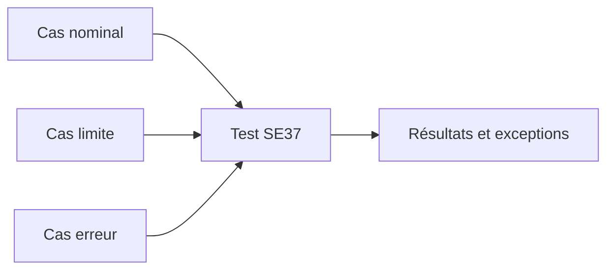

# 🌸 TEST, DOCUMENTATION ET LIBÉRATION

## 🌺 OBJECTIFS

- Tester un module dans `SE37`
- Constituer des données de test reproductibles
- Documenter le contrat complet
- Comprendre la portée d’un statut de libération

## 🌺 TEST DIRECT

Dans `SE37`, choisir **Tester / Exécuter**. L’écran de test reprend les sections de l’interface.

Procédure :

1. renseigner les paramètres d’entrée ;
2. exécuter ;
3. contrôler les sorties ;
4. contrôler les exceptions ;
5. vérifier les effets persistants éventuels ;
6. répéter avec cas nominal, limites et erreurs.

## 🌺 SÉQUENCES DE TEST

Certains modules doivent être testés dans une séquence, par exemple :

1. initialisation ;
2. lecture ;
3. modification ;
4. validation transactionnelle.

Utiliser les fonctions de séquence de test disponibles dans le Function Builder lorsque le scénario l’exige. Ne pas conclure à un défaut uniquement parce qu’un module transactionnel a été appelé isolément.

## 🌺 DOCUMENTATION

Documenter :

- objectif métier ou technique ;
- préconditions ;
- paramètres et unités ;
- valeurs facultatives ;
- effets en base ;
- exceptions et messages ;
- gestion du commit ;
- autorisations requises ;
- restrictions RFC éventuelles.

## 🌺 LIBÉRATION

Un indicateur de libération ou une documentation d’API est une information importante pour les consommateurs. Pour un objet SAP standard, ne pas déduire la stabilité publique du simple fait que le module est visible ou testable.

Pour un module client :

- définir les consommateurs autorisés ;
- établir une politique de compatibilité ;
- éviter les suppressions ou changements incompatibles ;
- versionner lorsque nécessaire.

## 🌺 LIMITES DU TEST SE37

Le test direct ne remplace pas :

- un test du programme appelant ;
- un test d’autorisation RFC ;
- un test de destination ;
- un test de concurrence ;
- un test de rollback ;
- un test automatisé autour de la logique métier.

## 🌺 RÉFÉRENCES OFFICIELLES SAP

- [Testing Function Modules — SAP Help Portal](https://help.sap.com/docs/ABAP_PLATFORM_NEW/c6663103e6ad47dcb8bb830d85137077/496d3bbee0221ec6e10000000a42189b.html)
- [Specifying Parameters and Exceptions — SAP Help Portal](https://help.sap.com/docs/ABAP_PLATFORM_2021/bd833c8355f34e96a6e83096b38bf192/d1801f0f454211d189710000e8322d00.html)
- [Looking Up Function Modules — SAP Help Portal](https://help.sap.com/docs/ABAP_PLATFORM_NEW/bd833c8355f34e96a6e83096b38bf192/d1801ec1454211d189710000e8322d00.html)

---

➡️ [Chapitre suivant — MODULES FONCTION DE MISE À JOUR](<./11 - 🍧 MODULES FONCTION DE MISE A JOUR.md>)
