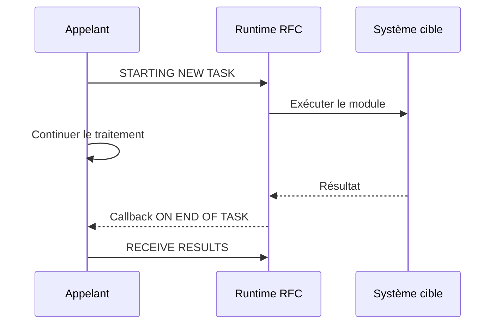

# 🌸 APPELS RFC SYNCHRONES ET ASYNCHRONES

## 🌺 OBJECTIFS

- Implémenter un appel RFC synchrone
- Comprendre `STARTING NEW TASK`
- Recevoir un résultat asynchrone
- Choisir le mode adapté au besoin

## 🌺 RFC SYNCHRONE

L’appelant attend la fin du module distant :

```abap
CALL FUNCTION 'Z_DEV_READ_REMOTE'
  DESTINATION 'S4H_DEV_100'
  EXPORTING
    iv_key                = lv_key
  IMPORTING
    es_result             = ls_result
  EXCEPTIONS
    system_failure        = 1 MESSAGE lv_message
    communication_failure = 2 MESSAGE lv_message
    OTHERS                = 3.
```

Utiliser ce mode lorsqu’un résultat est requis avant de poursuivre.

## 🌺 RFC ASYNCHRONE

`STARTING NEW TASK` démarre un appel asynchrone :

```abap
CALL FUNCTION 'Z_DEV_READ_REMOTE'
  STARTING NEW TASK lv_task
  DESTINATION 'S4H_DEV_100'
  CALLING on_end_of_task ON END OF TASK
  EXPORTING
    iv_key = lv_key.
```

La forme exacte de callback dépend du style procédural ou objet et de la version ABAP.

## 🌺 RÉCEPTION

Dans le callback, utiliser `RECEIVE RESULTS FROM FUNCTION` :

```abap
RECEIVE RESULTS FROM FUNCTION 'Z_DEV_READ_REMOTE'
  IMPORTING
    es_result             = ls_result
  EXCEPTIONS
    system_failure        = 1 MESSAGE lv_message
    communication_failure = 2 MESSAGE lv_message
    OTHERS                = 3.
```

## 🌺 FLUX



## 🌺 ATTENTE ET PARALLÉLISME

Un aRFC peut servir au traitement parallèle, notamment avec des groupes de serveurs. Ce mode exige :

- découpage indépendant des unités ;
- nombre de tâches maîtrisé ;
- gestion de la fin de chaque tâche ;
- agrégation sûre des résultats ;
- gestion des ressources et erreurs.

Ne pas paralléliser un traitement sans mesurer la charge globale du système.

## 🌺 CHOIX

| Besoin                        | Mode probable |
| ----------------------------- | ------------- |
| Résultat immédiat obligatoire | sRFC          |
| Travail parallèle avec retour | aRFC          |
| Livraison fiable différée     | tRFC ou qRFC  |
| Ordre strict entre unités     | qRFC          |

## 🌺 RÉFÉRENCES OFFICIELLES SAP

- [CALL FUNCTION STARTING NEW TASK — ABAP Keyword Documentation](https://help.sap.com/doc/abapdocu_816_index_htm/8.16/en-US/ABAPCALL_FUNCTION_STARTING.html)
- [Receiving Results from an Asynchronous RFC — SAP Help Portal](https://help.sap.com/docs/ABAP_PLATFORM_NEW/753088fc00704d0a80e7fbd6803c8adb/489bdeec0c1c73e7e10000000a42189b.html)
- [Parallel Processing with Asynchronous RFC — SAP Help Portal](https://help.sap.com/docs/ABAP_PLATFORM_NEW/753088fc00704d0a80e7fbd6803c8adb/489aa5b948c673e8e10000000a42189b.html)

---

➡️ [Chapitre suivant — TRFC, QRFC ET SURVEILLANCE](<./16 - 🍧 TRFC QRFC ET SURVEILLANCE.md>)
