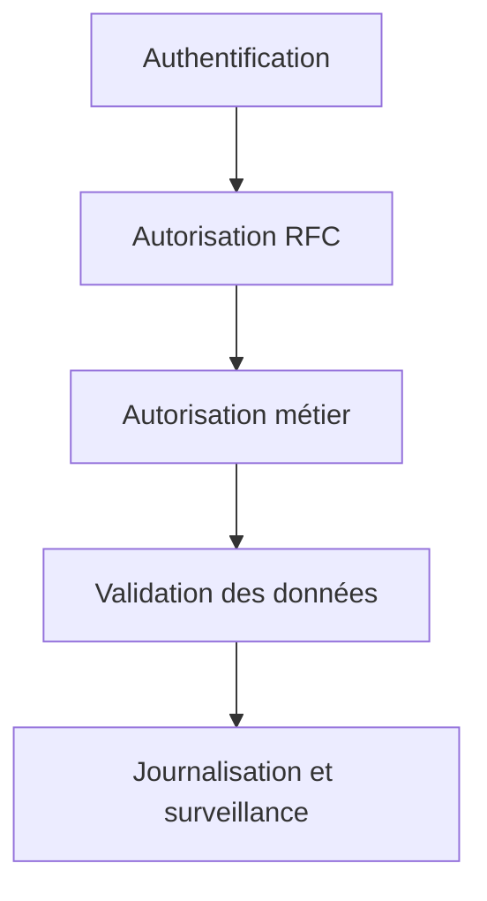

# 🌸 SÉCURITÉ ET AUTORISATIONS RFC

## 🌺 OBJECTIFS

- Comprendre les contrôles d’autorisation RFC
- Distinguer administration de destination et exécution distante
- Réduire les privilèges du compte technique
- Éviter l’exposition excessive de fonctions

## 🌺 SURFACE D EXPOSITION

Un module marqué RFC peut devenir accessible au-delà du programme local. La sécurité doit être conçue à plusieurs niveaux :



## 🌺 OBJETS D AUTORISATION

Parmi les objets classiques :

| Objet       | Rôle général                                                 |
| ----------- | ------------------------------------------------------------ |
| `S_RFC`     | Autoriser l’exécution de groupes ou modules RFC              |
| `S_RFC_ADM` | Contrôler certaines fonctions d’administration RFC et `SM59` |

Les champs et valeurs exacts doivent être définis par l’équipe sécurité selon le scénario.

## 🌺 COMPTE TECHNIQUE

Appliquer le moindre privilège :

- compte dédié au flux ;
- accès limité aux modules nécessaires ;
- absence d’autorisation de développement ;
- restrictions métier complémentaires ;
- mot de passe, certificat ou mécanisme d’authentification géré par l’administration ;
- rotation et supervision conformes aux règles de l’entreprise.

## 🌺 CONTRÔLES MÉTIER

`S_RFC` ne remplace pas les contrôles fonctionnels. Le module doit encore vérifier les autorisations requises pour lire ou modifier les données métier.

Exemple conceptuel :

```abap
AUTHORITY-CHECK OBJECT 'Z_PRODUCT'
  ID 'ACTVT' FIELD '03'.

IF sy-subrc <> 0.
  " Retourner une erreur d autorisation contrôlée
ENDIF.
```

## 🌺 DONNÉES D ENTRÉE

Traiter toute donnée RFC comme une entrée externe :

- valider format et longueur ;
- contrôler les valeurs autorisées ;
- éviter les appels dynamiques non maîtrisés ;
- protéger les lectures massives ;
- limiter les informations techniques retournées ;
- ne pas exposer de secret dans les messages.

## 🌺 TRAÇABILITÉ

Journaliser suffisamment pour relier :

- appelant ;
- destination ;
- utilisateur cible ;
- fonction ;
- objet métier ;
- résultat ;
- identifiant de corrélation lorsqu’il existe.

## 🌺 RÉFÉRENCES OFFICIELLES SAP

- [Authorizations — SAP Help Portal](https://help.sap.com/docs/ABAP_PLATFORM_NEW/c495ada972d045b2be2869f5573af8e7/488de31b81cd0e27e10000000a421937.html)
- [RFC Authorization — SAP Help Portal](https://help.sap.com/docs/SAP_NETWEAVER_700/108f625f6c53101491e88dc4cf51a6cc/4895128d94cc73eae10000000a42189b.html)
- [Authorization Object S_RFC_ADM — SAP Help Portal](https://help.sap.com/docs/ABAP_PLATFORM_NEW/c495ada972d045b2be2869f5573af8e7/488d1c05ae444e6ee10000000a421937.html)

---

➡️ [Chapitre suivant — PRINCIPES DES BAPI ET RECHERCHE](<./18 - 🍧 PRINCIPES DES BAPI ET RECHERCHE.md>)
