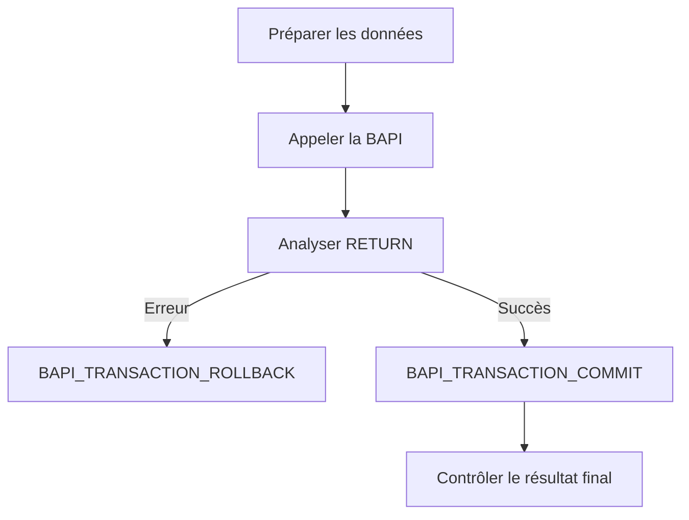

# 🌸 APPELER UNE BAPI ET GÉRER LA TRANSACTION

## 🌺 OBJECTIFS

- Construire un appel BAPI complet
- Analyser les retours métier
- Valider avec `BAPI_TRANSACTION_COMMIT`
- Annuler avec `BAPI_TRANSACTION_ROLLBACK`

## 🌺 SÉQUENCE GÉNÉRALE



## 🌺 EXEMPLE GÉNÉRIQUE

```abap
DATA lt_return TYPE TABLE OF bapiret2.

CALL FUNCTION 'BAPI_EXAMPLE_CHANGE'
  EXPORTING
    objectkey = lv_key
    data      = ls_data
    datax     = ls_datax
  TABLES
    return    = lt_return.

IF line_exists( lt_return[ type = 'E' ] )
 OR line_exists( lt_return[ type = 'A' ] ).

  CALL FUNCTION 'BAPI_TRANSACTION_ROLLBACK'.

ELSE.

  CALL FUNCTION 'BAPI_TRANSACTION_COMMIT'
    EXPORTING
      wait = abap_true.

ENDIF.
```

`BAPI_EXAMPLE_CHANGE` est un nom fictif. Utiliser l’interface réelle et sa documentation.

## 🌺 COMMIT BAPI

Après une BAPI de modification, utiliser le mécanisme transactionnel documenté par SAP. La documentation SAP précise l’usage de `BAPI_TRANSACTION_COMMIT` dans le modèle transactionnel BAPI.

Le paramètre `WAIT = abap_true` demande une validation synchrone des mises à jour, ce qui peut être nécessaire lorsque le traitement suivant doit lire immédiatement les données validées.

## 🌺 ROLLBACK

En présence d’une erreur métier ou technique avant validation, appeler `BAPI_TRANSACTION_ROLLBACK` lorsque le modèle de la BAPI le prévoit.

## 🌺 PIÈGES

- Appeler `COMMIT WORK` directement sans respecter le modèle BAPI.
- Valider alors que `RETURN` contient une erreur.
- Ignorer les avertissements ayant un impact métier.
- Effectuer plusieurs opérations indépendantes dans une même LUW sans stratégie.
- Supposer qu’un rollback distant annule des opérations déjà validées.
- Oublier que certaines BAPI documentent un comportement transactionnel particulier.

## 🌺 APPEL DISTANT

Lorsque la BAPI est appelée via une destination RFC, la gestion de la transaction doit rester dans le même contexte RFC selon le modèle applicable. Vérifier la documentation de la BAPI et de l’environnement appelant.

## 🌺 RÉFÉRENCES OFFICIELLES SAP

- [BAPI_TRANSACTION_COMMIT versus COMMIT WORK — SAP Help Portal](https://help.sap.com/docs/btp/ABAP/3353526184.html)
- [Transaction Model for Developing BAPIs — SAP Help Portal](https://help.sap.com/docs/SAP_ERP/67ae2d27aed945b7bd0ad1d2185ec217/4d5b102ba1483d8fe10000000a42189e.html)
- [Example: BAPI Transaction Model Without Commit — SAP Help Portal](https://help.sap.com/docs/SAP_NETWEAVER_702/fe1c8e016c551014ba0ec92da35a91ee/4d5bfea2db8618b5e10000000a42189e.html)

---

➡️ [Chapitre suivant — DIAGNOSTIC ET BONNES PRATIQUES](<./21 - 🍧 DIAGNOSTIC ET BONNES PRATIQUES.md>)
