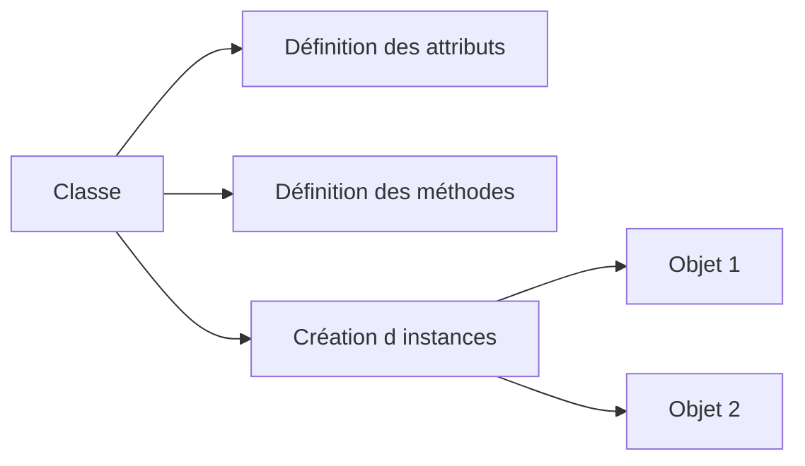

# 🌸 PRINCIPES DE LA PROGRAMMATION ORIENTÉE OBJET

## 🌺 OBJECTIFS

- Comprendre les notions de classe, objet et référence
- Situer ABAP Objects dans un développement SAP classique
- Identifier les bénéfices de l’encapsulation et du polymorphisme
- Distinguer modèle objet et simple découpage technique du code

## 🌺 MODÈLE OBJET

Une **classe** décrit un type d’objet. Elle définit les données portées par l’objet et les opérations qu’il expose. Une **instance** est un objet concret créé à partir de cette classe.



## 🌺 VOCABULAIRE

| Notion        | Description                                                  |
| ------------- | ------------------------------------------------------------ |
| Classe        | Modèle décrivant des composants et un comportement           |
| Objet         | Instance concrète d’une classe                               |
| Référence     | Variable permettant d’accéder à un objet                     |
| Attribut      | Donnée appartenant à une classe ou à une instance            |
| Méthode       | Procédure déclarée dans une classe ou une interface          |
| Encapsulation | Protection de l’état interne derrière une interface publique |
| Héritage      | Création d’une sous-classe à partir d’une superclasse        |
| Polymorphisme | Utilisation uniforme d’objets de types concrets différents   |

## 🌺 EXEMPLE MINIMAL

```abap
REPORT zdev_oo_intro.

CLASS lcl_counter DEFINITION FINAL.
  PUBLIC SECTION.
    METHODS increment.
    METHODS get_value
      RETURNING VALUE(rv_value) TYPE i.
  PRIVATE SECTION.
    DATA mv_value TYPE i.
ENDCLASS.

CLASS lcl_counter IMPLEMENTATION.
  METHOD increment.
    mv_value = mv_value + 1.
  ENDMETHOD.

  METHOD get_value.
    rv_value = mv_value.
  ENDMETHOD.
ENDCLASS.

START-OF-SELECTION.
  DATA lo_counter TYPE REF TO lcl_counter.
  DATA lv_value   TYPE i.

  CREATE OBJECT lo_counter.
  lo_counter->increment( ).
  lv_value = lo_counter->get_value( ).

  WRITE / lv_value.
```

L’état `mv_value` est privé. Le programme appelant ne peut le modifier qu’en utilisant les méthodes publiques prévues par la classe.

## 🌺 QUAND UTILISER ABAP OBJECTS

ABAP Objects est adapté lorsque le traitement possède au moins l’une des caractéristiques suivantes :

- plusieurs responsabilités doivent être séparées ;
- un état doit être protégé ;
- plusieurs implémentations doivent respecter un même contrat ;
- le code doit être réutilisé ou remplacé ;
- les dépendances doivent être explicites ;
- le traitement doit être testable indépendamment de son appelant.

Une classe n’est pas automatiquement bien conçue. Déplacer du code procédural dans une méthode sans définir de responsabilités claires ne produit pas un véritable modèle objet.

## 🌺 RÉFÉRENCES OFFICIELLES SAP

- [ABAP Objects — SAP Help Portal](https://help.sap.com/docs/ABAP_PLATFORM_BW4HANA/7bfe8cdcfbb040dcb6702dada8c3e2f0/8e8b9c6bc4b94848b13f792966f02085.html)
- [Deepening Your ABAP Programming Knowledge — SAP Learning](https://learning.sap.com/courses/deepening-your-abap-programming-knowledge)
- [Clean ABAP — SAP Style Guides](https://github.com/SAP/styleguides/blob/main/clean-abap/CleanABAP.md)

---

➡️ [Chapitre suivant — CLASSES LOCALES ET GLOBALES](<./02 - 🍧 CLASSES LOCALES ET GLOBALES.md>)
