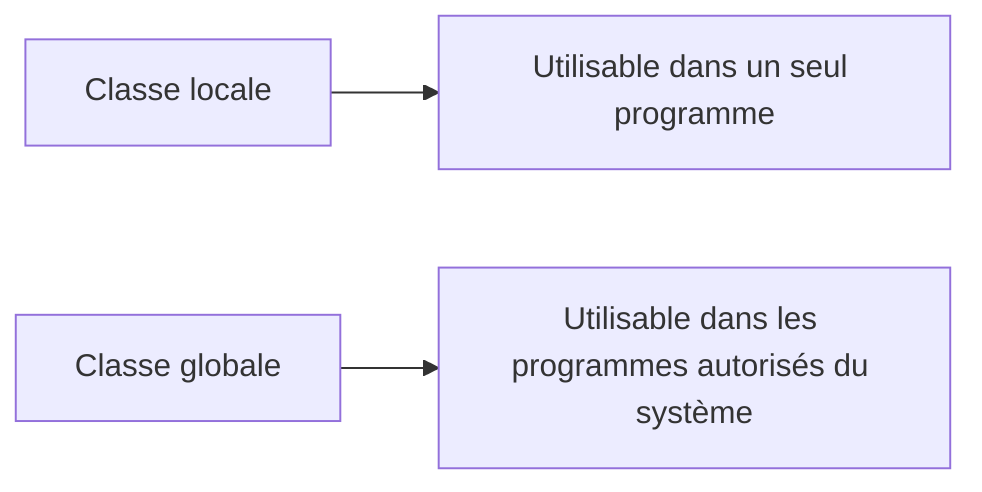

# 🌸 CLASSES LOCALES ET GLOBALES

## 🌺 OBJECTIFS

- Distinguer classes locales et classes globales
- Choisir la portée adaptée au besoin
- Comprendre l’impact sur la réutilisation et le transport
- Identifier les règles de déclaration d’une classe locale

## 🌺 CLASSE LOCALE

Une classe locale est déclarée dans le code source d’un programme ABAP. Elle n’est utilisable que dans ce programme.

```abap
CLASS lcl_validator DEFINITION FINAL.
  PUBLIC SECTION.
    METHODS is_valid
      IMPORTING iv_value        TYPE i
      RETURNING VALUE(rv_valid) TYPE abap_bool.
ENDCLASS.

CLASS lcl_validator IMPLEMENTATION.
  METHOD is_valid.
    rv_valid = xsdbool( iv_value > 0 ).
  ENDMETHOD.
ENDCLASS.
```

Préfixe couramment utilisé : `LCL_` pour une classe locale et `LIF_` pour une interface locale. Ces préfixes relèvent d’une convention de nommage, pas d’une obligation du langage.

## 🌺 CLASSE GLOBALE

Une classe globale est un objet du Repository ABAP. Elle est créée dans la bibliothèque de classes, généralement avec `SE24` ou `SE80`, puis affectée à un package et à un ordre de transport.



## 🌺 COMPARAISON

| Critère                   | Classe locale     | Classe globale              |
| ------------------------- | ----------------- | --------------------------- |
| Portée                    | Programme courant | Repository ABAP             |
| Réutilisation             | Locale            | Transversale                |
| Objet Repository distinct | Non               | Oui                         |
| Package propre            | Non               | Oui                         |
| Transport indépendant     | Non               | Oui                         |
| Nom typique               | `LCL_*`           | `ZCL_*` ou namespace client |

## 🌺 CHOIX PRATIQUE

Utiliser une classe locale pour :

- structurer un rapport spécifique ;
- isoler un gestionnaire d’événement local ;
- créer un adaptateur limité à un seul programme ;
- encapsuler une logique qui ne constitue pas une API partagée.

Utiliser une classe globale pour :

- exposer un service réutilisable ;
- partager un contrat entre plusieurs applications ;
- implémenter un framework SAP ;
- centraliser une logique métier ou technique stable ;
- permettre une utilisation par d’autres objets Repository.

## 🌺 ORDRE DANS UN PROGRAMME

La définition d’une classe locale doit être connue avant son utilisation. La forme classique est :

1. déclarations globales éventuelles ;
2. définitions des classes locales ;
3. implémentations des classes locales ;
4. blocs événementiels du programme.

Des déclarations différées avec `CLASS ... DEFINITION DEFERRED` permettent de résoudre certaines dépendances circulaires de typage, mais elles ne remplacent pas une architecture claire.

## 🌺 RÈGLE DE CONCEPTION

Ne rendre une classe globale que lorsqu’elle constitue réellement une unité réutilisable. Une classe globale inutilement publique augmente la surface d’API à maintenir.

## 🌺 RÉFÉRENCES OFFICIELLES SAP

- [Classes — SAP Help Portal](https://help.sap.com/docs/SAP_NETWEAVER_700/10a002cd6c531014b5e1cb16d2455072/c3225b5c54f411d194a60000e8353423.html)
- [Global Declarations of a Program — ABAP Keyword Documentation](https://help.sap.com/doc/abapdocu_latest_index_htm/latest/en-US/ABENGLOBAL_DECLAR_GUIDL.html)
- [ABAP Objects — SAP Help Portal](https://help.sap.com/docs/ABAP_PLATFORM_BW4HANA/7bfe8cdcfbb040dcb6702dada8c3e2f0/8e8b9c6bc4b94848b13f792966f02085.html)

---

➡️ [Chapitre suivant — CLASS BUILDER SE24 ET CLASS POOLS](<./03 - 🍧 CLASS BUILDER SE24 ET CLASS POOLS.md>)
