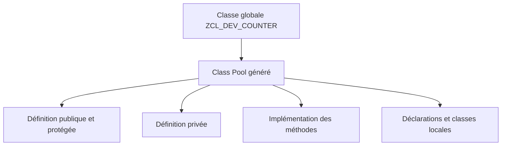

# 🌸 CLASS BUILDER SE24 ET CLASS POOLS

## 🌺 OBJECTIFS

- Créer et analyser une classe globale avec `SE24`
- Comprendre le rôle d’un Class Pool
- Identifier les sections gérées par le Class Builder
- Éviter les modifications directes des includes générés

## 🌺 TRANSACTION SE24

La transaction `SE24` ouvre le **Class Builder**. Elle permet notamment de créer, modifier, tester et documenter les classes et interfaces globales.

Pour créer une classe globale fictive :

1. ouvrir `SE24` ;
2. saisir `ZCL_DEV_COUNTER` ;
3. choisir **Créer** ;
4. renseigner la description ;
5. définir l’instanciation et les propriétés nécessaires ;
6. affecter la classe à un package ;
7. enregistrer dans un ordre de transport ;
8. définir les composants ;
9. implémenter les méthodes ;
10. activer la classe.

## 🌺 CLASS POOL

Une classe globale est stockée dans un programme ABAP de type **Class Pool**. Le système gère la structure technique de ce programme.

Un Class Pool contient une classe globale principale. Il peut également contenir des types, classes ou interfaces locales destinés à son implémentation interne.

## 🌺 PRINCIPAUX ONGLETS

Selon la version du système et l’affichage de l’outil, le Class Builder donne accès aux éléments suivants :

- attributs ;
- méthodes ;
- événements ;
- types ;
- interfaces ;
- relations d’héritage ;
- classes amies ;
- documentation ;
- code source des méthodes.

## 🌺 SE24 ET SE80

`SE24` est centré sur les classes et interfaces. `SE80` présente les mêmes objets dans le contexte plus large du Repository et du package.

| Besoin                         | Outil adapté                               |
| ------------------------------ | ------------------------------------------ |
| Analyser rapidement une classe | `SE24`                                     |
| Naviguer dans tout un package  | `SE80`                                     |
| Consulter la hiérarchie        | `SE24` ou `SE80`                           |
| Rechercher les utilisations    | Liste des utilisations depuis le Workbench |

## 🌺 GÉNÉRATION DU CODE

Ne pas déplacer ou renommer manuellement les includes techniques du Class Pool. Le Class Builder doit rester propriétaire de cette organisation.

Le code spécifique doit être placé dans :

- les méthodes de la classe ;
- les sections locales prévues par le Class Builder ;
- des classes collaboratrices clairement identifiées.

## 🌺 ACTIVATION

L’activation vérifie la cohérence de la définition, de l’implémentation et des dépendances. Une modification de l’interface publique peut rendre invalides les consommateurs existants.

## 🌺 RÉFÉRENCES OFFICIELLES SAP

- [Classes — SAP Help Portal](https://help.sap.com/docs/SAP_NETWEAVER_700/10a002cd6c531014b5e1cb16d2455072/c3225b5c54f411d194a60000e8353423.html)
- [Creating Local Definitions and Implementations — SAP Help Portal](https://help.sap.com/docs/SAP_NETWEAVER_750/bd833c8355f34e96a6e83096b38bf192/b5693ecb185011d5969b00a0c94260a5.html)
- [Source Code Modularization — ABAP Keyword Documentation](https://help.sap.com/doc/abapdocu_latest_index_htm/latest/en-US/ABENSOURCE_CODE_MODULAR_GUIDL.html)

---

➡️ [Chapitre suivant — DÉFINITION, IMPLÉMENTATION ET VISIBILITÉ](<./04 - 🍧 DEFINITION IMPLEMENTATION ET VISIBILITE.md>)
