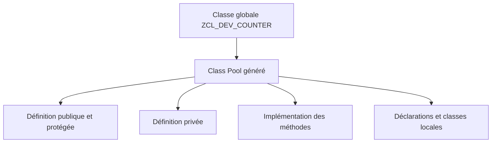

# 🌸 CLASS BUILDER SE24 ET CLASS POOLS

## 🌺 OBJECTIFS

- Créer et analyser une classe globale avec `SE24`
- Comprendre le rôle d’un Class Pool
- Identifier les sections gérées par le Class Builder
- Éviter les modifications directes des includes générés

## 🌺 TRANSACTION SE24

La transaction `SE24` ouvre le **Class Builder**. Elle permet notamment de créer, modifier, tester et documenter les classes et interfaces globales.

Pour créer une classe globale fictive :

1. ouvrir `SE24` ;
2. saisir `ZCL_DEV_COUNTER` ;
3. choisir **Créer** ;
4. renseigner la description ;
5. définir l’instanciation et les propriétés nécessaires ;
6. affecter la classe à un package ;
7. enregistrer dans un ordre de transport ;
8. définir les composants ;
9. implémenter les méthodes ;
10. activer la classe.

## 🌺 CLASS POOL

Une classe globale est stockée dans un programme ABAP de type **Class Pool**. Le système gère la structure technique de ce programme.



Un Class Pool contient une classe globale principale. Il peut également contenir des types, classes ou interfaces locales destinés à son implémentation interne.

## 🌺 PRINCIPAUX ONGLETS

Selon la version du système et l’affichage de l’outil, le Class Builder donne accès aux éléments suivants :

- attributs ;
- méthodes ;
- événements ;
- types ;
- interfaces ;
- relations d’héritage ;
- classes amies ;
- documentation ;
- code source des méthodes.

## 🌺 SE24 ET SE80

`SE24` est centré sur les classes et interfaces. `SE80` présente les mêmes objets dans le contexte plus large du Repository et du package.

| Besoin                         | Outil adapté                               |
| ------------------------------ | ------------------------------------------ |
| Analyser rapidement une classe | `SE24`                                     |
| Naviguer dans tout un package  | `SE80`                                     |
| Consulter la hiérarchie        | `SE24` ou `SE80`                           |
| Rechercher les utilisations    | Liste des utilisations depuis le Workbench |

## 🌺 GÉNÉRATION DU CODE

Ne pas déplacer ou renommer manuellement les includes techniques du Class Pool. Le Class Builder doit rester propriétaire de cette organisation.

Le code spécifique doit être placé dans :

- les méthodes de la classe ;
- les sections locales prévues par le Class Builder ;
- des classes collaboratrices clairement identifiées.

## 🌺 ACTIVATION

L’activation vérifie la cohérence de la définition, de l’implémentation et des dépendances. Une modification de l’interface publique peut rendre invalides les consommateurs existants.

## 🌺 CAS D’USAGE

Dans un contexte où une logique métier évolutive doit être encapsulée dans des classes afin de limiter les dépendances et faciliter les tests, le besoin consiste à **modéliser class builder se24 et class pools dans une conception ABAP Objects encapsulée et testable**. Cette notion est pertinente lorsque le lecteur doit pouvoir relier la syntaxe ou l’outil à une situation professionnelle concrète.

## 🌺 PROCÉDURE PAS À PAS

1. Saisir `/nSE24`.
2. Entrer le nom d’une classe globale Z puis choisir **Créer**, ou afficher une classe existante.
3. Maintenir définition, visibilité, types, attributs et méthodes dans les onglets appropriés.
4. Implémenter les méthodes dans l’éditeur.
5. Contrôler et activer la classe complète.
6. Utiliser la fonction de test ou un report Z appelant pour vérifier le comportement.

## 🌺 VÉRIFICATION

- Le lecteur peut expliquer la différence entre cette notion et les concepts proches.
- Le choix technique est justifié par un besoin concret, pas uniquement par habitude.
- Les limites liées à la release, aux autorisations et au contexte d’exécution sont identifiées.

## 🌺 ERREURS FRÉQUENTES

- Exposer des attributs modifiables au lieu d’encapsuler l’état.
- Créer une hiérarchie d’héritage alors qu’une composition suffit.

## 🌺 FICHE DE CONTRÔLE À COPIER

```text
Système / SID       :
Mandant             :
Utilisateur         :
Transaction / outil :
Objet technique     :
Jeu de données      :
Résultat attendu    :
Résultat observé    :
Horodatage          :
Ordre de transport  :
```

## 🌺 TERMES DU LEXIQUE

- [Classe](<../└─ 🧩 00 - LEXIQUE SAP ET ABAP/04 - 🍧 LANGAGE ET DEVELOPPEMENT ABAP.md#classe>)
- [Interface ABAP Objects](<../└─ 🧩 00 - LEXIQUE SAP ET ABAP/04 - 🍧 LANGAGE ET DEVELOPPEMENT ABAP.md#interface-abap-objects>)
- [Référence](<../└─ 🧩 00 - LEXIQUE SAP ET ABAP/04 - 🍧 LANGAGE ET DEVELOPPEMENT ABAP.md#reference>)
- [Exception](<../└─ 🧩 00 - LEXIQUE SAP ET ABAP/04 - 🍧 LANGAGE ET DEVELOPPEMENT ABAP.md#exception>)

## 🌺 À RETENIR

- À l’issue du chapitre, le lecteur sait **modéliser class builder se24 et class pools dans une conception ABAP Objects encapsulée et testable**.
- Toujours tester sur un objet Z ou un jeu de données sans impact avant d’intervenir sur un traitement réel.
- La documentation `F1` du système reste la référence pour la syntaxe disponible dans sa release.

## 🌺 RÉFÉRENCES OFFICIELLES SAP

- [Classes — SAP Help Portal](https://help.sap.com/docs/SAP_NETWEAVER_700/10a002cd6c531014b5e1cb16d2455072/c3225b5c54f411d194a60000e8353423.html)
- [Creating Local Definitions and Implementations — SAP Help Portal](https://help.sap.com/docs/SAP_NETWEAVER_750/bd833c8355f34e96a6e83096b38bf192/b5693ecb185011d5969b00a0c94260a5.html)
- [Source Code Modularization — ABAP Keyword Documentation](https://help.sap.com/doc/abapdocu_latest_index_htm/latest/en-US/ABENSOURCE_CODE_MODULAR_GUIDL.html)


---

➡️ [Chapitre suivant — DÉFINITION, IMPLÉMENTATION ET VISIBILITÉ](<./04 - 🍧 DEFINITION IMPLEMENTATION ET VISIBILITE.md>)
