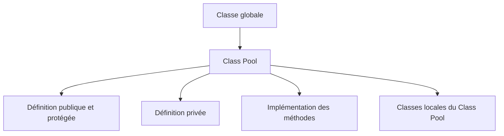

# 🌸 CLASS POOL ET ORGANISATION TECHNIQUE

## 🌺 OBJECTIFS

- Comprendre où le système stocke une classe globale.
- Identifier les includes gérés par le Class Builder.
- Savoir où placer les classes locales et les déclarations privées au Class Pool.
- Éviter les modifications techniques qui rendent l’objet incohérent.

## 🌺 FONCTIONNEMENT

Une classe globale est stockée dans un programme spécial appelé **Class Pool**. Le Class Builder organise la définition, l’implémentation et les parties locales dans des includes techniques.



Le nom technique des includes est généré. Il ne faut pas renommer, déplacer ou supprimer manuellement ces includes.

## 🌺 PARTIES LOCALES UTILES

Le Class Builder fournit généralement des emplacements pour :

- définitions locales visibles de la classe globale ;
- implémentations locales ;
- macros historiques ;
- classes de test ABAP Unit.

Les classes locales sont utiles pour des collaborateurs strictement internes ou des doubles de test. Elles ne remplacent pas les classes globales devant être appelées depuis d’autres objets.

## 🌺 PROCÉDURE POUR CONSULTER LE CLASS POOL

1. Ouvrir la classe dans `SE24` ou `SE80`.
2. Accéder à l’affichage du code source complet ou des includes.
3. Identifier les zones générées par le Class Builder.
4. Ne modifier que les zones prévues pour le code client.
5. Revenir à l’affichage par composants pour maintenir les méthodes et attributs.
6. Activer la classe complète.

## 🌺 CAS D’USAGE

Une classe globale doit utiliser un petit parseur qui n’a aucun sens en dehors de son implémentation. Une classe locale du Class Pool peut encapsuler ce détail sans ajouter un objet global supplémentaire dans le package.

## 🌺 SNIPPET DE CLASSE LOCALE INTERNE

```abap
CLASS lcl_tokenizer DEFINITION FINAL.
  PUBLIC SECTION.
    METHODS split
      IMPORTING iv_text TYPE string
      RETURNING VALUE(rt_tokens) TYPE string_table.
ENDCLASS.

CLASS lcl_tokenizer IMPLEMENTATION.
  METHOD split.
    SPLIT iv_text AT space INTO TABLE rt_tokens.
    DELETE rt_tokens WHERE table_line IS INITIAL.
  ENDMETHOD.
ENDCLASS.
```

## 🌺 VÉRIFICATION

- La classe globale reste activable.
- La classe locale n’est pas visible depuis un report externe.
- Aucun include généré n’a été créé manuellement.
- La responsabilité de la classe locale est strictement interne.

## 🌺 ERREURS FRÉQUENTES

- Développer toute la logique dans les includes au lieu des méthodes de la classe globale.
- Déclarer globalement une classe qui ne sert qu’à une seule implémentation privée.
- Dépendre d’une classe locale depuis un autre objet Repository.

## 🌺 RÉFÉRENCES OFFICIELLES SAP

- [Creating Local Definitions and Implementations — SAP Help Portal](https://help.sap.com/docs/ABAP_PLATFORM_NEW/bd833c8355f34e96a6e83096b38bf192/b5693ecb185011d5969b00a0c94260a5.html)
- [Class Builder — SAP Help Portal](https://help.sap.com/docs/ABAP_PLATFORM_BW4HANA/a602ff71a47c441bb3000504ec938fea/cac035baa6c611d1b4790000e8a52bed.html)

---

➡️ [Chapitre suivant — VISIBILITÉ, TYPES, CONSTANTES ET ATTRIBUTS](<./05 - 🍧 VISIBILITE TYPES CONSTANTES ET ATTRIBUTS.md>)
