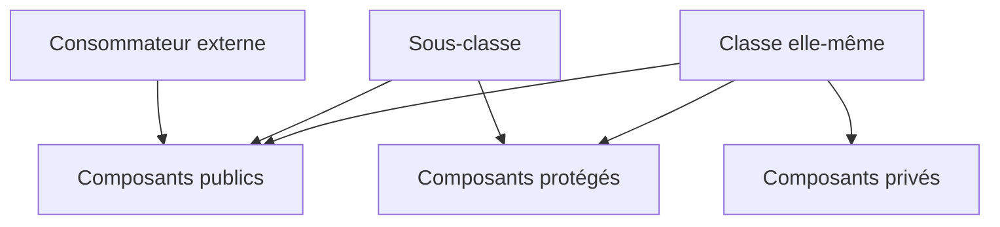

# 🌸 DÉFINITION, IMPLÉMENTATION ET VISIBILITÉ

## 🌺 OBJECTIFS

- Séparer le contrat d’une classe de son implémentation
- Maîtriser les sections `PUBLIC`, `PROTECTED` et `PRIVATE`
- Réduire la surface publique d’une classe
- Comprendre l’accès depuis une sous-classe

## 🌺 DEUX PARTIES

Une classe locale est décrite en deux blocs :

```abap
CLASS lcl_product DEFINITION.
  PUBLIC SECTION.
    METHODS get_name
      RETURNING VALUE(rv_name) TYPE string.
  PRIVATE SECTION.
    DATA mv_name TYPE string.
ENDCLASS.

CLASS lcl_product IMPLEMENTATION.
  METHOD get_name.
    rv_name = mv_name.
  ENDMETHOD.
ENDCLASS.
```

La **définition** décrit les composants et leur visibilité. L’**implémentation** contient le code des méthodes.

## 🌺 SECTIONS DE VISIBILITÉ

| Section             | Accessible depuis                        |
| ------------------- | ---------------------------------------- |
| `PUBLIC SECTION`    | Tous les consommateurs autorisés         |
| `PROTECTED SECTION` | La classe et ses sous-classes            |
| `PRIVATE SECTION`   | La classe elle-même et ses amis déclarés |



## 🌺 SURFACE PUBLIQUE

La section publique constitue le contrat de la classe. Toute modification incompatible peut affecter les programmes consommateurs.

Placer en public uniquement :

- les méthodes nécessaires aux appelants ;
- les types utiles au contrat ;
- les constantes faisant partie de l’API ;
- les événements destinés aux consommateurs.

Les détails d’implémentation doivent rester privés.

## 🌺 SECTION PROTÉGÉE

La visibilité protégée crée un contrat spécifique pour les sous-classes. Elle doit être utilisée avec retenue : toute donnée protégée augmente le couplage entre la superclasse et ses descendants.

Préférer une méthode protégée ciblée à l’exposition directe d’un ensemble important d’attributs.

## 🌺 EXEMPLE D ENCAPSULATION

```abap
CLASS lcl_bank_account DEFINITION FINAL.
  PUBLIC SECTION.
    METHODS deposit
      IMPORTING iv_amount TYPE decfloat34.
    METHODS get_balance
      RETURNING VALUE(rv_balance) TYPE decfloat34.
  PRIVATE SECTION.
    DATA mv_balance TYPE decfloat34.
ENDCLASS.
```

L’appelant ne peut pas affecter directement `mv_balance`. La méthode `deposit` peut donc contrôler la validité du montant avant de modifier l’état.

## 🌺 RÈGLE

Commencer par une visibilité privée. Élargir ensuite uniquement lorsqu’un besoin réel du contrat le justifie.

## 🌺 CAS D’USAGE

Dans un contexte où une logique métier évolutive doit être encapsulée dans des classes afin de limiter les dépendances et faciliter les tests, le besoin consiste à **modéliser définition, implémentation et visibilité dans une conception ABAP Objects encapsulée et testable**. Cette notion est pertinente lorsque le lecteur doit pouvoir relier la syntaxe ou l’outil à une situation professionnelle concrète.

## 🌺 PROCÉDURE PAS À PAS

1. Saisir `/nSE38` dans le champ de commande.
2. Entrer le nom d’un programme Z de test, par exemple `ZREF_DEMO`, puis choisir **Créer** ou **Modifier** selon le cas.
3. Pour un exercice local uniquement, affecter `$TMP` ; pour un développement livrable, utiliser le package et l’ordre fournis par le projet.
4. Coller ou adapter le snippet du chapitre.
5. Exécuter le contrôle syntaxique avec `Ctrl+F2`.
6. Activer avec `Ctrl+F3`.
7. Exécuter avec `F8` et comparer le résultat avec la section **Vérification**.

## 🌺 VÉRIFICATION

- Le contrôle syntaxique réussit.
- La version active correspond au code sauvegardé.
- L’exécution produit le résultat décrit dans le chapitre.
- Les cas vide, limite et erreur sont testés séparément lorsque la syntaxe le permet.

## 🌺 ERREURS FRÉQUENTES

- Copier un exemple sans adapter les types, noms d’objets et données disponibles dans le système.
- Tester uniquement le cas nominal et ignorer les valeurs initiales, absentes ou invalides.
- Exposer des attributs modifiables au lieu d’encapsuler l’état.
- Créer une hiérarchie d’héritage alors qu’une composition suffit.

## 🌺 SNIPPET À RÉUTILISER

> [!NOTE]
> Adapter les noms `Z*`, les types DDIC, les données et les autorisations au système cible. Effectuer un contrôle syntaxique avant activation.

```abap
CLASS lcl_product DEFINITION.
  PUBLIC SECTION.
    METHODS get_name
      RETURNING VALUE(rv_name) TYPE string.
  PRIVATE SECTION.
    DATA mv_name TYPE string.
ENDCLASS.

CLASS lcl_product IMPLEMENTATION.
  METHOD get_name.
    rv_name = mv_name.
  ENDMETHOD.
ENDCLASS.
```

## 🌺 TERMES DU LEXIQUE

- [Classe](<../└─ 🧩 00 - LEXIQUE SAP ET ABAP/04 - 🍧 LANGAGE ET DEVELOPPEMENT ABAP.md#classe>)
- [Interface ABAP Objects](<../└─ 🧩 00 - LEXIQUE SAP ET ABAP/04 - 🍧 LANGAGE ET DEVELOPPEMENT ABAP.md#interface-abap-objects>)
- [Référence](<../└─ 🧩 00 - LEXIQUE SAP ET ABAP/04 - 🍧 LANGAGE ET DEVELOPPEMENT ABAP.md#reference>)
- [Exception](<../└─ 🧩 00 - LEXIQUE SAP ET ABAP/04 - 🍧 LANGAGE ET DEVELOPPEMENT ABAP.md#exception>)

## 🌺 À RETENIR

- À l’issue du chapitre, le lecteur sait **modéliser définition, implémentation et visibilité dans une conception ABAP Objects encapsulée et testable**.
- Toujours tester sur un objet Z ou un jeu de données sans impact avant d’intervenir sur un traitement réel.
- La documentation `F1` du système reste la référence pour la syntaxe disponible dans sa release.

## 🌺 RÉFÉRENCES OFFICIELLES SAP

- [CLASS, DEFINITION — ABAP Keyword Documentation](https://help.sap.com/doc/abapdocu_latest_index_htm/latest/en-US/ABAPCLASS_DEFINITION.html)
- [ABAP Objects as a Programming Model — ABAP Keyword Documentation](https://help.sap.com/doc/abapdocu_latest_index_htm/latest/en-US/ABENABAP_OBJ_PROGR_MODEL_GUIDL.html)
- [ABAP Objects — SAP Help Portal](https://help.sap.com/docs/ABAP_PLATFORM_BW4HANA/7bfe8cdcfbb040dcb6702dada8c3e2f0/8e8b9c6bc4b94848b13f792966f02085.html)


---

➡️ [Chapitre suivant — ATTRIBUTS, CONSTANTES ET TYPES DE CLASSE](<./05 - 🍧 ATTRIBUTS CONSTANTES ET TYPES DE CLASSE.md>)
