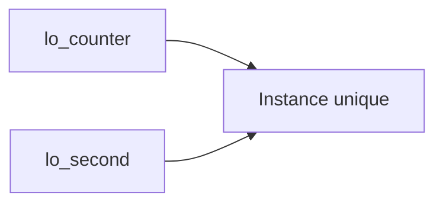

# 🌸 INSTANCIATION, RÉFÉRENCES ET IDENTITÉ DES OBJETS

## 🌺 OBJECTIFS

- Déclarer une référence d’objet
- Créer une instance avec `CREATE OBJECT` ou `NEW`
- Détecter une référence initiale
- Comprendre l’identité et la durée de vie d’un objet

## 🌺 RÉFÉRENCE D OBJET

```abap
DATA lo_counter TYPE REF TO lcl_counter.
```

Cette déclaration crée une variable de référence. Elle ne crée pas encore d’objet. Tant qu’aucune instance n’est affectée, la référence est initiale.

## 🌺 CRÉATION CLASSIQUE

```abap
CREATE OBJECT lo_counter
  EXPORTING
    iv_start = 10.
```

## 🌺 EXPRESSION NEW

Sur les versions ABAP compatibles :

```abap
DATA(lo_counter) = NEW lcl_counter( iv_start = 10 ).
```

`NEW` crée l’objet et retourne directement une référence. La syntaxe disponible dépend de la version ABAP du système, pas de l’utilisation de SAP GUI.

## 🌺 ACCÈS À UNE RÉFÉRENCE INITIALE

```abap
IF lo_counter IS BOUND.
  lo_counter->increment( ).
ENDIF.
```

`IS BOUND` vérifie qu’une référence pointe vers un objet valide. L’appel d’un composant d’instance via une référence initiale provoque une exception d’exécution.

## 🌺 COPIE D UNE RÉFÉRENCE

```abap
DATA lo_second TYPE REF TO lcl_counter.
lo_second = lo_counter.
```

Cette affectation ne duplique pas l’objet. Les deux variables de référence pointent vers la même instance.



Une modification de l’objet via l’une des références est visible via l’autre.

## 🌺 IDENTITÉ

La comparaison de deux références permet de déterminer si elles désignent la même instance. Elle ne compare pas automatiquement le contenu métier des objets.

Pour comparer deux objets selon des règles métier, exposer une méthode explicite, par exemple `is_equal_to`.

## 🌺 DURÉE DE VIE

Le runtime ABAP gère la mémoire des objets. Un objet devient récupérable lorsque plus aucune référence accessible ne le désigne. ABAP Objects ne fournit pas de destructeur déterministe à utiliser pour piloter une transaction ou libérer une ressource métier.

Les ressources doivent être fermées ou libérées par des méthodes explicites lorsque l’API utilisée l’exige.

## 🌺 RÉFÉRENCES OFFICIELLES SAP

- [ABAP Objects — SAP Help Portal](https://help.sap.com/docs/ABAP_PLATFORM_BW4HANA/7bfe8cdcfbb040dcb6702dada8c3e2f0/8e8b9c6bc4b94848b13f792966f02085.html)
- [ABAP Objects Example — ABAP Keyword Documentation](https://help.sap.com/doc/abapdocu_latest_index_htm/latest/en-US/ABENABAP_OBJECTS_ABEXA.html)
- [Reference to Data Types or Data Objects — ABAP Keyword Documentation](https://help.sap.com/doc/abapdocu_latest_index_htm/latest/en-US/ABENREF_TYPES_OBJECTS_GUIDL.html)

---

➡️ [Chapitre suivant — CONSTRUCTEURS D INSTANCE ET DE CLASSE](<./08 - 🍧 CONSTRUCTEURS D INSTANCE ET DE CLASSE.md>)
