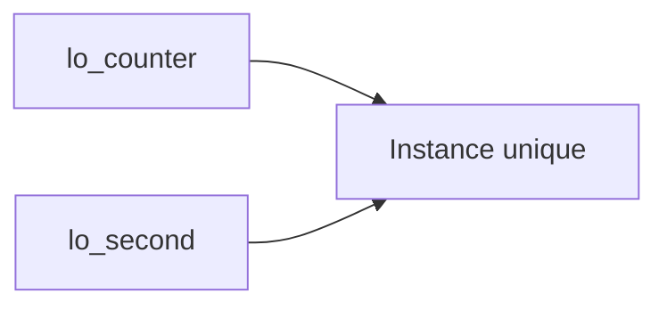

# 🌸 INSTANCIATION, RÉFÉRENCES ET IDENTITÉ DES OBJETS

## 🌺 OBJECTIFS

- Déclarer une référence d’objet
- Créer une instance avec `CREATE OBJECT` ou `NEW`
- Détecter une référence initiale
- Comprendre l’identité et la durée de vie d’un objet

## 🌺 RÉFÉRENCE D OBJET

```abap
DATA lo_counter TYPE REF TO lcl_counter.
```

Cette déclaration crée une variable de référence. Elle ne crée pas encore d’objet. Tant qu’aucune instance n’est affectée, la référence est initiale.

## 🌺 CRÉATION CLASSIQUE

```abap
CREATE OBJECT lo_counter
  EXPORTING
    iv_start = 10.
```

## 🌺 EXPRESSION NEW

Sur les versions ABAP compatibles :

```abap
DATA(lo_counter) = NEW lcl_counter( iv_start = 10 ).
```

`NEW` crée l’objet et retourne directement une référence. La syntaxe disponible dépend de la version ABAP du système, pas de l’utilisation de SAP GUI.

## 🌺 ACCÈS À UNE RÉFÉRENCE INITIALE

```abap
IF lo_counter IS BOUND.
  lo_counter->increment( ).
ENDIF.
```

`IS BOUND` vérifie qu’une référence pointe vers un objet valide. L’appel d’un composant d’instance via une référence initiale provoque une exception d’exécution.

## 🌺 COPIE D UNE RÉFÉRENCE

```abap
DATA lo_second TYPE REF TO lcl_counter.
lo_second = lo_counter.
```

Cette affectation ne duplique pas l’objet. Les deux variables de référence pointent vers la même instance.



Une modification de l’objet via l’une des références est visible via l’autre.

## 🌺 IDENTITÉ

La comparaison de deux références permet de déterminer si elles désignent la même instance. Elle ne compare pas automatiquement le contenu métier des objets.

Pour comparer deux objets selon des règles métier, exposer une méthode explicite, par exemple `is_equal_to`.

## 🌺 DURÉE DE VIE

Le runtime ABAP gère la mémoire des objets. Un objet devient récupérable lorsque plus aucune référence accessible ne le désigne. ABAP Objects ne fournit pas de destructeur déterministe à utiliser pour piloter une transaction ou libérer une ressource métier.

Les ressources doivent être fermées ou libérées par des méthodes explicites lorsque l’API utilisée l’exige.

## 🌺 CAS D’USAGE

Dans un contexte où une logique métier évolutive doit être encapsulée dans des classes afin de limiter les dépendances et faciliter les tests, le besoin consiste à **modéliser instanciation, références et identité des objets dans une conception ABAP Objects encapsulée et testable**. Cette notion est pertinente lorsque le lecteur doit pouvoir relier la syntaxe ou l’outil à une situation professionnelle concrète.

## 🌺 PROCÉDURE PAS À PAS

1. Saisir `/nSE38` dans le champ de commande.
2. Entrer le nom d’un programme Z de test, par exemple `ZREF_DEMO`, puis choisir **Créer** ou **Modifier** selon le cas.
3. Pour un exercice local uniquement, affecter `$TMP` ; pour un développement livrable, utiliser le package et l’ordre fournis par le projet.
4. Coller ou adapter le snippet du chapitre.
5. Exécuter le contrôle syntaxique avec `Ctrl+F2`.
6. Activer avec `Ctrl+F3`.
7. Exécuter avec `F8` et comparer le résultat avec la section **Vérification**.

## 🌺 VÉRIFICATION

- Le contrôle syntaxique réussit.
- La version active correspond au code sauvegardé.
- L’exécution produit le résultat décrit dans le chapitre.
- Les cas vide, limite et erreur sont testés séparément lorsque la syntaxe le permet.

## 🌺 ERREURS FRÉQUENTES

- Copier un exemple sans adapter les types, noms d’objets et données disponibles dans le système.
- Tester uniquement le cas nominal et ignorer les valeurs initiales, absentes ou invalides.
- Exposer des attributs modifiables au lieu d’encapsuler l’état.
- Créer une hiérarchie d’héritage alors qu’une composition suffit.

## 🌺 SNIPPET À RÉUTILISER

> [!NOTE]
> Adapter les noms `Z*`, les types DDIC, les données et les autorisations au système cible. Effectuer un contrôle syntaxique avant activation.

```abap
IF lo_counter IS BOUND.
  lo_counter->increment( ).
ENDIF.
```

## 🌺 TERMES DU LEXIQUE

- [Référence](<../└─ 🧩 00 - LEXIQUE SAP ET ABAP/04 - 🍧 LANGAGE ET DEVELOPPEMENT ABAP.md#reference>)
- [Classe](<../└─ 🧩 00 - LEXIQUE SAP ET ABAP/04 - 🍧 LANGAGE ET DEVELOPPEMENT ABAP.md#classe>)
- [Interface ABAP Objects](<../└─ 🧩 00 - LEXIQUE SAP ET ABAP/04 - 🍧 LANGAGE ET DEVELOPPEMENT ABAP.md#interface-abap-objects>)
- [Exception](<../└─ 🧩 00 - LEXIQUE SAP ET ABAP/04 - 🍧 LANGAGE ET DEVELOPPEMENT ABAP.md#exception>)

## 🌺 À RETENIR

- À l’issue du chapitre, le lecteur sait **modéliser instanciation, références et identité des objets dans une conception ABAP Objects encapsulée et testable**.
- Toujours tester sur un objet Z ou un jeu de données sans impact avant d’intervenir sur un traitement réel.
- La documentation `F1` du système reste la référence pour la syntaxe disponible dans sa release.

## 🌺 RÉFÉRENCES OFFICIELLES SAP

- [ABAP Objects — SAP Help Portal](https://help.sap.com/docs/ABAP_PLATFORM_BW4HANA/7bfe8cdcfbb040dcb6702dada8c3e2f0/8e8b9c6bc4b94848b13f792966f02085.html)
- [ABAP Objects Example — ABAP Keyword Documentation](https://help.sap.com/doc/abapdocu_latest_index_htm/latest/en-US/ABENABAP_OBJECTS_ABEXA.html)
- [Reference to Data Types or Data Objects — ABAP Keyword Documentation](https://help.sap.com/doc/abapdocu_latest_index_htm/latest/en-US/ABENREF_TYPES_OBJECTS_GUIDL.html)


---

➡️ [Chapitre suivant — CONSTRUCTEURS D INSTANCE ET DE CLASSE](<./08 - 🍧 CONSTRUCTEURS D INSTANCE ET DE CLASSE.md>)
