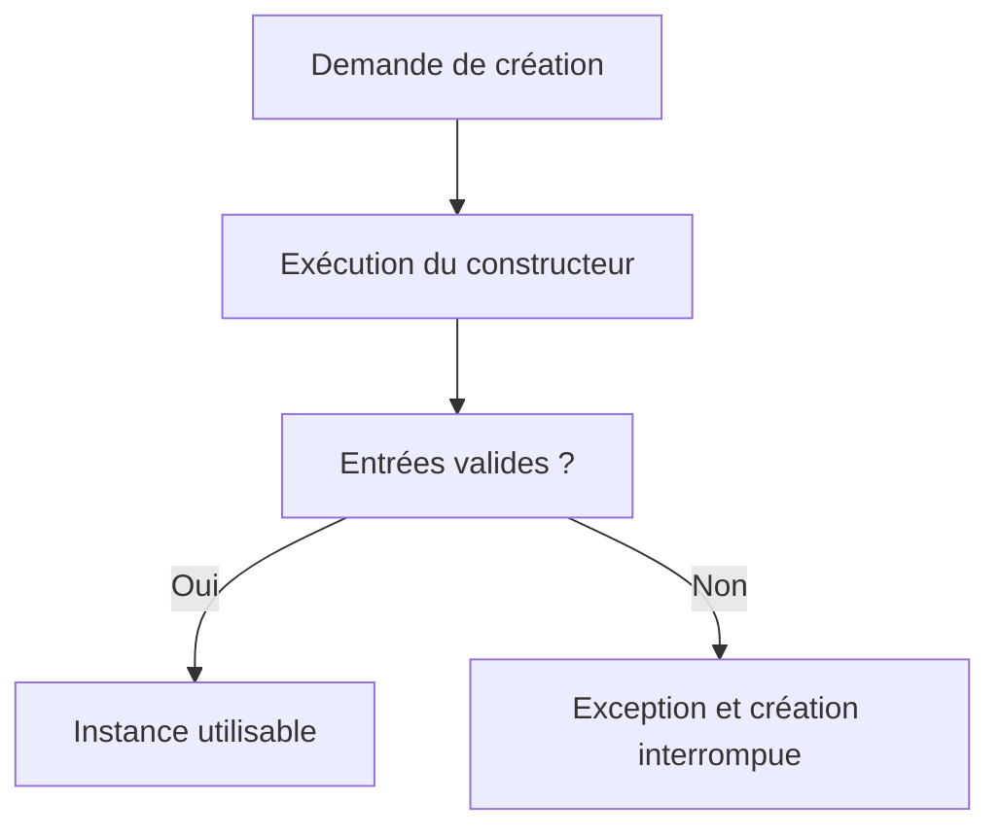

# 🌸 CONSTRUCTEURS D INSTANCE ET DE CLASSE

## 🌺 OBJECTIFS

- Initialiser une instance avec `constructor`
- Initialiser un état statique avec `class_constructor`
- Garantir les invariants dès la création
- Éviter les traitements métier cachés dans les constructeurs

## 🌺 CONSTRUCTEUR D INSTANCE

La méthode spéciale `constructor` est exécutée lors de la création d’une instance.

```abap
CLASS lcl_counter DEFINITION FINAL.
  PUBLIC SECTION.
    METHODS constructor
      IMPORTING iv_start TYPE i.
    METHODS get_value
      RETURNING VALUE(rv_value) TYPE i.
  PRIVATE SECTION.
    DATA mv_value TYPE i.
ENDCLASS.

CLASS lcl_counter IMPLEMENTATION.
  METHOD constructor.
    mv_value = iv_start.
  ENDMETHOD.
ENDCLASS.
```

Le constructeur ne se déclare pas avec `RETURNING`. Il initialise l’objet qui vient d’être créé.

## 🌺 INVARIANT

Un invariant est une règle qui doit rester vraie pour toute instance valide. Le constructeur doit empêcher la création d’un objet incohérent.

```abap
METHOD constructor.
  IF iv_start < 0.
    RAISE EXCEPTION TYPE zcx_dev_invalid_value.
  ENDIF.

  mv_value = iv_start.
ENDMETHOD.
```

## 🌺 CONSTRUCTEUR DE CLASSE

`class_constructor` est une méthode statique spéciale exécutée automatiquement avant la première utilisation pertinente de la classe dans une session interne.

```abap
CLASS-METHODS class_constructor.
CLASS-DATA gv_default_limit TYPE i READ-ONLY.
```

```abap
METHOD class_constructor.
  gv_default_limit = 100.
ENDMETHOD.
```

Le constructeur de classe :

- ne possède pas de paramètres ;
- n’est pas appelé explicitement ;
- sert à initialiser des composants statiques ;
- ne doit pas dépendre d’un ordre implicite entre plusieurs classes.

## 🌺 LIMITER LE TRAVAIL DU CONSTRUCTEUR

Éviter dans un constructeur :

- un traitement long ;
- un `COMMIT WORK` ;
- une interaction utilisateur ;
- des écritures en base non attendues ;
- des dépendances réseau cachées ;
- une logique qui pourrait être appelée explicitement par une méthode nommée.

Le constructeur doit principalement valider les entrées et établir un état cohérent.

## 🌺 CRÉATION IMPOSSIBLE

Si le constructeur lève une exception, aucune référence valide à la nouvelle instance n’est retournée à l’appelant.



## 🌺 RÉFÉRENCES OFFICIELLES SAP

- [ABAP Objects - Inheritance and Constructors — ABAP Keyword Documentation](https://help.sap.com/doc/abapdocu_cp_index_htm/CLOUD/en-US/abeninheritance_constructors.html)
- [CLASS, DEFINITION — ABAP Keyword Documentation](https://help.sap.com/doc/abapdocu_latest_index_htm/latest/en-US/ABAPCLASS_DEFINITION.html)
- [ABAP Objects Example — ABAP Keyword Documentation](https://help.sap.com/doc/abapdocu_latest_index_htm/latest/en-US/ABENABAP_OBJECTS_ABEXA.html)

---

➡️ [Chapitre suivant — COMPOSANTS D INSTANCE ET COMPOSANTS STATIQUES](<./09 - 🍧 COMPOSANTS D INSTANCE ET COMPOSANTS STATIQUES.md>)
