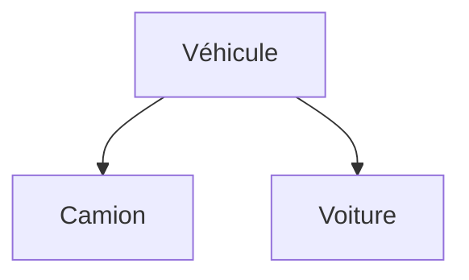

# 🌸 HÉRITAGE SIMPLE

## 🌺 OBJECTIFS

- Définir une relation de spécialisation
- Créer une sous-classe avec `INHERITING FROM`
- Comprendre les composants hérités
- Identifier les limites de l’héritage simple ABAP

## 🌺 DÉFINITION

L’héritage permet de définir une sous-classe à partir d’une superclasse.

```abap
CLASS lcl_vehicle DEFINITION.
  PUBLIC SECTION.
    METHODS get_description
      RETURNING VALUE(rv_text) TYPE string.
  PROTECTED SECTION.
    DATA mv_category TYPE string.
ENDCLASS.

CLASS lcl_truck DEFINITION INHERITING FROM lcl_vehicle.
  PUBLIC SECTION.
    METHODS constructor.
ENDCLASS.
```

Une classe ABAP possède au maximum une superclasse directe. Plusieurs interfaces peuvent toutefois être implémentées.

## 🌺 RELATION DE SPÉCIALISATION

Une sous-classe doit représenter un cas particulier valide de la superclasse.



Un camion est un véhicule. En revanche, un moteur n’est pas un véhicule : cette relation relève de la composition, pas de l’héritage.

## 🌺 COMPOSANTS HÉRITÉS

La sous-classe connaît les composants publics et protégés de la superclasse. Les composants privés existent dans l’objet mais ne sont pas directement accessibles depuis le code de la sous-classe.

La sous-classe peut :

- ajouter de nouveaux composants ;
- redéfinir les méthodes autorisées ;
- utiliser les méthodes publiques et protégées héritées ;
- fournir son propre constructeur.

## 🌺 RISQUES

L’héritage crée un couplage fort :

- la sous-classe dépend du contrat protégé de la superclasse ;
- une évolution de la superclasse peut affecter les descendants ;
- une hiérarchie profonde devient difficile à comprendre ;
- l’héritage utilisé seulement pour réutiliser du code produit souvent un mauvais modèle.

## 🌺 CHOIX

Utiliser l’héritage lorsque :

- la relation « est un » est stable ;
- le polymorphisme est réellement nécessaire ;
- le contrat de la superclasse est conçu pour l’extension ;
- les invariants de la superclasse restent valides pour toutes les sous-classes.

Préférer la composition lorsque la classe a seulement besoin d’utiliser un autre service.

## 🌺 RÉFÉRENCES OFFICIELLES SAP

- [Implementing Inheritance — SAP Learning](https://learning.sap.com/courses/deepening-your-abap-programming-knowledge/implementing-inheritance_bfdb59f7-0f99-48b9-b019-a7b766830ecc)
- [Inheritance — SAP Help Portal](https://help.sap.com/docs/SAP_NETWEAVER_731_BW_ABAP/cfae740a0a21455dbe6e510c2d86e36a/dd4049c40f4611d3b9380000e8353423.html)
- [ABAP Objects — SAP Help Portal](https://help.sap.com/docs/ABAP_PLATFORM_BW4HANA/7bfe8cdcfbb040dcb6702dada8c3e2f0/8e8b9c6bc4b94848b13f792966f02085.html)

---

➡️ [Chapitre suivant — REDÉFINITION, SUPER ET CONSTRUCTEURS HÉRITÉS](<./12 - 🍧 REDEFINITION SUPER ET CONSTRUCTEURS HERITES.md>)
