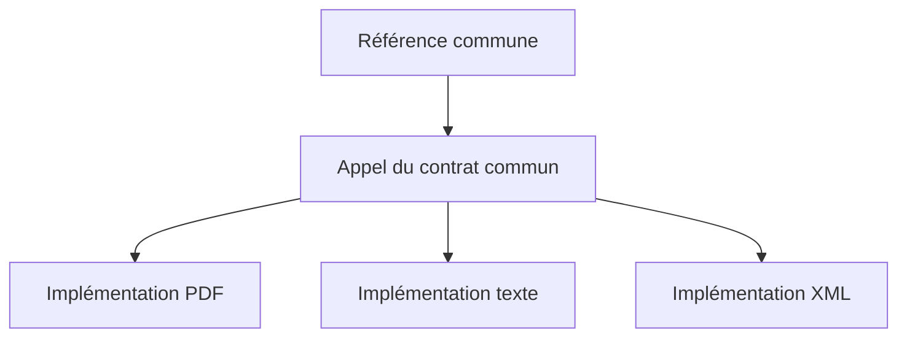

# 🌸 POLYMORPHISME, UP-CAST ET DOWN-CAST

## 🌺 OBJECTIFS

- Manipuler plusieurs classes par un type commun
- Comprendre l’up-cast implicite
- Réaliser un down-cast contrôlé
- Utiliser `IS INSTANCE OF`, `CAST` et `?=` avec prudence

## 🌺 POLYMORPHISME

Le polymorphisme permet de manipuler des objets concrets différents via une référence commune de superclasse ou d’interface.

```abap
DATA lo_document TYPE REF TO lcl_document.
CREATE OBJECT lo_document TYPE lcl_pdf_document.
lv_content = lo_document->render( ).
```

La méthode exécutée dépend du type réel de l’objet.

## 🌺 UP CAST

Un up-cast affecte une référence de sous-classe à une référence de superclasse.

```abap
DATA lo_pdf      TYPE REF TO lcl_pdf_document.
DATA lo_document TYPE REF TO lcl_document.

CREATE OBJECT lo_pdf.
lo_document = lo_pdf.
```

Cette conversion est sûre : tout objet `lcl_pdf_document` est également un `lcl_document`.

## 🌺 DOWN CAST

Un down-cast tente de retrouver un type plus spécialisé.

Syntaxe classique :

```abap
lo_pdf ?= lo_document.
```

Expression de conversion sur une version compatible :

```abap
lo_pdf = CAST lcl_pdf_document( lo_document ).
```

Si le type réel de l’objet n’est pas compatible, une exception de cast est déclenchée.

## 🌺 VÉRIFICATION

```abap
IF lo_document IS INSTANCE OF lcl_pdf_document.
  lo_pdf ?= lo_document.
ENDIF.
```

Cette vérification évite un cast invalide lorsque le type concret n’est pas garanti.

## 🌺 CONCEPTION

Un code riche en down-casts connaît trop précisément les implémentations concrètes. Il perd le bénéfice du polymorphisme.



Le consommateur doit appeler le contrat commun plutôt que tester chaque classe concrète avec une série de `IS INSTANCE OF`.

## 🌺 RÉFÉRENCES OFFICIELLES SAP

- [Using Inheritance — SAP Learning](https://learning.sap.com/courses/deepening-your-abap-programming-knowledge/using-inheritance_e8db2ae2-5d5d-4848-8534-ea9fa00f4f3c)
- [ABAP Objects — SAP Help Portal](https://help.sap.com/docs/ABAP_PLATFORM_BW4HANA/7bfe8cdcfbb040dcb6702dada8c3e2f0/8e8b9c6bc4b94848b13f792966f02085.html)
- [ABAP Objects Example — ABAP Keyword Documentation](https://help.sap.com/doc/abapdocu_latest_index_htm/latest/en-US/ABENABAP_OBJECTS_ABEXA.html)

---

➡️ [Chapitre suivant — INTERFACES](<./15 - 🍧 INTERFACES.md>)
