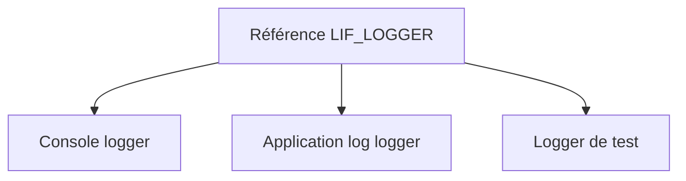

# 🌸 RÉFÉRENCES D’INTERFACE, ALIASES ET IMPLÉMENTATIONS MULTIPLES

## 🌺 OBJECTIFS

- Utiliser une référence typée sur une interface
- Comprendre la vue limitée offerte par cette référence
- Déclarer un alias de composant d’interface
- Gérer plusieurs interfaces possédant des noms similaires

## 🌺 RÉFÉRENCE D INTERFACE

```abap
DATA lo_logger TYPE REF TO lif_logger.
lo_logger = NEW lcl_console_logger( ).
lo_logger->log( iv_message = 'OK' ).
```

La référence donne accès uniquement aux composants du contrat `lif_logger`, même si l’objet concret possède d’autres méthodes publiques.

Cette restriction réduit le couplage du consommateur.

## 🌺 AFFECTATION

Tout objet d’une classe qui implémente l’interface peut être affecté à la référence :



Le consommateur peut changer d’implémentation sans changer son contrat.

## 🌺 ALIAS

Une classe peut définir un alias pour un composant d’interface.

```abap
PUBLIC SECTION.
  INTERFACES lif_logger.
  ALIASES log FOR lif_logger~log.
```

L’appel via une référence de classe devient alors :

```abap
lo_console_logger->log( iv_message = 'OK' ).
```

L’alias ne crée pas une seconde méthode. Il fournit un autre nom d’accès au même composant.

## 🌺 COLLISIONS DE NOMS

Deux interfaces peuvent déclarer une méthode portant le même nom. Les implémentations restent distinguées par leur qualification :

```abap
METHOD lif_text_writer~write.
ENDMETHOD.

METHOD lif_binary_writer~write.
ENDMETHOD.
```

La qualification rend explicite le contrat concerné.

## 🌺 DÉPENDANCE PAR INTERFACE

Préférer :

```abap
METHODS constructor
  IMPORTING io_logger TYPE REF TO lif_logger.
```

à :

```abap
METHODS constructor
  IMPORTING io_logger TYPE REF TO zcl_specific_logger.
```

lorsque le consommateur n’a besoin que du comportement défini par l’interface.

## 🌺 RÉFÉRENCES OFFICIELLES SAP

- [Using Interfaces — SAP Learning](https://learning.sap.com/courses/deepening-your-abap-programming-knowledge/using-interfaces_e45af9bb-46e5-457b-88ef-d5ad6b0d38d7)
- [Defining Interfaces — SAP Learning](https://learning.sap.com/courses/deepening-your-abap-programming-knowledge/defining-interfaces_ab3c7c07-bb66-424b-ba06-6cfa7cc39439)
- [ABAP Objects Example — ABAP Keyword Documentation](https://help.sap.com/doc/abapdocu_latest_index_htm/latest/en-US/ABENABAP_OBJECTS_ABEXA.html)

---

➡️ [Chapitre suivant — ÉVÉNEMENTS ET GESTIONNAIRES](<./17 - 🍧 EVENEMENTS ET GESTIONNAIRES.md>)
