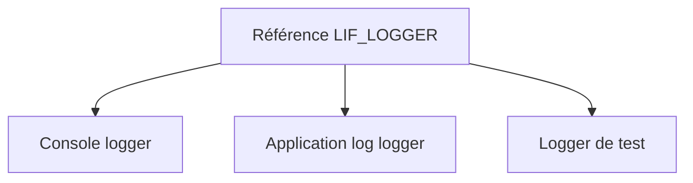

# 🌸 RÉFÉRENCES D’INTERFACE, ALIASES ET IMPLÉMENTATIONS MULTIPLES

## 🌺 OBJECTIFS

- Utiliser une référence typée sur une interface
- Comprendre la vue limitée offerte par cette référence
- Déclarer un alias de composant d’interface
- Gérer plusieurs interfaces possédant des noms similaires

## 🌺 RÉFÉRENCE D INTERFACE

```abap
DATA lo_logger TYPE REF TO lif_logger.
lo_logger = NEW lcl_console_logger( ).
lo_logger->log( iv_message = 'OK' ).
```

La référence donne accès uniquement aux composants du contrat `lif_logger`, même si l’objet concret possède d’autres méthodes publiques.

Cette restriction réduit le couplage du consommateur.

## 🌺 AFFECTATION

Tout objet d’une classe qui implémente l’interface peut être affecté à la référence :



Le consommateur peut changer d’implémentation sans changer son contrat.

## 🌺 ALIAS

Une classe peut définir un alias pour un composant d’interface.

```abap
PUBLIC SECTION.
  INTERFACES lif_logger.
  ALIASES log FOR lif_logger~log.
```

L’appel via une référence de classe devient alors :

```abap
lo_console_logger->log( iv_message = 'OK' ).
```

L’alias ne crée pas une seconde méthode. Il fournit un autre nom d’accès au même composant.

## 🌺 COLLISIONS DE NOMS

Deux interfaces peuvent déclarer une méthode portant le même nom. Les implémentations restent distinguées par leur qualification :

```abap
METHOD lif_text_writer~write.
ENDMETHOD.

METHOD lif_binary_writer~write.
ENDMETHOD.
```

La qualification rend explicite le contrat concerné.

## 🌺 DÉPENDANCE PAR INTERFACE

Préférer :

```abap
METHODS constructor
  IMPORTING io_logger TYPE REF TO lif_logger.
```

à :

```abap
METHODS constructor
  IMPORTING io_logger TYPE REF TO zcl_specific_logger.
```

lorsque le consommateur n’a besoin que du comportement défini par l’interface.

## 🌺 CAS D’USAGE

Dans un contexte où une logique métier évolutive doit être encapsulée dans des classes afin de limiter les dépendances et faciliter les tests, le besoin consiste à **modéliser références d’interface, aliases et implémentations multiples dans une conception ABAP Objects encapsulée et testable**. Cette notion est pertinente lorsque le lecteur doit pouvoir relier la syntaxe ou l’outil à une situation professionnelle concrète.

## 🌺 PROCÉDURE PAS À PAS

1. Saisir `/nSE38` dans le champ de commande.
2. Entrer le nom d’un programme Z de test, par exemple `ZREF_DEMO`, puis choisir **Créer** ou **Modifier** selon le cas.
3. Pour un exercice local uniquement, affecter `$TMP` ; pour un développement livrable, utiliser le package et l’ordre fournis par le projet.
4. Coller ou adapter le snippet du chapitre.
5. Exécuter le contrôle syntaxique avec `Ctrl+F2`.
6. Activer avec `Ctrl+F3`.
7. Exécuter avec `F8` et comparer le résultat avec la section **Vérification**.

## 🌺 VÉRIFICATION

- Le contrôle syntaxique réussit.
- La version active correspond au code sauvegardé.
- L’exécution produit le résultat décrit dans le chapitre.
- Les cas vide, limite et erreur sont testés séparément lorsque la syntaxe le permet.

## 🌺 ERREURS FRÉQUENTES

- Copier un exemple sans adapter les types, noms d’objets et données disponibles dans le système.
- Tester uniquement le cas nominal et ignorer les valeurs initiales, absentes ou invalides.
- Exposer des attributs modifiables au lieu d’encapsuler l’état.
- Créer une hiérarchie d’héritage alors qu’une composition suffit.

## 🌺 SNIPPET À RÉUTILISER

> [!NOTE]
> Adapter les noms `Z*`, les types DDIC, les données et les autorisations au système cible. Effectuer un contrôle syntaxique avant activation.

```abap
METHOD lif_text_writer~write.
ENDMETHOD.

METHOD lif_binary_writer~write.
ENDMETHOD.
```

## 🌺 TERMES DU LEXIQUE

- [Référence](<../└─ 🧩 00 - LEXIQUE SAP ET ABAP/04 - 🍧 LANGAGE ET DEVELOPPEMENT ABAP.md#reference>)
- [Interface](<../└─ 🧩 00 - LEXIQUE SAP ET ABAP/07 - 🍧 INTERFACES ET INTEGRATION.md#interface-integration>)
- [Classe](<../└─ 🧩 00 - LEXIQUE SAP ET ABAP/04 - 🍧 LANGAGE ET DEVELOPPEMENT ABAP.md#classe>)
- [Interface ABAP Objects](<../└─ 🧩 00 - LEXIQUE SAP ET ABAP/04 - 🍧 LANGAGE ET DEVELOPPEMENT ABAP.md#interface-abap-objects>)
- [Exception](<../└─ 🧩 00 - LEXIQUE SAP ET ABAP/04 - 🍧 LANGAGE ET DEVELOPPEMENT ABAP.md#exception>)

## 🌺 À RETENIR

- À l’issue du chapitre, le lecteur sait **modéliser références d’interface, aliases et implémentations multiples dans une conception ABAP Objects encapsulée et testable**.
- Toujours tester sur un objet Z ou un jeu de données sans impact avant d’intervenir sur un traitement réel.
- La documentation `F1` du système reste la référence pour la syntaxe disponible dans sa release.

## 🌺 RÉFÉRENCES OFFICIELLES SAP

- [Using Interfaces — SAP Learning](https://learning.sap.com/courses/deepening-your-abap-programming-knowledge/using-interfaces_e45af9bb-46e5-457b-88ef-d5ad6b0d38d7)
- [Defining Interfaces — SAP Learning](https://learning.sap.com/courses/deepening-your-abap-programming-knowledge/defining-interfaces_ab3c7c07-bb66-424b-ba06-6cfa7cc39439)
- [ABAP Objects Example — ABAP Keyword Documentation](https://help.sap.com/doc/abapdocu_latest_index_htm/latest/en-US/ABENABAP_OBJECTS_ABEXA.html)


---

➡️ [Chapitre suivant — ÉVÉNEMENTS ET GESTIONNAIRES](<./17 - 🍧 EVENEMENTS ET GESTIONNAIRES.md>)
