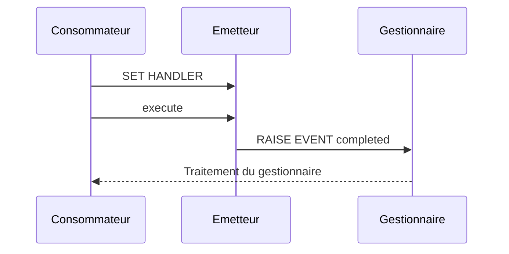

# 🌸 ÉVÉNEMENTS ET GESTIONNAIRES

## 🌺 OBJECTIFS

- Déclarer et déclencher un événement
- Implémenter une méthode gestionnaire
- Enregistrer un gestionnaire avec `SET HANDLER`
- Comprendre le couplage entre émetteur et abonnés

## 🌺 DÉCLARATION

```abap
CLASS lcl_download DEFINITION FINAL.
  PUBLIC SECTION.
    EVENTS completed
      EXPORTING VALUE(ev_file_name) TYPE string.
    METHODS execute.
ENDCLASS.
```

## 🌺 DÉCLENCHEMENT

```abap
METHOD execute.
  DATA lv_file_name TYPE string VALUE 'result.csv'.

  " Traitement...

  RAISE EVENT completed
    EXPORTING
      ev_file_name = lv_file_name.
ENDMETHOD.
```

## 🌺 GESTIONNAIRE

```abap
CLASS lcl_monitor DEFINITION FINAL.
  PUBLIC SECTION.
    METHODS on_completed
      FOR EVENT completed OF lcl_download
      IMPORTING ev_file_name sender.
ENDCLASS.
```

```abap
CLASS lcl_monitor IMPLEMENTATION.
  METHOD on_completed.
    WRITE: / 'Fichier créé :', ev_file_name.
  ENDMETHOD.
ENDCLASS.
```

## 🌺 ENREGISTREMENT

```abap
SET HANDLER lo_monitor->on_completed FOR lo_download.
lo_download->execute( ).
```

Le gestionnaire doit être enregistré avant le déclenchement. La référence du gestionnaire doit rester valide tant que les événements doivent être reçus.

## 🌺 FLUX



Les événements ABAP sont traités dans le flux d’exécution du programme. Ils ne constituent pas à eux seuls une file asynchrone ou un mécanisme de persistance.

## 🌺 DÉSENREGISTREMENT

`SET HANDLER ... ACTIVATION abap_false` permet de désactiver un enregistrement lorsque le scénario l’exige.

## 🌺 USAGES

Les événements conviennent notamment pour :

- notifier un changement d’état ;
- connecter un contrôleur à un objet d’interface graphique ;
- permettre plusieurs réactions sans que l’émetteur connaisse leurs implémentations ;
- étendre un traitement par abonnement.

Ne pas utiliser un événement lorsque l’émetteur exige un résultat immédiat et unique d’un collaborateur. Une méthode appelée explicitement est alors plus claire.

## 🌺 CAS D’USAGE

Dans un contexte où une logique métier évolutive doit être encapsulée dans des classes afin de limiter les dépendances et faciliter les tests, le besoin consiste à **modéliser événements et gestionnaires dans une conception ABAP Objects encapsulée et testable**. Cette notion est pertinente lorsque le lecteur doit pouvoir relier la syntaxe ou l’outil à une situation professionnelle concrète.

## 🌺 PROCÉDURE PAS À PAS

1. Saisir `/nSE38` dans le champ de commande.
2. Entrer le nom d’un programme Z de test, par exemple `ZREF_DEMO`, puis choisir **Créer** ou **Modifier** selon le cas.
3. Pour un exercice local uniquement, affecter `$TMP` ; pour un développement livrable, utiliser le package et l’ordre fournis par le projet.
4. Coller ou adapter le snippet du chapitre.
5. Exécuter le contrôle syntaxique avec `Ctrl+F2`.
6. Activer avec `Ctrl+F3`.
7. Exécuter avec `F8` et comparer le résultat avec la section **Vérification**.

## 🌺 VÉRIFICATION

- Le contrôle syntaxique réussit.
- La version active correspond au code sauvegardé.
- L’exécution produit le résultat décrit dans le chapitre.
- Les cas vide, limite et erreur sont testés séparément lorsque la syntaxe le permet.

## 🌺 ERREURS FRÉQUENTES

- Copier un exemple sans adapter les types, noms d’objets et données disponibles dans le système.
- Tester uniquement le cas nominal et ignorer les valeurs initiales, absentes ou invalides.
- Exposer des attributs modifiables au lieu d’encapsuler l’état.
- Créer une hiérarchie d’héritage alors qu’une composition suffit.

## 🌺 SNIPPET À RÉUTILISER

> [!NOTE]
> Adapter les noms `Z*`, les types DDIC, les données et les autorisations au système cible. Effectuer un contrôle syntaxique avant activation.

```abap
CLASS lcl_download DEFINITION FINAL.
  PUBLIC SECTION.
    EVENTS completed
      EXPORTING VALUE(ev_file_name) TYPE string.
    METHODS execute.
ENDCLASS.
```

## 🌺 TERMES DU LEXIQUE

- [Classe](<../└─ 🧩 00 - LEXIQUE SAP ET ABAP/04 - 🍧 LANGAGE ET DEVELOPPEMENT ABAP.md#classe>)
- [Interface ABAP Objects](<../└─ 🧩 00 - LEXIQUE SAP ET ABAP/04 - 🍧 LANGAGE ET DEVELOPPEMENT ABAP.md#interface-abap-objects>)
- [Référence](<../└─ 🧩 00 - LEXIQUE SAP ET ABAP/04 - 🍧 LANGAGE ET DEVELOPPEMENT ABAP.md#reference>)
- [Exception](<../└─ 🧩 00 - LEXIQUE SAP ET ABAP/04 - 🍧 LANGAGE ET DEVELOPPEMENT ABAP.md#exception>)

## 🌺 À RETENIR

- À l’issue du chapitre, le lecteur sait **modéliser événements et gestionnaires dans une conception ABAP Objects encapsulée et testable**.
- Toujours tester sur un objet Z ou un jeu de données sans impact avant d’intervenir sur un traitement réel.
- La documentation `F1` du système reste la référence pour la syntaxe disponible dans sa release.

## 🌺 RÉFÉRENCES OFFICIELLES SAP

- [ABAP Objects Example — ABAP Keyword Documentation](https://help.sap.com/doc/abapdocu_latest_index_htm/latest/en-US/ABENABAP_OBJECTS_ABEXA.html)
- [SET HANDLER, Static Event — ABAP Keyword Documentation](https://help.sap.com/doc/abapdocu_751_index_htm/7.51/en-US/abapset_handler_static.htm)
- [ABAP Objects — SAP Help Portal](https://help.sap.com/docs/ABAP_PLATFORM_BW4HANA/7bfe8cdcfbb040dcb6702dada8c3e2f0/8e8b9c6bc4b94848b13f792966f02085.html)


---

➡️ [Chapitre suivant — CLASSES AMIES](<./18 - 🍧 CLASSES AMIES.md>)
