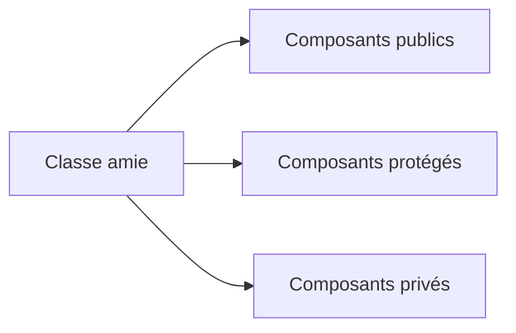

# 🌸 CLASSES AMIES

## 🌺 OBJECTIFS

- Comprendre le mécanisme `FRIENDS`
- Identifier les accès accordés à une classe amie
- Reconnaître le couplage créé par cette relation
- Limiter son utilisation aux cas exceptionnels

## 🌺 DÉCLARATION

Une classe peut déclarer d’autres classes ou interfaces comme amies.

```abap
CLASS lcl_account DEFINITION
  FRIENDS lcl_account_inspector.
  PRIVATE SECTION.
    DATA mv_balance TYPE decfloat34.
ENDCLASS.
```

La classe amie peut alors accéder aux composants privés et protégés selon les règles du langage.

## 🌺 EFFET



L’amitié élargit volontairement la frontière d’encapsulation. Elle crée donc un couplage fort avec l’implémentation interne de la classe cible.

## 🌺 CARACTÉRISTIQUES

Ne pas considérer l’amitié comme :

- une relation d’héritage ;
- une interface métier ;
- une autorisation applicative ;
- un remplacement des méthodes publiques ;
- un moyen général d’éviter la conception d’un contrat.

L’accès technique aux composants privés n’accorde aucune autorisation métier à l’utilisateur courant.

## 🌺 CAS POSSIBLES

Une relation d’amitié peut être justifiée pour :

- un collaborateur interne étroitement lié à l’implémentation ;
- un mécanisme technique imposé par un framework ;
- certaines classes de test locales, selon l’organisation retenue ;
- une construction contrôlée nécessitant un accès interne précis.

## 🌺 ALTERNATIVES

Avant d’utiliser `FRIENDS`, vérifier si le besoin peut être résolu par :

- une méthode privée appelée par la classe elle-même ;
- une méthode protégée destinée aux sous-classes ;
- une interface publique réduite ;
- une composition avec un contrat explicite ;
- le déplacement de la responsabilité dans la bonne classe.

## 🌺 RÈGLE

Une classe amie dépend des détails internes de la classe cible. Documenter la raison de cette exception et maintenir la liste des amis aussi courte que possible.

## 🌺 RÉFÉRENCES OFFICIELLES SAP

- [CLASS, DEFINITION — ABAP Keyword Documentation](https://help.sap.com/doc/abapdocu_latest_index_htm/latest/en-US/ABAPCLASS_DEFINITION.html)
- [ABAP Objects as a Programming Model — ABAP Keyword Documentation](https://help.sap.com/doc/abapdocu_latest_index_htm/latest/en-US/ABENABAP_OBJ_PROGR_MODEL_GUIDL.html)
- [Clean ABAP — SAP Style Guides](https://github.com/SAP/styleguides/blob/main/clean-abap/CleanABAP.md)

---

➡️ [Chapitre suivant — CRÉATION CONTRÔLÉE ET MÉTHODES FABRIQUES](<./19 - 🍧 CREATION CONTROLEE ET METHODES FABRIQUES.md>)
