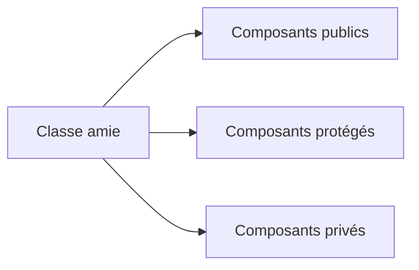

# 🌸 CLASSES AMIES

## 🌺 OBJECTIFS

- Comprendre le mécanisme `FRIENDS`
- Identifier les accès accordés à une classe amie
- Reconnaître le couplage créé par cette relation
- Limiter son utilisation aux cas exceptionnels

## 🌺 DÉCLARATION

Une classe peut déclarer d’autres classes ou interfaces comme amies.

```abap
CLASS lcl_account DEFINITION
  FRIENDS lcl_account_inspector.
  PRIVATE SECTION.
    DATA mv_balance TYPE decfloat34.
ENDCLASS.
```

La classe amie peut alors accéder aux composants privés et protégés selon les règles du langage.

## 🌺 EFFET



L’amitié élargit volontairement la frontière d’encapsulation. Elle crée donc un couplage fort avec l’implémentation interne de la classe cible.

## 🌺 CARACTÉRISTIQUES

Ne pas considérer l’amitié comme :

- une relation d’héritage ;
- une interface métier ;
- une autorisation applicative ;
- un remplacement des méthodes publiques ;
- un moyen général d’éviter la conception d’un contrat.

L’accès technique aux composants privés n’accorde aucune autorisation métier à l’utilisateur courant.

## 🌺 CAS POSSIBLES

Une relation d’amitié peut être justifiée pour :

- un collaborateur interne étroitement lié à l’implémentation ;
- un mécanisme technique imposé par un framework ;
- certaines classes de test locales, selon l’organisation retenue ;
- une construction contrôlée nécessitant un accès interne précis.

## 🌺 ALTERNATIVES

Avant d’utiliser `FRIENDS`, vérifier si le besoin peut être résolu par :

- une méthode privée appelée par la classe elle-même ;
- une méthode protégée destinée aux sous-classes ;
- une interface publique réduite ;
- une composition avec un contrat explicite ;
- le déplacement de la responsabilité dans la bonne classe.

## 🌺 RÈGLE

Une classe amie dépend des détails internes de la classe cible. Documenter la raison de cette exception et maintenir la liste des amis aussi courte que possible.

## 🌺 CAS D’USAGE

Dans un contexte où une logique métier évolutive doit être encapsulée dans des classes afin de limiter les dépendances et faciliter les tests, le besoin consiste à **modéliser classes amies dans une conception ABAP Objects encapsulée et testable**. Cette notion est pertinente lorsque le lecteur doit pouvoir relier la syntaxe ou l’outil à une situation professionnelle concrète.

## 🌺 PROCÉDURE PAS À PAS

1. Saisir `/nSE38` dans le champ de commande.
2. Entrer le nom d’un programme Z de test, par exemple `ZREF_DEMO`, puis choisir **Créer** ou **Modifier** selon le cas.
3. Pour un exercice local uniquement, affecter `$TMP` ; pour un développement livrable, utiliser le package et l’ordre fournis par le projet.
4. Coller ou adapter le snippet du chapitre.
5. Exécuter le contrôle syntaxique avec `Ctrl+F2`.
6. Activer avec `Ctrl+F3`.
7. Exécuter avec `F8` et comparer le résultat avec la section **Vérification**.

## 🌺 VÉRIFICATION

- Le contrôle syntaxique réussit.
- La version active correspond au code sauvegardé.
- L’exécution produit le résultat décrit dans le chapitre.
- Les cas vide, limite et erreur sont testés séparément lorsque la syntaxe le permet.

## 🌺 ERREURS FRÉQUENTES

- Copier un exemple sans adapter les types, noms d’objets et données disponibles dans le système.
- Tester uniquement le cas nominal et ignorer les valeurs initiales, absentes ou invalides.
- Exposer des attributs modifiables au lieu d’encapsuler l’état.
- Créer une hiérarchie d’héritage alors qu’une composition suffit.

## 🌺 SNIPPET À RÉUTILISER

> [!NOTE]
> Adapter les noms `Z*`, les types DDIC, les données et les autorisations au système cible. Effectuer un contrôle syntaxique avant activation.

```abap
CLASS lcl_account DEFINITION
  FRIENDS lcl_account_inspector.
  PRIVATE SECTION.
    DATA mv_balance TYPE decfloat34.
ENDCLASS.
```

## 🌺 TERMES DU LEXIQUE

- [Classe](<../└─ 🧩 00 - LEXIQUE SAP ET ABAP/04 - 🍧 LANGAGE ET DEVELOPPEMENT ABAP.md#classe>)
- [Interface ABAP Objects](<../└─ 🧩 00 - LEXIQUE SAP ET ABAP/04 - 🍧 LANGAGE ET DEVELOPPEMENT ABAP.md#interface-abap-objects>)
- [Référence](<../└─ 🧩 00 - LEXIQUE SAP ET ABAP/04 - 🍧 LANGAGE ET DEVELOPPEMENT ABAP.md#reference>)
- [Exception](<../└─ 🧩 00 - LEXIQUE SAP ET ABAP/04 - 🍧 LANGAGE ET DEVELOPPEMENT ABAP.md#exception>)

## 🌺 À RETENIR

- À l’issue du chapitre, le lecteur sait **modéliser classes amies dans une conception ABAP Objects encapsulée et testable**.
- Toujours tester sur un objet Z ou un jeu de données sans impact avant d’intervenir sur un traitement réel.
- La documentation `F1` du système reste la référence pour la syntaxe disponible dans sa release.

## 🌺 RÉFÉRENCES OFFICIELLES SAP

- [CLASS, DEFINITION — ABAP Keyword Documentation](https://help.sap.com/doc/abapdocu_latest_index_htm/latest/en-US/ABAPCLASS_DEFINITION.html)
- [ABAP Objects as a Programming Model — ABAP Keyword Documentation](https://help.sap.com/doc/abapdocu_latest_index_htm/latest/en-US/ABENABAP_OBJ_PROGR_MODEL_GUIDL.html)
- [Clean ABAP — SAP Style Guides](https://github.com/SAP/styleguides/blob/main/clean-abap/CleanABAP.md)


---

➡️ [Chapitre suivant — CRÉATION CONTRÔLÉE ET MÉTHODES FABRIQUES](<./19 - 🍧 CREATION CONTROLEE ET METHODES FABRIQUES.md>)
