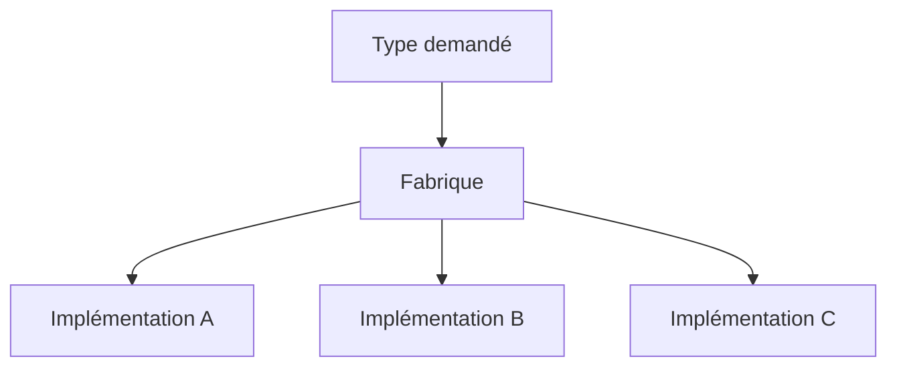

# 🌸 CRÉATION CONTRÔLÉE ET MÉTHODES FABRIQUES

## 🌺 OBJECTIFS

- Restreindre la création directe d’instances
- Utiliser `CREATE PRIVATE` ou `CREATE PROTECTED`
- Implémenter une méthode fabrique statique
- Distinguer fabrique et singleton

## 🌺 CRÉATION PRIVÉE

```abap
CLASS lcl_currency DEFINITION
  FINAL
  CREATE PRIVATE.
  PUBLIC SECTION.
    CLASS-METHODS create
      IMPORTING iv_code              TYPE string
      RETURNING VALUE(ro_currency)   TYPE REF TO lcl_currency
      RAISING   zcx_dev_invalid_code.
    METHODS get_code
      RETURNING VALUE(rv_code) TYPE string.
  PRIVATE SECTION.
    METHODS constructor
      IMPORTING iv_code TYPE string.
    DATA mv_code TYPE string.
ENDCLASS.
```

Le consommateur ne peut pas utiliser directement `CREATE OBJECT` ou `NEW` sur cette classe. Il doit passer par la méthode publique prévue.

## 🌺 MÉTHODE FABRIQUE

```abap
METHOD create.
  IF iv_code IS INITIAL.
    RAISE EXCEPTION TYPE zcx_dev_invalid_code.
  ENDIF.

  CREATE OBJECT ro_currency
    EXPORTING
      iv_code = iv_code.
ENDMETHOD.
```

La fabrique peut :

- valider les paramètres ;
- choisir une sous-classe ;
- retourner une instance mise en cache ;
- masquer une construction complexe ;
- garantir une politique de création uniforme.

## 🌺 POLYMORPHISME

Une fabrique peut retourner une référence d’interface :

```abap
CLASS-METHODS create
  IMPORTING iv_type           TYPE string
  RETURNING VALUE(ro_service) TYPE REF TO lif_service.
```



Le consommateur reste indépendant des classes concrètes.

## 🌺 CREATE PROTECTED

`CREATE PROTECTED` réserve la création à la classe, à ses sous-classes et aux amis autorisés. L’utiliser lorsqu’une hiérarchie doit contrôler l’instanciation tout en permettant la construction par les descendants.

## 🌺 SINGLETON

Un singleton impose une instance unique dans le périmètre d’exécution concerné. Il s’appuie généralement sur :

- `CREATE PRIVATE` ;
- un attribut statique contenant l’instance ;
- une méthode statique `get_instance`.

Ne pas utiliser ce modèle par défaut. Il introduit un état global, complique le remplacement de la dépendance et peut conserver un état plus longtemps que prévu.

## 🌺 RÉFÉRENCES OFFICIELLES SAP

- [Implementing Factory Methods — SAP Learning](https://learning.sap.com/courses/deepening-your-abap-programming-knowledge/implementing-factory-methods_ff885b1e-5e7c-4d73-b9df-b4be5112e1fa)
- [CLASS, DEFINITION — ABAP Keyword Documentation](https://help.sap.com/doc/abapdocu_latest_index_htm/latest/en-US/ABAPCLASS_DEFINITION.html)
- [Clean ABAP — SAP Style Guides](https://github.com/SAP/styleguides/blob/main/clean-abap/CleanABAP.md)

---

➡️ [Chapitre suivant — COMPOSITION, DÉPENDANCES ET BONNES PRATIQUES](<./20 - 🍧 COMPOSITION DEPENDANCES ET BONNES PRATIQUES.md>)
