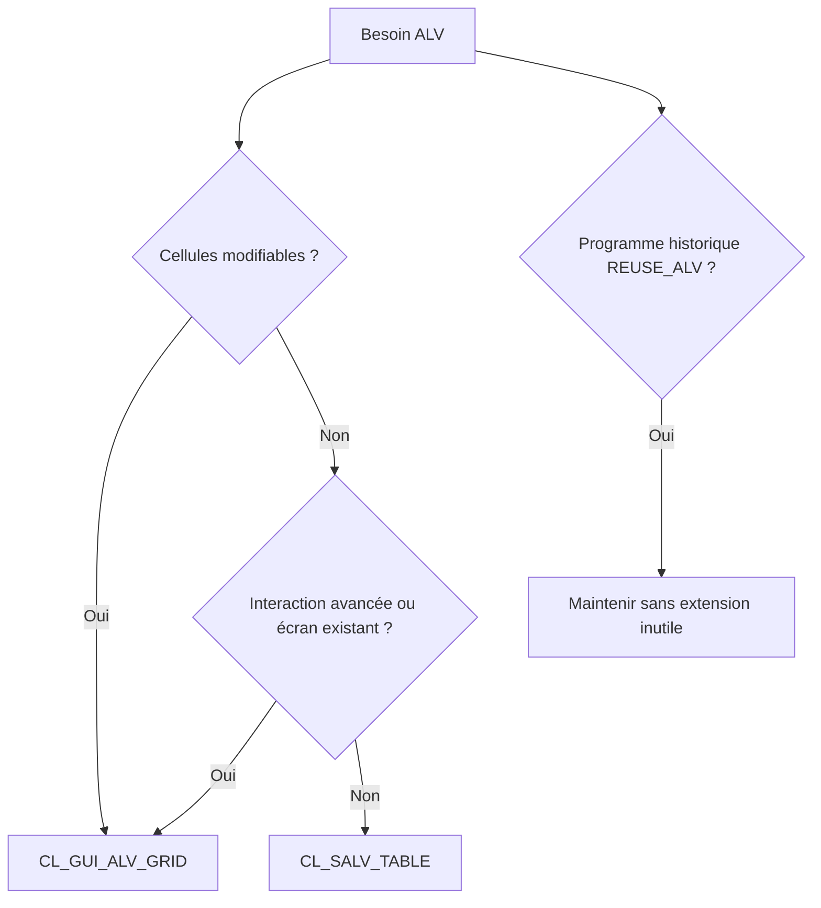

# 🌸 CHOISIR ENTRE SALV, ALV GRID ET FONCTIONS CLASSIQUES

## 🌺 OBJECTIFS

- Choisir l’API ALV selon les exigences
- Éviter d’utiliser une technologie trop complexe
- Identifier les contraintes de maintenance

## 🌺 ARBRE DE DÉCISION

## 🌺 UTILISER CL_SALV_TABLE

Choisir SALV lorsque le besoin consiste principalement à afficher une table interne :

- rapport en lecture seule ;
- fonctions standard suffisantes ;
- configuration de colonnes, tris et totaux ;
- événements simples comme double-clic ou lien.

SALV réduit fortement le code d’infrastructure.

## 🌺 UTILISER CL_GUI_ALV_GRID

Choisir le Grid Control lorsque le programme nécessite :

- saisie ou modification de cellules ;
- validation avec `DATA_CHANGED` ;
- barre d’outils personnalisée ;
- styles ou propriétés au niveau cellule ;
- intégration dans un Dynpro existant ;
- actualisations répétées avec conservation du contexte utilisateur.

## 🌺 FONCTIONS CLASSIQUES

Les fonctions `REUSE_ALV_*` sont fréquentes dans les développements anciens. Elles restent utiles pour comprendre et corriger l’existant, mais ne constituent pas le choix prioritaire pour un nouveau développement orienté objet.

## 🌺 CRITÈRES DE CHOIX

| Critère                      |                  SALV | ALV Grid |                REUSE_ALV |
| ---------------------------- | --------------------: | -------: | -----------------------: |
| Code initial réduit          |                  Fort |    Moyen |                    Moyen |
| Lecture seule                |                   Oui |      Oui |                      Oui |
| Édition                      | Non, modèle classique |      Oui | Limitée et moins adaptée |
| Contrôle cellule par cellule |                Limité |     Fort |                   Limité |
| Événements avancés           |                 Moyen |     Fort |               Historique |
| Nouveau développement        |                   Oui |      Oui |          Non prioritaire |

## 🌺 VÉRIFICATION

- Le lecteur peut expliquer la différence entre cette notion et les concepts proches.
- Le choix technique est justifié par un besoin concret, pas uniquement par habitude.
- Les limites liées à la release, aux autorisations et au contexte d’exécution sont identifiées.

## 🌺 ERREURS FRÉQUENTES

- Afficher un volume non borné dans l’ALV.
- Rendre une cellule éditable sans validation ni sauvegarde transactionnelle.

## 🌺 TERMES DU LEXIQUE

- [SALV](<../└─ 🧩 00 - LEXIQUE SAP ET ABAP/10 - 🍧 ACRONYMES SAP.md#acro-salv>)
- [ALV](<../└─ 🧩 00 - LEXIQUE SAP ET ABAP/10 - 🍧 ACRONYMES SAP.md#acro-alv>)
- [Table interne](<../└─ 🧩 00 - LEXIQUE SAP ET ABAP/04 - 🍧 LANGAGE ET DEVELOPPEMENT ABAP.md#table-interne>)

## 🌺 RÉFÉRENCES OFFICIELLES SAP

- [Main ALV Classes — SAP Help Portal](https://help.sap.com/docs/ABAP_PLATFORM_NEW/b1c834a22d05483b8a75710743b5ff26/4ec1f117076868b8e10000000a42189e.html)
- [Object-Oriented ALV Guide — SAP Help Portal](https://help.sap.com/docs/SUPPORT_CONTENT/abap/3353523914.html)
- [Function Modules Related to ALV Grid — SAP Help Portal](https://help.sap.com/docs/SUPPORT_CONTENT/abap/3353524193.html)

---

➡️ [Chapitre suivant — PREMIER ALV AVEC CL_SALV_TABLE](<./03 - 🍧 PREMIER ALV AVEC CL_SALV_TABLE.md>)
