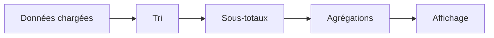

# 🌸 TRI, FILTRES, TOTAUX ET AGRÉGATIONS SALV

## 🌺 OBJECTIFS

- Définir un tri initial
- Créer des sous-totaux
- Ajouter des agrégations
- Préparer des filtres applicatifs

## 🌺 TRI INITIAL

```abap
DATA lo_sorts TYPE REF TO cl_salv_sorts.

lo_sorts = go_alv->get_sorts( ).
lo_sorts->add_sort(
  columnname = 'CARRID'
  position   = 1
  sequence   = if_salv_c_sort=>sort_up
  subtotal   = abap_true ).
```

## 🌺 AGRÉGATION

```abap
DATA lo_aggregations TYPE REF TO cl_salv_aggregations.

lo_aggregations = go_alv->get_aggregations( ).
lo_aggregations->add_aggregation(
  columnname  = 'PRICE'
  aggregation = if_salv_c_aggregation=>total ).
```

Les agrégations possibles dépendent du type de la colonne. Les champs de quantité et de montant doivent conserver leurs références d’unité ou de devise pour produire une sortie compréhensible.

## 🌺 FILTRES

Les filtres ALV n’ont pas le même objectif qu’un `WHERE` SQL :

- `WHERE` réduit les données lues en base ;
- le filtre ALV agit sur les données déjà chargées dans la table de sortie.

Pour des volumes importants, filtrer au plus tôt dans la requête SQL.

## 🌺 ORDRE DE CONFIGURATION



## 🌺 GESTION DES EXCEPTIONS

Les méthodes de tri et d’agrégation peuvent lever des exceptions SALV en cas de colonne inconnue ou de combinaison non autorisée. Les traiter localement ou les propager selon l’architecture du programme.

## 🌺 CAS D’USAGE

Dans un contexte où un utilisateur métier doit analyser une liste tabulaire, trier, filtrer et éventuellement interagir avec les lignes, le besoin consiste à **mettre en œuvre tri, filtres, totaux et agrégations salv dans un affichage ALV borné et adapté aux interactions attendues**. Cette notion est pertinente lorsque le lecteur doit pouvoir relier la syntaxe ou l’outil à une situation professionnelle concrète.

## 🌺 PROCÉDURE PAS À PAS

1. Saisir `/nSE38` dans le champ de commande.
2. Entrer le nom d’un programme Z de test, par exemple `ZREF_DEMO`, puis choisir **Créer** ou **Modifier** selon le cas.
3. Pour un exercice local uniquement, affecter `$TMP` ; pour un développement livrable, utiliser le package et l’ordre fournis par le projet.
4. Coller ou adapter le snippet du chapitre.
5. Exécuter le contrôle syntaxique avec `Ctrl+F2`.
6. Activer avec `Ctrl+F3`.
7. Exécuter avec `F8` et comparer le résultat avec la section **Vérification**.

## 🌺 VÉRIFICATION

- Le contrôle syntaxique réussit.
- La version active correspond au code sauvegardé.
- L’exécution produit le résultat décrit dans le chapitre.
- Les cas vide, limite et erreur sont testés séparément lorsque la syntaxe le permet.

## 🌺 ERREURS FRÉQUENTES

- Copier un exemple sans adapter les types, noms d’objets et données disponibles dans le système.
- Tester uniquement le cas nominal et ignorer les valeurs initiales, absentes ou invalides.
- Afficher un volume non borné dans l’ALV.
- Rendre une cellule éditable sans validation ni sauvegarde transactionnelle.

## 🌺 SNIPPET À RÉUTILISER

> [!NOTE]
> Adapter les noms `Z*`, les types DDIC, les données et les autorisations au système cible. Effectuer un contrôle syntaxique avant activation.

```abap
DATA lo_sorts TYPE REF TO cl_salv_sorts.

lo_sorts = go_alv->get_sorts( ).
lo_sorts->add_sort(
  columnname = 'CARRID'
  position   = 1
  sequence   = if_salv_c_sort=>sort_up
  subtotal   = abap_true ).
```

## 🌺 TERMES DU LEXIQUE

- [SALV](<../└─ 🧩 00 - LEXIQUE SAP ET ABAP/10 - 🍧 ACRONYMES SAP.md#acro-salv>)
- [ALV](<../└─ 🧩 00 - LEXIQUE SAP ET ABAP/10 - 🍧 ACRONYMES SAP.md#acro-alv>)
- [Table interne](<../└─ 🧩 00 - LEXIQUE SAP ET ABAP/04 - 🍧 LANGAGE ET DEVELOPPEMENT ABAP.md#table-interne>)

## 🌺 À RETENIR

- À l’issue du chapitre, le lecteur sait **mettre en œuvre tri, filtres, totaux et agrégations salv dans un affichage ALV borné et adapté aux interactions attendues**.
- Toujours tester sur un objet Z ou un jeu de données sans impact avant d’intervenir sur un traitement réel.
- La documentation `F1` du système reste la référence pour la syntaxe disponible dans sa release.

## 🌺 RÉFÉRENCES OFFICIELLES SAP

- [Sorting by Columns — SAP Help Portal](https://help.sap.com/docs/SAP_NETWEAVER_700/a85596deeb19418982bee031d1fd1427/4ec1b299087c2b91e10000000a42189d.html)
- [Making Aggregation Settings — SAP Help Portal](https://help.sap.com/docs/ABAP_PLATFORM_NEW/b1c834a22d05483b8a75710743b5ff26/4ec2686758e968b9e10000000a42189e.html)


---

➡️ [Chapitre suivant — AFFICHAGE, MISE EN FORME ET LAYOUT SALV](<./07 - 🍧 AFFICHAGE MISE EN FORME ET LAYOUT SALV.md>)
