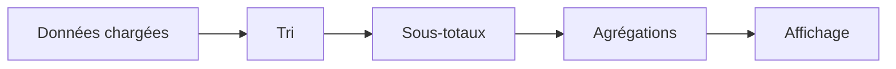

# 🌸 TRI, FILTRES, TOTAUX ET AGRÉGATIONS SALV

## 🌺 OBJECTIFS

- Définir un tri initial
- Créer des sous-totaux
- Ajouter des agrégations
- Préparer des filtres applicatifs

## 🌺 TRI INITIAL

```abap
DATA lo_sorts TYPE REF TO cl_salv_sorts.

lo_sorts = go_alv->get_sorts( ).
lo_sorts->add_sort(
  columnname = 'CARRID'
  position   = 1
  sequence   = if_salv_c_sort=>sort_up
  subtotal   = abap_true ).
```

## 🌺 AGRÉGATION

```abap
DATA lo_aggregations TYPE REF TO cl_salv_aggregations.

lo_aggregations = go_alv->get_aggregations( ).
lo_aggregations->add_aggregation(
  columnname  = 'PRICE'
  aggregation = if_salv_c_aggregation=>total ).
```

Les agrégations possibles dépendent du type de la colonne. Les champs de quantité et de montant doivent conserver leurs références d’unité ou de devise pour produire une sortie compréhensible.

## 🌺 FILTRES

Les filtres ALV n’ont pas le même objectif qu’un `WHERE` SQL :

- `WHERE` réduit les données lues en base ;
- le filtre ALV agit sur les données déjà chargées dans la table de sortie.

Pour des volumes importants, filtrer au plus tôt dans la requête SQL.

## 🌺 ORDRE DE CONFIGURATION



## 🌺 GESTION DES EXCEPTIONS

Les méthodes de tri et d’agrégation peuvent lever des exceptions SALV en cas de colonne inconnue ou de combinaison non autorisée. Les traiter localement ou les propager selon l’architecture du programme.

## 🌺 RÉFÉRENCES OFFICIELLES SAP

- [Sorting by Columns — SAP Help Portal](https://help.sap.com/docs/SAP_NETWEAVER_700/a85596deeb19418982bee031d1fd1427/4ec1b299087c2b91e10000000a42189d.html)
- [Making Aggregation Settings — SAP Help Portal](https://help.sap.com/docs/ABAP_PLATFORM_NEW/b1c834a22d05483b8a75710743b5ff26/4ec2686758e968b9e10000000a42189e.html)

---

➡️ [Chapitre suivant — AFFICHAGE, MISE EN FORME ET LAYOUT SALV](<./07 - 🍧 AFFICHAGE MISE EN FORME ET LAYOUT SALV.md>)
