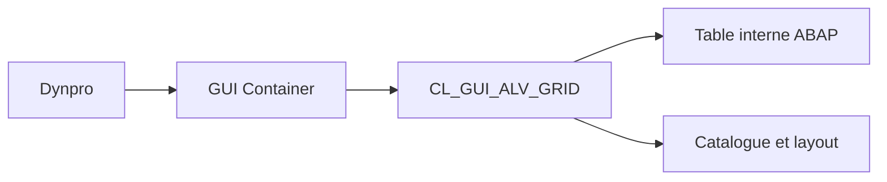

# 🌸 PRINCIPES DE CL_GUI_ALV_GRID

## 🌺 OBJECTIFS

- Comprendre le rôle du Grid Control
- Identifier ses composants obligatoires
- Distinguer données backend et état frontend

## 🌺 ARCHITECTURE

`CL_GUI_ALV_GRID` représente un contrôle graphique géré par le SAP Control Framework. Il affiche une table interne dans un conteneur rattaché à un écran SAP GUI.

## 🌺 COMPOSANTS

- un écran Dynpro ;
- un conteneur, par exemple `CL_GUI_CUSTOM_CONTAINER` ;
- une instance `CL_GUI_ALV_GRID` ;
- une table interne de sortie ;
- un catalogue de champs ou une structure DDIC ;
- éventuellement une classe de gestion des événements.

## 🌺 CYCLE DE VIE

Créer le conteneur et la grille une seule fois, généralement lors du premier PBO. Lors des PBO suivants, actualiser la grille au lieu de recréer les contrôles.

## 🌺 BACKEND ET FRONTEND

La table interne existe côté serveur ABAP. L’utilisateur manipule une représentation côté frontend. Pour un ALV éditable, les changements doivent être transférés et validés avant la sauvegarde.

## 🌺 QUAND UTILISER LE GRID

- écran Dynpro existant ;
- édition ;
- événements détaillés ;
- toolbar personnalisée ;
- styles par cellule ;
- rafraîchissements fréquents.

## 🌺 CAS D’USAGE

Dans un contexte où un utilisateur métier doit analyser une liste tabulaire, trier, filtrer et éventuellement interagir avec les lignes, le besoin consiste à **intégrer une grille interactive dans un dynpro et gérer ses événements**. Cette notion est pertinente lorsque le choix technique doit être compris avant d’appliquer une procédure.

## 🌺 PROCÉDURE PAS À PAS

1. Saisir `/nSE38` dans le champ de commande.
2. Entrer le nom d’un programme Z de test, par exemple `ZREF_DEMO`, puis choisir **Créer** ou **Modifier** selon le cas.
3. Pour un exercice local uniquement, affecter `$TMP` ; pour un développement livrable, utiliser le package et l’ordre fournis par le projet.
4. Coller ou adapter le snippet du chapitre.
5. Exécuter le contrôle syntaxique avec `Ctrl+F2`.
6. Activer avec `Ctrl+F3`.
7. Exécuter avec `F8` et comparer le résultat avec la section **Vérification**.

## 🌺 VÉRIFICATION

- Le lecteur peut expliquer la différence entre cette notion et les concepts proches.
- Le choix technique est justifié par un besoin concret, pas uniquement par habitude.
- Les limites liées à la release, aux autorisations et au contexte d’exécution sont identifiées.

## 🌺 ERREURS FRÉQUENTES

- Afficher un volume non borné dans l’ALV.
- Rendre une cellule éditable sans validation ni sauvegarde transactionnelle.

## 🌺 TERMES DU LEXIQUE

- [ALV](<../└─ 🧩 00 - LEXIQUE SAP ET ABAP/10 - 🍧 ACRONYMES SAP.md#acro-alv>)
- [SALV](<../└─ 🧩 00 - LEXIQUE SAP ET ABAP/10 - 🍧 ACRONYMES SAP.md#acro-salv>)
- [Table interne](<../└─ 🧩 00 - LEXIQUE SAP ET ABAP/04 - 🍧 LANGAGE ET DEVELOPPEMENT ABAP.md#table-interne>)

## 🌺 À RETENIR

- À l’issue du chapitre, le lecteur sait **intégrer une grille interactive dans un dynpro et gérer ses événements**.
- Toujours tester sur un objet Z ou un jeu de données sans impact avant d’intervenir sur un traitement réel.
- La documentation `F1` du système reste la référence pour la syntaxe disponible dans sa release.

## 🌺 RÉFÉRENCES OFFICIELLES SAP

- [Instance for ALV Grid Control — SAP Help Portal](https://help.sap.com/docs/ABAP_PLATFORM_NEW/70396d7dec4c4f19b9ca3b2e47559d12/4ebaebe1251356a2e10000000a421937.html)
- [Working with the ALV Grid Control — SAP Help Portal](https://help.sap.com/docs/ABAP_PLATFORM_NEW/70396d7dec4c4f19b9ca3b2e47559d12/4ebd16291041389ee10000000a421937.html)
- [Methods of Class CL_GUI_ALV_GRID — SAP Help Portal](https://help.sap.com/docs/ABAP_PLATFORM_NEW/70396d7dec4c4f19b9ca3b2e47559d12/22a3f5ecd2fe11d2b467006094192fe3.html)

---

➡️ [Chapitre suivant — ÉCRAN DYNPRO ET CUSTOM CONTAINER](<./11 - 🍧 ECRAN DYNPRO ET CUSTOM CONTAINER.md>)
