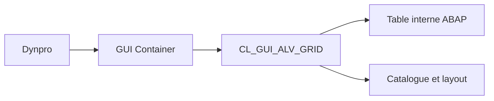

# 🌸 PRINCIPES DE CL_GUI_ALV_GRID

## 🌺 OBJECTIFS

- Comprendre le rôle du Grid Control
- Identifier ses composants obligatoires
- Distinguer données backend et état frontend

## 🌺 ARCHITECTURE

`CL_GUI_ALV_GRID` représente un contrôle graphique géré par le SAP Control Framework. Il affiche une table interne dans un conteneur rattaché à un écran SAP GUI.

## 🌺 COMPOSANTS

- un écran Dynpro ;
- un conteneur, par exemple `CL_GUI_CUSTOM_CONTAINER` ;
- une instance `CL_GUI_ALV_GRID` ;
- une table interne de sortie ;
- un catalogue de champs ou une structure DDIC ;
- éventuellement une classe de gestion des événements.

## 🌺 CYCLE DE VIE

Créer le conteneur et la grille une seule fois, généralement lors du premier PBO. Lors des PBO suivants, actualiser la grille au lieu de recréer les contrôles.

## 🌺 BACKEND ET FRONTEND

La table interne existe côté serveur ABAP. L’utilisateur manipule une représentation côté frontend. Pour un ALV éditable, les changements doivent être transférés et validés avant la sauvegarde.

## 🌺 QUAND UTILISER LE GRID

- écran Dynpro existant ;
- édition ;
- événements détaillés ;
- toolbar personnalisée ;
- styles par cellule ;
- rafraîchissements fréquents.

## 🌺 RÉFÉRENCES OFFICIELLES SAP

- [Instance for ALV Grid Control — SAP Help Portal](https://help.sap.com/docs/ABAP_PLATFORM_NEW/70396d7dec4c4f19b9ca3b2e47559d12/4ebaebe1251356a2e10000000a421937.html)
- [Working with the ALV Grid Control — SAP Help Portal](https://help.sap.com/docs/ABAP_PLATFORM_NEW/70396d7dec4c4f19b9ca3b2e47559d12/4ebd16291041389ee10000000a421937.html)
- [Methods of Class CL_GUI_ALV_GRID — SAP Help Portal](https://help.sap.com/docs/ABAP_PLATFORM_NEW/70396d7dec4c4f19b9ca3b2e47559d12/22a3f5ecd2fe11d2b467006094192fe3.html)

---

➡️ [Chapitre suivant — ÉCRAN DYNPRO ET CUSTOM CONTAINER](<./11 - 🍧 ECRAN DYNPRO ET CUSTOM CONTAINER.md>)
