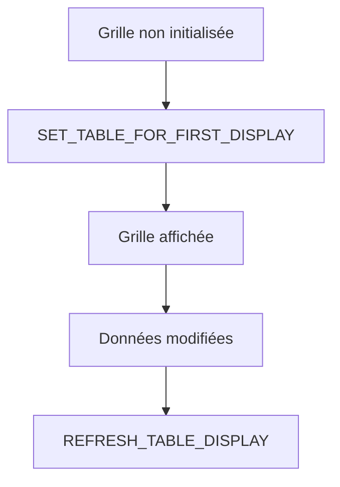

# 🌸 PREMIER AFFICHAGE AVEC SET_TABLE_FOR_FIRST_DISPLAY

## 🌺 OBJECTIFS

- Appeler correctement la méthode d’affichage initial
- Distinguer premier affichage et rafraîchissement
- Traiter les erreurs du Control Framework

## 🌺 APPEL COMPLET

```abap
FORM display_grid.
  DATA ls_variant TYPE disvariant.

  ls_variant-report = sy-repid.

  CALL METHOD go_grid->set_table_for_first_display
    EXPORTING
      is_variant      = ls_variant
      i_save          = 'A'
      is_layout       = gs_layout
    CHANGING
      it_outtab       = gt_output
      it_fieldcatalog = gt_fieldcat
    EXCEPTIONS
      invalid_parameter_combination = 1
      program_error                 = 2
      too_many_lines                = 3
      OTHERS                        = 4.

  IF sy-subrc <> 0.
    MESSAGE 'Impossible d afficher l ALV' TYPE 'E'.
  ENDIF.
ENDFORM.
```

## 🌺 STRUCTURE DDIC OU CATALOGUE

Deux modèles principaux :

```abap
" Structure DDIC
EXPORTING i_structure_name = 'ZDEV_S_ALV_OUTPUT'
```

ou :

```abap
" Catalogue explicite
CHANGING it_fieldcatalog = gt_fieldcat
```

Éviter de mélanger des définitions contradictoires.

## 🌺 PREMIER AFFICHAGE

`SET_TABLE_FOR_FIRST_DISPLAY` doit être appelé pour initialiser le contrôle. Pour les modifications ultérieures de données, utiliser `REFRESH_TABLE_DISPLAY`.



## 🌺 RÉFÉRENCES OFFICIELLES SAP

- [Methods of Class CL_GUI_ALV_GRID — SAP Help Portal](https://help.sap.com/docs/ABAP_PLATFORM_NEW/70396d7dec4c4f19b9ca3b2e47559d12/22a3f5ecd2fe11d2b467006094192fe3.html)
- [Getting Started with ALV Grid Control — SAP Help Portal](https://help.sap.com/docs/ABAP_PLATFORM_NEW/70396d7dec4c4f19b9ca3b2e47559d12/4eba23f5250f568be10000000a421937.html)

---

➡️ [Chapitre suivant — ÉVÉNEMENTS ET CLASSE RÉCEPTRICE](<./15 - 🍧 EVENEMENTS ET CLASSE RECEPTRICE.md>)
