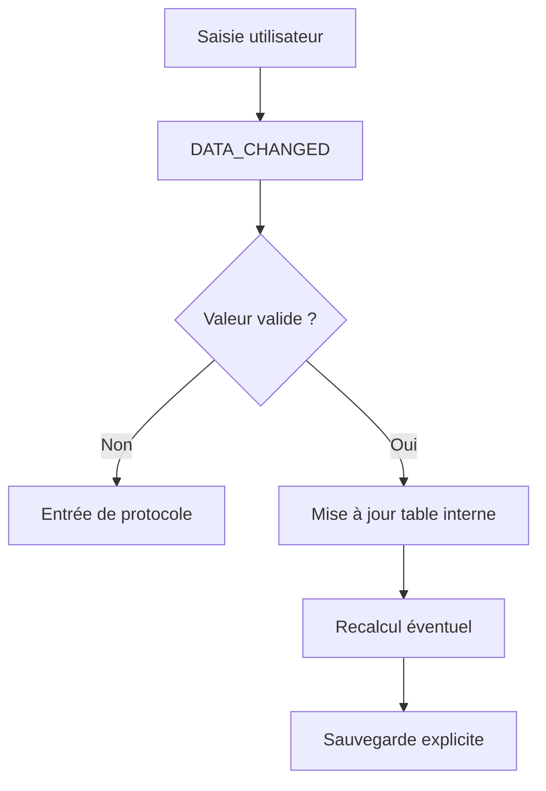

# 🌸 VALIDATION AVEC DATA_CHANGED

## 🌺 OBJECTIFS

- Analyser les cellules modifiées
- Rejeter une valeur invalide
- Recalculer une cellule dépendante

## 🌺 DÉCLARATION DU HANDLER

```abap
METHODS handle_data_changed
  FOR EVENT data_changed OF cl_gui_alv_grid
  IMPORTING er_data_changed e_onf4 e_onf4_before e_onf4_after e_ucomm.
```

## 🌺 LIRE LES MODIFICATIONS

```abap
METHOD handle_data_changed.
  LOOP AT er_data_changed->mt_mod_cells INTO DATA(ls_mod_cell).
    CASE ls_mod_cell-fieldname.
      WHEN 'QUANTITY'.
        IF ls_mod_cell-value <= 0.
          er_data_changed->add_protocol_entry(
            i_msgid     = 'ZDEV'
            i_msgno     = '001'
            i_msgty     = 'E'
            i_msgv1     = 'Quantité invalide'
            i_fieldname = ls_mod_cell-fieldname
            i_row_id    = ls_mod_cell-row_id ).
        ENDIF.
    ENDCASE.
  ENDLOOP.
ENDMETHOD.
```

## 🌺 RECALCULER UNE CELLULE

```abap
er_data_changed->modify_cell(
  i_row_id    = ls_mod_cell-row_id
  i_fieldname = 'TOTAL'
  i_value     = lv_total ).
```

## 🌺 FLUX DE VALIDATION



## 🌺 RÈGLES

- La validation de cellule ne remplace pas la validation métier finale.
- Ne pas effectuer un `COMMIT WORK` pour chaque cellule modifiée.
- Regrouper la sauvegarde derrière une action utilisateur explicite.
- Produire des messages localisés via une classe de messages.

## 🌺 CAS D’USAGE

Dans un contexte où un utilisateur métier doit analyser une liste tabulaire, trier, filtrer et éventuellement interagir avec les lignes, le besoin consiste à **mettre en œuvre validation avec data_changed dans un affichage ALV borné et adapté aux interactions attendues**. Cette notion est pertinente lorsque le lecteur doit pouvoir relier la syntaxe ou l’outil à une situation professionnelle concrète.

## 🌺 PROCÉDURE PAS À PAS

1. Saisir `/nSE38` dans le champ de commande.
2. Entrer le nom d’un programme Z de test, par exemple `ZREF_DEMO`, puis choisir **Créer** ou **Modifier** selon le cas.
3. Pour un exercice local uniquement, affecter `$TMP` ; pour un développement livrable, utiliser le package et l’ordre fournis par le projet.
4. Coller ou adapter le snippet du chapitre.
5. Exécuter le contrôle syntaxique avec `Ctrl+F2`.
6. Activer avec `Ctrl+F3`.
7. Exécuter avec `F8` et comparer le résultat avec la section **Vérification**.

## 🌺 VÉRIFICATION

- Le contrôle syntaxique réussit.
- La version active correspond au code sauvegardé.
- L’exécution produit le résultat décrit dans le chapitre.
- Les cas vide, limite et erreur sont testés séparément lorsque la syntaxe le permet.

## 🌺 ERREURS FRÉQUENTES

- Copier un exemple sans adapter les types, noms d’objets et données disponibles dans le système.
- Tester uniquement le cas nominal et ignorer les valeurs initiales, absentes ou invalides.
- Afficher un volume non borné dans l’ALV.
- Rendre une cellule éditable sans validation ni sauvegarde transactionnelle.

## 🌺 SNIPPET À RÉUTILISER

> [!NOTE]
> Adapter les noms `Z*`, les types DDIC, les données et les autorisations au système cible. Effectuer un contrôle syntaxique avant activation.

```abap
METHOD handle_data_changed.
  LOOP AT er_data_changed->mt_mod_cells INTO DATA(ls_mod_cell).
    CASE ls_mod_cell-fieldname.
      WHEN 'QUANTITY'.
        IF ls_mod_cell-value <= 0.
          er_data_changed->add_protocol_entry(
            i_msgid     = 'ZDEV'
            i_msgno     = '001'
            i_msgty     = 'E'
            i_msgv1     = 'Quantité invalide'
            i_fieldname = ls_mod_cell-fieldname
            i_row_id    = ls_mod_cell-row_id ).
        ENDIF.
    ENDCASE.
  ENDLOOP.
ENDMETHOD.
```

## 🌺 TERMES DU LEXIQUE

- [ALV](<../└─ 🧩 00 - LEXIQUE SAP ET ABAP/10 - 🍧 ACRONYMES SAP.md#acro-alv>)
- [SALV](<../└─ 🧩 00 - LEXIQUE SAP ET ABAP/10 - 🍧 ACRONYMES SAP.md#acro-salv>)
- [Table interne](<../└─ 🧩 00 - LEXIQUE SAP ET ABAP/04 - 🍧 LANGAGE ET DEVELOPPEMENT ABAP.md#table-interne>)

## 🌺 À RETENIR

- À l’issue du chapitre, le lecteur sait **mettre en œuvre validation avec data_changed dans un affichage ALV borné et adapté aux interactions attendues**.
- Toujours tester sur un objet Z ou un jeu de données sans impact avant d’intervenir sur un traitement réel.
- La documentation `F1` du système reste la référence pour la syntaxe disponible dans sa release.

## 🌺 RÉFÉRENCES OFFICIELLES SAP

- [Making ALV React to Changed Data — SAP Help Portal](https://help.sap.com/docs/SUPPORT_CONTENT/abap/3353523611.html)
- [Events of Class CL_GUI_ALV_GRID — SAP Help Portal](https://help.sap.com/docs/ABAP_PLATFORM_NEW/70396d7dec4c4f19b9ca3b2e47559d12/22a3f5f5d2fe11d2b467006094192fe3.html)


---

➡️ [Chapitre suivant — STYLES, COULEURS, ICÔNES ET CELLULES](<./20 - 🍧 STYLES COULEURS ICONES ET CELLULES.md>)
