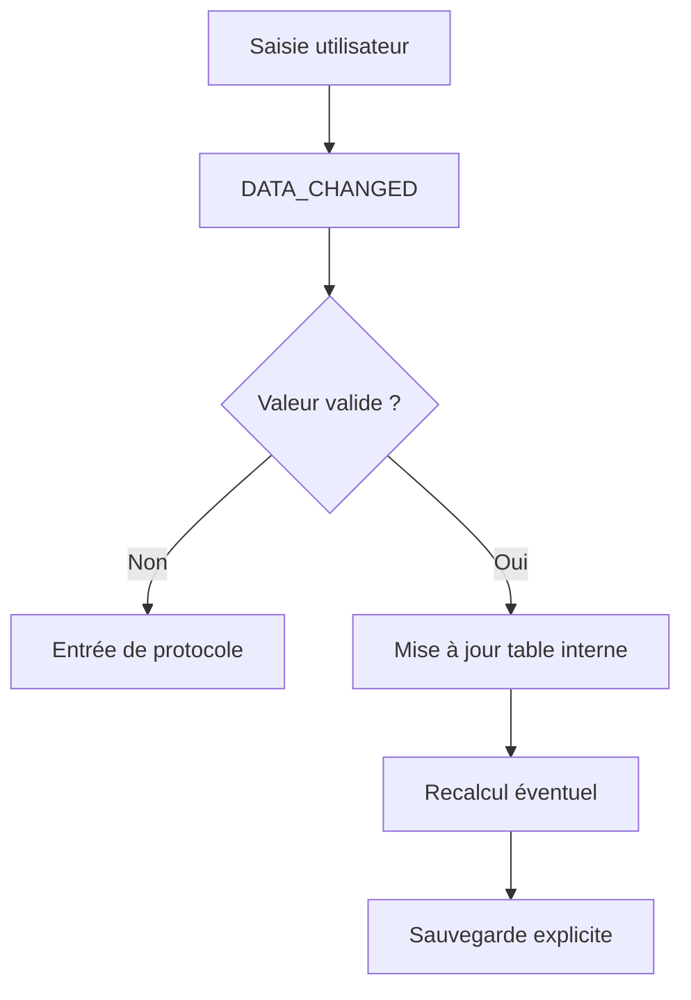

# 🌸 VALIDATION AVEC DATA_CHANGED

## 🌺 OBJECTIFS

- Analyser les cellules modifiées
- Rejeter une valeur invalide
- Recalculer une cellule dépendante

## 🌺 DÉCLARATION DU HANDLER

```abap
METHODS handle_data_changed
  FOR EVENT data_changed OF cl_gui_alv_grid
  IMPORTING er_data_changed e_onf4 e_onf4_before e_onf4_after e_ucomm.
```

## 🌺 LIRE LES MODIFICATIONS

```abap
METHOD handle_data_changed.
  LOOP AT er_data_changed->mt_mod_cells INTO DATA(ls_mod_cell).
    CASE ls_mod_cell-fieldname.
      WHEN 'QUANTITY'.
        IF ls_mod_cell-value <= 0.
          er_data_changed->add_protocol_entry(
            i_msgid     = 'ZDEV'
            i_msgno     = '001'
            i_msgty     = 'E'
            i_msgv1     = 'Quantité invalide'
            i_fieldname = ls_mod_cell-fieldname
            i_row_id    = ls_mod_cell-row_id ).
        ENDIF.
    ENDCASE.
  ENDLOOP.
ENDMETHOD.
```

## 🌺 RECALCULER UNE CELLULE

```abap
er_data_changed->modify_cell(
  i_row_id    = ls_mod_cell-row_id
  i_fieldname = 'TOTAL'
  i_value     = lv_total ).
```

## 🌺 FLUX DE VALIDATION



## 🌺 RÈGLES

- La validation de cellule ne remplace pas la validation métier finale.
- Ne pas effectuer un `COMMIT WORK` pour chaque cellule modifiée.
- Regrouper la sauvegarde derrière une action utilisateur explicite.
- Produire des messages localisés via une classe de messages.

## 🌺 RÉFÉRENCES OFFICIELLES SAP

- [Making ALV React to Changed Data — SAP Help Portal](https://help.sap.com/docs/SUPPORT_CONTENT/abap/3353523611.html)
- [Events of Class CL_GUI_ALV_GRID — SAP Help Portal](https://help.sap.com/docs/ABAP_PLATFORM_NEW/70396d7dec4c4f19b9ca3b2e47559d12/22a3f5f5d2fe11d2b467006094192fe3.html)

---

➡️ [Chapitre suivant — STYLES, COULEURS, ICÔNES ET CELLULES](<./20 - 🍧 STYLES COULEURS ICONES ET CELLULES.md>)
